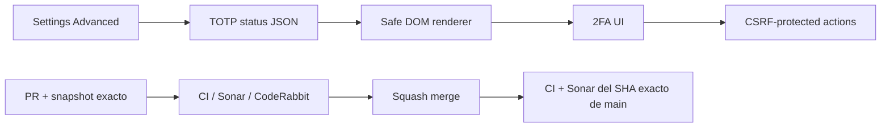

# BRVTAL — Último deploy

  
  
  

> **Development dashboard** · snapshot profesional de **solo el deploy actual**.

## Progress convention

- ✅ ~~Struck through~~ = completed and verified through the required delivery gates.
- 🚧 Normal text = pending or currently in progress.
- Completed roadmap items remain visible and crossed out.

## Estado del deploy

| Señal | Estado | Evidencia |
| --- | --- | --- |
| Work line | 🚧 **#553 SECURITY HOTFIX** | 2FA embebido: JSON autenticado + DOM seguro |
| Base exacta | ✅ **VALIDATED IN CODE** | `main` `f29cf1a25fee211c621368165d0877af74e3ab93` · exact-main `validate` verde; Sonar main detectó regresión de Security Rating |
| Version | 🚧 **0.1.7 → 0.1.8** | patch hotfix · pre-1.0 |
| Producción | ⛔ **BLOCKED / EXTERNAL** | Hostinger marker tracked in [#534](https://github.com/pl0n3r/brvtal/issues/534) |

## Huella del cambio

<!-- brvtal:git-delta -->

| Archivos | Inserciones | Eliminaciones | Neto |
| ---: | ---: | ---: | ---: |
| **9** | **+314** | **−82** | **+232** |

## Calidad y entrega

<!-- brvtal:gate-plan -->

| Control | Estado / contrato |
| --- | --- |
| Gates seleccionados | **preflight · fast[PHP+JS] · chromium · real-stack · webkit** |
| Security | no HTML remoto/importado; estado 2FA JSON autenticado; mutaciones conservan CSRF |
| Browser | estado/email se renderizan como texto y la UI 2FA sigue operativa |
| Real stack | Settings Advanced carga Security real con administrador E2E aislado |
| Sonar + CodeRabbit | ejecutados en paralelo; objetivo Sonar: volver a Security Rating **A** |
| Exact-main | CI + Sonar del SHA exacto de main obligatorios tras squash merge |

## Flujo de entrega

## Qué se hizo

- Elimina `DOMParser` + `document.importNode` del embedding de Security / 2FA.
- Reutiliza el endpoint TOTP autenticado para entregar estado y email como JSON.
- Renderiza la interfaz desde estructura DOM confiable y usa `textContent` para datos del administrador.
- Mantiene START / CONFIRM / DISABLE, recovery codes, rate limits y CSRF existentes.
- Evita `innerHTML` dentro del renderer Security.
- Añade regresión browser para comprobar que texto con forma de markup sigue siendo texto.
- Añade contratos que impiden reintroducir HTML remoto en Settings.
- Incrementa BRVTAL a **0.1.8**.

## Archivos modificados en este deploy

- `AGENTS.md`
- `README.md`
- `config/version.php`
- `discadmin/settings-v2.js`
- `discadmin/security.js`
- `discadmin/totp-api.php`
- `tests/e2e/discadmin-settings-v2.spec.mjs`
- `tests/sonar-security-contract.php`
- `tests/totp-enrollment-contract.php`

## Validación

- Settings deja de consumir `totp-status.php` como HTML para el embedding.
- El estado 2FA usa sesión, CSRF y JSON.
- Los datos dinámicos no se convierten en markup.
- Las mutaciones TOTP conservan el endpoint y límites de seguridad existentes.
- No hay migración ni operación destructiva de producción.

## Qué sigue

| Lane | Trabajo |
| --- | --- |
| **NOW** | 🚧 [#553](https://github.com/pl0n3r/brvtal/issues/553) · recuperar Sonar Security Rating A y cerrar exact-main. |
| **NEXT** | 🚧 [#523](https://github.com/pl0n3r/brvtal/issues/523) · medir/corregir primer load de Banners. |
| **NEXT** | 🚧 [#480](https://github.com/pl0n3r/brvtal/issues/480) · hero desktop overlap/clipping. |
| **BLOCKED / EXTERNAL** | 🚧 [#534](https://github.com/pl0n3r/brvtal/issues/534) · Hostinger Git auto-deploy marker. |

## Panorama general pendiente

| Lane | Frente | Issues |
| --- | --- | --- |
| **DONE** | ✅ ~~Phase 1 + Admin IA + Appearance + Premium Admin + Settings~~ | ✅ ~~[#527](https://github.com/pl0n3r/brvtal/issues/527), [#520](https://github.com/pl0n3r/brvtal/issues/520), [#521](https://github.com/pl0n3r/brvtal/issues/521), [#526](https://github.com/pl0n3r/brvtal/issues/526), [#522](https://github.com/pl0n3r/brvtal/issues/522), [#479](https://github.com/pl0n3r/brvtal/issues/479), [#517](https://github.com/pl0n3r/brvtal/issues/517), [#221](https://github.com/pl0n3r/brvtal/issues/221), [#348](https://github.com/pl0n3r/brvtal/issues/348), [#149](https://github.com/pl0n3r/brvtal/issues/149), [#514](https://github.com/pl0n3r/brvtal/issues/514), [#516](https://github.com/pl0n3r/brvtal/issues/516)~~ |
| **NOW** | 🚧 Security quality | 🚧 [#553](https://github.com/pl0n3r/brvtal/issues/553) |
| **NEXT** | 🚧 Phase 2 closeout | 🚧 [#523](https://github.com/pl0n3r/brvtal/issues/523), [#480](https://github.com/pl0n3r/brvtal/issues/480), [#193](https://github.com/pl0n3r/brvtal/issues/193), [#216](https://github.com/pl0n3r/brvtal/issues/216) |
| **LATER** | 🚧 Editorial productivity | 🚧 [#519](https://github.com/pl0n3r/brvtal/issues/519), [#518](https://github.com/pl0n3r/brvtal/issues/518), [#257](https://github.com/pl0n3r/brvtal/issues/257), [#525](https://github.com/pl0n3r/brvtal/issues/525), [#524](https://github.com/pl0n3r/brvtal/issues/524), [#528](https://github.com/pl0n3r/brvtal/issues/528), [#529](https://github.com/pl0n3r/brvtal/issues/529) |
| **LATER** | 🚧 Operational dashboards | 🚧 [#513](https://github.com/pl0n3r/brvtal/issues/513), [#515](https://github.com/pl0n3r/brvtal/issues/515), [#532](https://github.com/pl0n3r/brvtal/issues/532) |
| **BLOCKED / EXTERNAL** | 🚧 Deploy observation | 🚧 [#534](https://github.com/pl0n3r/brvtal/issues/534) |
