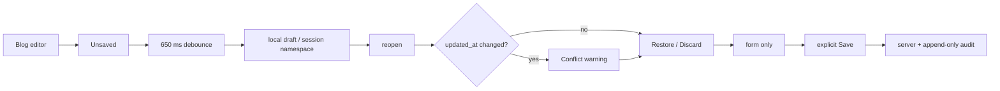

# BRVTAL — Último deploy

> Snapshot de **solo el deploy actual** para #528: drafts recuperables de Blog. No declara producción GREEN.

## Progress convention
- ✅ ~~Struck through~~ = completed and verified through required gates.
- 🚧 Normal text = pending/in progress.
- 🚧 = active production blocker.

## Estado del deploy
| Señal | Estado | Evidencia |
| --- | --- | --- |
| Work line | 🚧 **#528 · recoverable Blog drafts** | `work/issue-528` · reserva `0f1759ee-d30a-4993-9c7e-08b6bb4f074f` |
| Base | ✅ **main** | `4eef787234ab31c8d0901653ece6388a5f5a90c1` |
| Versión | 🚧 **v0.1.66** | `config/version.php` + `package.json` |
| PR | 🚧 **#707** | exact-head gates obligatorios |
| Producción | 🚧 **NO GREEN · #681** | migration registry recovery sin autoridad/transporte |
| Continuidad | ✅ **#708** | rollout restante preservado |

## Huella del cambio
<!-- brvtal:git-delta -->
| Archivos | Inserciones | Eliminaciones | Neto |
| ---: | ---: | ---: | ---: |
| **8** | **+555** | **−62** | **+493** |

## Calidad y entrega
<!-- brvtal:gate-plan -->
| Control | Estado / contrato |
| --- | --- |
| Gates | **preflight · coordination · fast[PHP+JS] · database · chromium · real-stack · webkit** |
| Factory | Policy · Privacy · Labels |
| Snapshot | PR + snapshot exacto |
| Main | CI del SHA exacto de main |
| Review | Sonar + CodeRabbit |
| Seguridad | sin endpoint, permiso, proveedor ni migración nuevos |
| Producción | #681 permanece fuera de alcance; no se declara GREEN |

## Flujo de entrega

## Qué se hizo
- Nuevo `editor-drafts.js`: storage same-origin, versionado y reusable.
- Namespace derivado con SHA-256 del CSRF de sesión; el token no se persiste.
- Blog autosave local con debounce; no hace POST/PUT ni publica.
- Estados accesibles: Unsaved, Saving, Draft saved, Save failed y Saved to server.
- Reopen ofrece Restore/Discard y muestra conflicto si cambió `updated_at`.
- Restore repone formulario/SEO/body/relaciones; el body vuelve a pasar por sanitización cliente.
- Save manual exitoso limpia el draft solo si no hubo ediciones nuevas en vuelo; fallo HTTP conserva recovery.
- Fallo de storage queda visible y no borra el input; expiración de sesión purga drafts locales.
- Version History sigue append-only/read-only.
- #708 conserva Events, Artists, Releases, Sets, Pages y evaluación Hero/Theme.

## Archivos modificados en este deploy
- `discadmin/editor-drafts.js`
- `discadmin/blog.js`
- `discadmin/blog.css`
- `discadmin/index.php`
- `tests/e2e/discadmin-blog.spec.mjs`
- `config/version.php`
- `package.json`
- `README.md`

## Validación
- E2E: debounce sin mutación de servidor.
- E2E: reload + Restore/Discard.
- E2E: conflicto por revisión.
- E2E: Save exitoso limpia; Save fallido conserva.
- E2E: localStorage degradado conserva input.
- No cambia `datos.yml`: no añade campo personal, proveedor ni transferencia a tercero.
- Sin SQL, migración, Hostinger write ni cambios de readiness.
- 🚧 Gates exact-head del HEAD final de #707 deben cerrar antes de merge.

## Qué sigue
| Lane | Trabajo |
| --- | --- |
| **NOW** | 🚧 #528 / PR #707: cerrar gates del fundamento + Blog. |
| **NEXT** | 🚧 #708: rollout del contrato a otros editores · https://github.com/pl0n3r/brvtal/issues/708 |
| **LATER** | 🚧 #533: roadmap canónico. |
| **BLOCKED / EXTERNAL** | 🚧 #681: migration registry parity / producción NO GREEN · https://github.com/pl0n3r/brvtal/issues/681 |

## Panorama general pendiente
- 🚧 **NOW**: #707 exact-head y merge serial.
- 🚧 **NEXT**: #708, solo después de exact-main del fundamento.
- 🚧 **LATER**: continuar #533 según prioridad real.
- 🚧 **BLOCKED / EXTERNAL**: #681 conserva el recovery productivo fail-closed.
