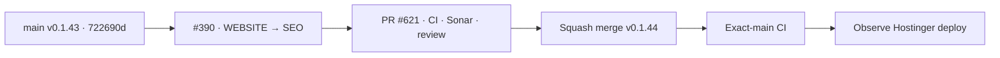

# BRVTAL — Último deploy

  
  
  

> **Development dashboard** · snapshot de **solo el deploy actual** para Issue #390.

## Progress convention

- ✅ ~~Struck through~~ = completed and verified through the required delivery gates.
- 🚧 Normal text = pending or currently in progress.

## Estado del deploy

| Señal | Estado | Evidencia |
| --- | --- | --- |
| Work line | 🚧 **#390 · WEBSITE → SEO workspace canónico** | `work/issue-390` · PR #621 |
| Base exacta | ✅ ~~main v0.1.43 validado y desplegado~~ | `722690d2fc9feeb1cfa21ead9b8f85c9555f00f5` |
| Versión | 🚧 **0.1.44 candidate** | centralized server-rendered SEO authority |
| Producción | 🚧 pendiente merge + exact-main + observación Hostinger | sin migraciones ni mutaciones manuales SEO |

## Huella del cambio

<!-- brvtal:git-delta -->

| Archivos | Inserciones | Eliminaciones | Neto |
| ---: | ---: | ---: | ---: |
| **27** | **+1760** | **−132** | **+1628** |

## Calidad y entrega

<!-- brvtal:gate-plan -->

| Control | Estado / contrato |
| --- | --- |
| Gates | **preflight · coordination · fast[PHP+JS] · database · chromium · real-stack · webkit** |
| PR integrity | PR #621 · Issue #390 · UUID `74a6178a-25bf-4c36-9278-e3d1ce1f8fe1` |
| Single authority | 🚧 Home/Contact + Events/Artists/Sets/Releases/Blog/Pages usan la metadata del renderer público |
| AUTO semantics | 🚧 override vacío vuelve a fallback vivo; no materializa defaults derivados |
| Static routes | 🚧 allowlist cerrada Home/Contact dentro de `settings.seo.routes`; sin tabla nueva |
| Entity routes | 🚧 columnas SEO existentes + persistence/audit boundary compartido |
| Canonical/social | 🚧 canonical derivado/read-only; OG/Twitter heredan metadata efectiva |
| Settings | 🚧 delega metadata al workspace y conserva IndexNow |
| Durable coverage | 🚧 contratos PHP + MariaDB + browser desktop/mobile + IA/Settings |
| Sonar | 🚧 Quality Gate verde; limpieza de deuda nueva en curso |
| CodeRabbit | 🚧 full review en curso |
| CI exact-main | 🚧 después del squash merge |

## Flujo de entrega

## Qué se hizo

- Un workspace **WEBSITE → SEO** dentro del shell canónico de DISCADMIN centraliza Home, Contact y seis familias editoriales.
- Home/Contact usan rutas estáticas allowlisted en el setting SEO existente; Home mantiene compatibilidad con valores legacy flat.
- Entidades reutilizan `seo_title` / `seo_description`, auditoría y defaults dinámicos ya existentes.
- AUTO / MANUAL / MIXED, filtros, health, preview efectivo y reset por campo evitan congelar fallbacks.
- Canonical es derivado; OG/Twitter reutilizan la salida server-rendered en vez de crear controles sin autoridad real.
- Settings deja de ser un segundo editor Home y conserva IndexNow como infraestructura.
- El editor usa diálogo nativo, conserva retry de saves fallidos y valida imágenes estáticas contra URLs/rutas inseguras.
- Cobertura nueva: MariaDB, contratos PHP, navegación IA, Settings, Chromium y mobile 390px.

## Archivos modificados en este deploy

- `README.md`
- `api/seo-metadata.php`
- `api/seo-workspace.php`
- `config/public_contact_page.php`
- `config/public_seo.php`
- `config/seo_workspace.php`
- `config/version.php`
- `discadmin/admin-information-architecture.js`
- `discadmin/admin-modules.js`
- `discadmin/seo-workspace.css`
- `discadmin/seo-workspace.js`
- `discadmin/seo-workspace.php`
- `discadmin/settings-v2.js`
- `docs/BRVTAL-SPEC.md`
- `index.php`
- `package.json`
- `tests/blog-contract.php`
- `tests/e2e/discadmin-information-architecture.spec.mjs`
- `tests/e2e/discadmin-seo-workspace.spec.mjs`
- `tests/e2e/discadmin-settings-v2.spec.mjs`
- `tests/integration/seo-workspace.php`
- `tests/media-library-contract.php`
- `tests/public-contact-contract.php`
- `tests/releases-contract.php`
- `tests/seo-contract.php`
- `tests/seo-defaults-contract.php`
- `tests/seo-workspace-contract.php`

## Validación

- Base exacta `722690d2fc9feeb1cfa21ead9b8f85c9555f00f5`: CI/validate, Sonar, Deploy Observer y Performance verdes para v0.1.43.
- PR #621 parte de esa base, 0 commits detrás y mantiene la reserva canónica de #390.
- Primer ciclo detectó dos regresiones de contrato/UI; fueron corregidas en la misma rama antes del merge.
- Pendiente: ciclo verde estable, revisión final, squash merge, exact-main y observación de producción.

## Qué sigue

| Lane | Trabajo |
| --- | --- |
| **NOW** | 🚧 #390 · cerrar PR #621 y entregar v0.1.44. |
| **NEXT** | 🚧 #528 · autosave/recovery del editor. |
| **LATER** | 🚧 #530 · recycle bin y backlog restante según roadmap #533. |
| **BLOCKED / EXTERNAL** | 🚧 migraciones o mutaciones manuales SEO en producción requieren autorización explícita. |

## Panorama general pendiente

- 🚧 **Editorial resilience:** #528 autosave/recovery y #530 recycle bin.
- 🚧 **Backlog posterior:** continuar por el orden canónico definido en Issue #533.
- 🚧 **Producción:** cualquier operación manual de datos/schema queda fuera de este deploy.
