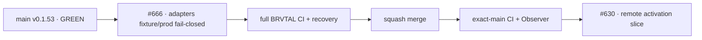

# BRVTAL — Último deploy

  
  
  

> Snapshot de **solo el deploy actual**: #666 prepara adapters reversibles para Factory v1 sin activar transporte remoto ni escribir producción. Base exacta `main 61af00a5daf973c3bef04651eab50fc7a3e6c003` / v0.1.53 GREEN.

## Progress convention

- ✅ ~~Struck through~~ = completed and verified through the required delivery gates.
- 🚧 Normal text = pending or currently in progress.

## Estado del deploy

| Señal | Estado | Evidencia |
| --- | --- | --- |
| Work line | 🚧 **#666 · reversible Factory deploy adapters** | `work/issue-666`; reserva `2285b2e3-89dd-4347-aa7e-fcac66e5d43b` |
| Base exacta | ✅ ~~main v0.1.53 GREEN~~ | `61af00a5daf973c3bef04651eab50fc7a3e6c003` |
| Versión producto | ✅ ~~v0.1.53 sin cambio~~ | repository-only; adapters aún no activan deploy remoto |
| Backup | 🚧 **reutiliza engine canónico** | `config/backups.php`; fail-closed antes de migrate/deploy |
| Migración | 🚧 **aditiva + explícita** | un único `migration_*.sql`; sin apply-all implícito |
| Rollback | 🚧 **solo artefacto** | puntero `current`; nunca restaura/borrar BD |
| Producción | ✅ ~~sin writes en este slice~~ | activación remota permanece cerrada |

## Huella del cambio

<!-- brvtal:git-delta -->

| Archivos | Inserciones | Eliminaciones | Neto |
| ---: | ---: | ---: | ---: |
| **10** | **+407** | **−41** | **+366** |

## Calidad y entrega

<!-- brvtal:gate-plan -->

| Control | Estado / contrato |
| --- | --- |
| Gates esperados | **preflight · coordination · fast[PHP+JS] · database · chromium · real-stack · webkit · recovery** |
| PR + snapshot exacto | Issue #666 · reserva `2285b2e3-89dd-4347-aa7e-fcac66e5d43b` |
| Roles | Infrastructure · SRE · Security · DBA · QA |
| Seguridad | fixture confinado a `.factory-fixture/`; remote activation falla cerrado |
| Datos | backup canónico; rollback de artefacto no ejecuta restore SQL |
| Review | Sonar, CodeQL y CodeRabbit permanecen activos sobre el HEAD estable |
| CI del SHA exacto de main | 🚧 después del merge |

## Flujo de entrega

## Qué se hizo

- Añade `ops/factory/{build,backup,migrate,deploy,rollback}` como superficie local esperada por `factory/deploy.yml@v1`.
- El modo fixture modela build → backup → migración aditiva → cambio atómico de `current` → rollback del artefacto.
- Backup productivo reutiliza `brvtal_backup_create()`; migración productiva reutiliza `scripts/migrations.php apply` y exige un archivo explícito.
- El modo producción queda bloqueado por `BRVTAL_FACTORY_REMOTE_ACTIVATION=1`; este slice no lo habilita ni añade caller remoto.
- El deploy fixture exige evidencia previa de backup y, en modo additive, evidencia de migración.
- Rollback solo restaura el puntero del release anterior; no contiene operaciones de DB.
- El contrato dinámico cubre rutas fuera del repo, backup fallido, migración fallida, deploy sin evidencia y rollback exitoso.
- `ci-scope.sh` trata `ops/factory/` como mantenimiento repository-only y activa DB/recovery; al modificarse el clasificador, este PR corre la matriz completa.

## Archivos modificados en este deploy

- `.gitignore`
- `README.md`
- `ops/factory/backup`
- `ops/factory/build`
- `ops/factory/common.sh`
- `ops/factory/deploy`
- `ops/factory/migrate`
- `ops/factory/rollback`
- `scripts/ci-scope.sh`
- `tests/factory-deploy-adapters-contract.php`

## Validación

- 🚧 Contrato PHP debe probar los cinco adapters y los fallos parciales.
- 🚧 Recovery aislado debe permanecer verde; producción no participa.
- 🚧 Factory CI/Policy/Privacy, Sonar, CodeQL y CodeRabbit deben cerrar sobre el HEAD estable.
- 🚧 Tras merge: BRVTAL CI exact-main + Deploy Observer deben mantener GREEN.

## Qué sigue

| Lane | Trabajo |
| --- | --- |
| **NOW** | 🚧 [#666](https://github.com/pl0n3r/brvtal/issues/666): adapters reversibles Factory v1. |
| **NEXT** | 🚧 [#630](https://github.com/pl0n3r/brvtal/issues/630): activar transporte remoto + caller Factory solo con interfaz Hostinger demostrada. |
| **LATER** | 🚧 [#533](https://github.com/pl0n3r/brvtal/issues/533): reanudar roadmap tras cerrar TANDA 2. |
| **BLOCKED / EXTERNAL** | 🚧 [#627](https://github.com/pl0n3r/brvtal/issues/627): labels espera equivalencia central del kit. |

## Panorama general pendiente

- 🚧 **NOW**: validar #666 sin producción writes.
- 🚧 **NEXT**: conectar Factory deploy al transporte Hostinger con rollback real de artefacto.
- 🚧 **LATER**: cerrar #630 con PR de prueba end-to-end y GREEN posterior.
- 🚧 **BLOCKED / EXTERNAL**: #627 permanece fuera hasta que Factory cubra su contrato completo.
