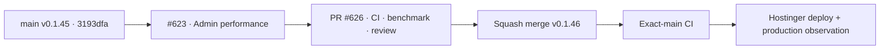

# BRVTAL — Último deploy

  
  
  

> **Development dashboard** · snapshot de **solo el deploy actual** para Issue #623.

## Progress convention

- ✅ ~~Struck through~~ = completed and verified through the required delivery gates.
- 🚧 Normal text = pending or currently in progress.

## Estado del deploy

| Señal | Estado | Evidencia |
| --- | --- | --- |
| Work line | 🚧 **#623 · DISCADMIN authenticated performance** | `work/issue-623` · PR #626 |
| Base exacta | ✅ ~~main v0.1.45~~ | `3193dfae8d3debc7427e98d9dfa7e8db6d04660e` |
| Versión | 🚧 **0.1.46 candidate** | sesión, auth, dashboard y listados |
| Producción | 🚧 después del merge | sin migración de DB para #623 |

## Huella del cambio

<!-- brvtal:git-delta -->

| Archivos | Inserciones | Eliminaciones | Neto |
| ---: | ---: | ---: | ---: |
| **39** | **+1107** | **−183** | **+924** |

## Calidad y entrega

<!-- brvtal:gate-plan -->

| Control | Estado / contrato |
| --- | --- |
| Gates | **preflight · coordination · fast[PHP+JS] · database · chromium · real-stack · webkit** |
| PR + snapshot exacto | PR #626 · Issue #623 · UUID `9c8da78e-52d6-4e6b-b662-7c9e1e275310` |
| Sesión | 🚧 GET autenticado libera el lock PHP después de revalidar/actualizar actividad |
| Auth frontend | 🚧 un dueño memoizado de auth/CSRF; módulos dejan de repetir `/auth` |
| Dashboard | 🚧 sin preload legacy; conteos agregados + 1 catálogo de tablas/request |
| Listados | 🚧 páginas de 50 + búsqueda server-side; consumidores internos conservan compatibilidad |
| Evidencia | 🚧 contrato concurrente + browser + benchmark real-stack before/after |
| Sonar | ✅ Quality Gate passed · 0 Security Hotspots |
| CodeRabbit | 🚧 9 hallazgos de primera ronda atendidos en la candidata; requiere segunda revisión |
| CI del SHA exacto de main | 🚧 después del squash merge |

## Flujo de entrega

## Qué se hizo

- Los GET autenticados liberan el lock de sesión PHP inmediatamente después de autenticar/revalidar y refrescar la actividad.
- DISCADMIN centraliza auth/CSRF en `BRVTALAdminAuthBoundary`; los módulos reutilizan la misma promesa/token.
- Dashboard V2 elimina el preload legacy y reduce consultas con conteos SQL agregados.
- `information_schema.TABLES` se consulta una sola vez por request mediante un catálogo compartido.
- Events, Artists, Sets, Media y Pages soportan paginación server-side opt-in, búsqueda parametrizada y metadatos de página.
- Los consumidores internos que necesitan colecciones completas mantienen el contrato anterior al no solicitar paginación.
- Content Health usa proyecciones explícitas y omite columnas opcionales de Events que falten antes de la migración SEO.
- El real-stack compara 9 auth + dashboard legacy con V2: 309.7 ms contra 19.3 ms (~93.8% menos) en el stack descartable; la carga inicial fue 595.7 ms y no es comparable directamente. Producción autenticada sigue pendiente.
- No hay cambio de esquema ni migración para v0.1.46.

## Archivos modificados en este deploy

- `README.md` — estado, medición y huella exacta
- `api/admin-grid-preferences.php` — optimización admin
- `api/admin-read-plan.php` — paginación y búsqueda literal
- `api/admin-search.php` — catálogo compartido
- `api/content-health.php` — proyección compatible
- `api/dashboard-overview.php` — conteos agregados
- `api/index.php` — listados paginados
- `config/admin_auth.php` — libera sesión GET
- `config/schema_catalog.php` — tablas memoizadas
- `config/version.php` — release 0.1.46
- `discadmin/admin-auth-boundary.js` — auth compartida
- `discadmin/admin-data-grid.css` — estilos paginación
- `discadmin/admin-data-grid.js` — paginación accesible
- `discadmin/backups.js` — cliente auth compartido
- `discadmin/blog.js` — cliente auth compartido
- `discadmin/bulk-actions.js` — cliente auth compartido
- `discadmin/content-ordering.js` — cliente auth compartido
- `discadmin/event-workflow.js` — cliente auth compartido
- `discadmin/index-core.php` — búsqueda sin foco perdido
- `discadmin/totp-api.php` — 405 antes de CSRF
- `discadmin/public-preview.js` — cliente auth compartido
- `discadmin/releases.js` — cliente auth compartido
- `discadmin/seo-metadata.js` — cliente auth compartido
- `discadmin/seo-workspace.js` — cliente auth compartido
- `package.json` — versión 0.1.46
- `tests/admin-data-grid-contract.php` — contrato PHP
- `tests/admin-performance-contract.php` — contrato PHP
- `tests/admin-read-plan-contract.php` — escape SQL literal
- `tests/admin-session-lock-contract.php` — contrato PHP
- `tests/admin-session-revalidation-contract.php` — contrato PHP
- `tests/content-health-contract.php` — columnas opcionales
- `tests/dashboard-v2-contract.php` — contrato PHP
- `tests/e2e/admin-performance-real-stack.spec.mjs` — benchmark real-stack
- `tests/e2e/content-core-real-stack.spec.mjs` — montaje dashboard estable
- `tests/e2e/discadmin-auth-cache.spec.mjs` — cache CSRF invalidable
- `tests/e2e/discadmin-content-ordering.spec.mjs` — regresión E2E
- `tests/e2e/discadmin-data-grid.spec.mjs` — regresión E2E
- `tests/e2e/run-content-core-real-stack.sh` — PHP concurrente
- `tests/e2e/ticket-types-editor.spec.mjs` — regresión E2E

## Validación

- Reserva #623 íntegra y rama 0 commits detrás de `main` al preparar el candidato.
- Contrato concurrente verifica que dos lectores de la misma sesión no se serialicen después de liberar el lock.
- Browser contract verifica una única promesa auth/CSRF y paginación accesible.
- Real-stack verifica 1 GET `/auth`, 0 GET al dashboard legacy y registra before/after en el log del gate.
- Pendiente: CI/Sonar sobre HEAD corregido, segunda revisión CodeRabbit, squash merge, exact-main, observación y smoke productivos.

## Qué sigue

| Lane | Trabajo |
| --- | --- |
| **NOW** | 🚧 [#623](https://github.com/pl0n3r/brvtal/issues/623) · cerrar gates y entregar v0.1.46. |
| **NEXT** | 🚧 [#528](https://github.com/pl0n3r/brvtal/issues/528) · autosave/recovery editorial. |
| **LATER** | 🚧 [#530](https://github.com/pl0n3r/brvtal/issues/530) · recycle bin; orden general en [roadmap #533](https://github.com/pl0n3r/brvtal/issues/533). |
| **BLOCKED / EXTERNAL** | 🚧 medición autenticada en Hostinger y smoke productivo pendiente; verificar migraciones v0.1.45. |

## Panorama general pendiente

- 🚧 **Editorial resilience:** #528 autosave/recovery y #530 recycle bin.
- 🚧 **Operaciones:** mantener #533 alineado con cierres reales.
- 🚧 **Producción previa:** aplicar/verificar la migración v0.1.45 cuando exista acceso al runner canónico; no pertenece a #623.
