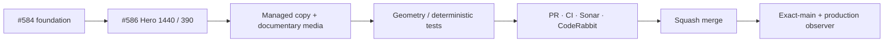

# BRVTAL — Último deploy

  
  
  

> **Development dashboard** · snapshot de **solo el deploy actual** para Issue #586.

## Progress convention

- ✅ ~~Struck through~~ = completed and verified through the required delivery gates.
- 🚧 Normal text = pending or currently in progress.

## Estado del deploy

| Señal | Estado | Evidencia |
| --- | --- | --- |
| Work line | 🚧 **#586 · Concept 05 authored Hero 1440/390** | parent #583 |
| Base exacta | ✅ ~~main v0.1.26 validado y observado~~ | `67be14f1942aafaecae6ee9f6ca58f733a2b93bd` |
| Versión | 🚧 **0.1.27** | cambio visible de producto/runtime público |
| Producción | 🚧 pendiente de merge + observación | sin migración de datos |

## Huella del cambio

<!-- brvtal:git-delta -->

| Archivos | Inserciones | Eliminaciones | Neto |
| ---: | ---: | ---: | ---: |
| **8** | **+921** | **−53** | **+868** |

## Calidad y entrega

<!-- brvtal:gate-plan -->

| Control | Estado / contrato |
| --- | --- |
| Gates | **preflight · coordination · fast[PHP+JS] · database · chromium · real-stack · webkit** |
| Reservation | Issue #586 · `work/issue-586` · UUID `6affb2ca-c9ef-46b4-a21f-55dc1bc13f74` |
| PR integrity | **PR + snapshot exacto** contra `main` |
| Browser | 🚧 geometría authored 1440/390 + data projection + visual-test mode |
| Sonar / CodeRabbit | 🚧 pendientes sobre el head de PR |
| Exact-main | **CI del SHA exacto de main** después del squash merge |

## Flujo de entrega

## Qué se hizo

- Se convierte el primer viewport estático en una composición editorial Concept 05 distinta para desktop 1440 y mobile 390.
- Desktop usa campo negro estructural, contaminación roja, wordmark sobredimensionado, statement lateral y documento fotográfico superpuesto.
- Mobile recompone la jerarquía en vez de comprimir desktop: wordmark apilado, statement, fotografía y navegación inferior permanecen contenidos.
- El statement reutiliza tagline/description administrables y el Hero Slider sigue siendo autoritativo cuando está habilitado.
- La fotografía documental se proyecta desde datos públicos reales, priorizando Memories curadas y reutilizando el payload existente sin una segunda petición.
- Si no existe material público utilizable, la superficie documental permanece oculta; no se inventa contenido.
- Motion GSAP queda acotado a entrada jerárquica y se desactiva con reduced-motion o `c5-visual-test`.
- Se añadieron contratos PHP y Playwright para idempotencia, 1440/390, no-overflow, CTA, media/copy projection y determinismo.

## Archivos modificados en este deploy

- `README.md` — snapshot exacto de #586.
- `config/public_home.php` — proyección authored Hero y hooks administrables.
- `config/version.php` — versión 0.1.27.
- `css/public-concept05-hero.css` — composiciones desktop/mobile Concept 05.
- `js/public-concept05-hero.js` — proyección de settings/media y motion del Hero.
- `package.json` — versión 0.1.27.
- `tests/e2e/public-concept05-hero.spec.mjs` — geometría y comportamiento real.
- `tests/public-concept05-dressing-contract.php` — contrato de integración/idempotencia.

## Validación

- Base exacta: `67be14f1942aafaecae6ee9f6ca58f733a2b93bd`, con CI exact-main y Production Deploy Observer verdes.
- La implementación conserva el Hero Slider administrable existente: cuando `.hero-slider-active` existe, el slider canónico mantiene ownership del primer viewport.
- El runtime Concept 05 reutiliza `window.BRVTALPublicDataPromise`; no añade otra petición pública.
- No hay migraciones, contenido ficticio ni un segundo subsistema de Theme Studio.
- Merge únicamente después de CI, Sonar y revisión del head estable.

## Qué sigue

| Lane | Trabajo |
| --- | --- |
| **NOW** | 🚧 [#586](https://github.com/pl0n3r/brvtal/issues/586) · Hero Concept 05 authored 1440/390. |
| **NEXT** | 🚧 [#583](https://github.com/pl0n3r/brvtal/issues/583) · continuar fidelidad Concept 05 con el siguiente slice dependiente. |
| **LATER** | 🚧 [#182](https://github.com/pl0n3r/brvtal/issues/182), [#252](https://github.com/pl0n3r/brvtal/issues/252), [#528](https://github.com/pl0n3r/brvtal/issues/528). |
| **BLOCKED / EXTERNAL** | 🚧 Ningún bloqueo externo activo para #586. |

## Panorama general pendiente

| Lane | Frente | Issues |
| --- | --- | --- |
| **NOW** | 🚧 Concept 05 first viewport | 🚧 [#586](https://github.com/pl0n3r/brvtal/issues/586) |
| **NEXT** | 🚧 visual fidelity / connected cultural archive | 🚧 [#583](https://github.com/pl0n3r/brvtal/issues/583), [#398](https://github.com/pl0n3r/brvtal/issues/398) |
| **LATER** | 🚧 editorial trust / drafts | 🚧 [#182](https://github.com/pl0n3r/brvtal/issues/182), [#252](https://github.com/pl0n3r/brvtal/issues/252), [#528](https://github.com/pl0n3r/brvtal/issues/528) |
