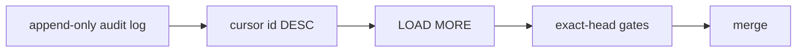

# BRVTAL — Último deploy

> Snapshot de **solo el deploy actual** para #232 / PR #703: paginación estable de Admin Activity y Editorial Version History. No declara producción GREEN.

## Progress convention
- ✅ ~~Struck through~~ = completed and verified through required gates.
- 🚧 Normal text = pending/in progress.
- ⛔ = active production blocker.

## Estado del deploy
| Señal | Estado | Evidencia |
| --- | --- | --- |
| Work line | 🚧 **#232 · audit history pagination** | `work/issue-232` · reserva `0976b7af-24ae-47fd-94c8-81e12aaa4f66` |
| Base exacta | ✅ **main** | `e264ded7147b4ef230876d890828bc7723631768` |
| Versión de producto | 🚧 **v0.1.62** | `config/version.php` + `package.json` |
| Producción | ⛔ **NO GREEN · #681** | recuperación de migraciones pendiente |
| PR | 🚧 **#703 draft** | branch mergeable |

## Huella del cambio
<!-- brvtal:git-delta -->
| Archivos | Inserciones | Eliminaciones | Neto |
| ---: | ---: | ---: | ---: |
| **8** | **+261** | **−57** | **+204** |

## Calidad y entrega
<!-- brvtal:gate-plan -->
| Control | Estado / contrato |
| --- | --- |
| Gates esperados | **preflight · coordination · fast[PHP+JS] · database · chromium · real-stack** |
| PR + snapshot exacto | **#703 · #232 audit history pagination** |
| Roles | **Software Engineering · QA** |
| Review | BRVTAL CI + Factory Policy/Privacy + Sonar/CodeRabbit |
| CI del SHA exacto de main | 🚧 obligatorio después del merge |
| Production GREEN | ⛔ fuera de alcance mientras #681 siga abierto |

## Flujo de entrega

## Qué se hizo
- Admin Activity acepta cursor descendente por `id`, sin `OFFSET`.
- La API consulta `limit + 1` y expone `next_cursor`, `has_more` y `returned`.
- `total` permanece filtrado pero independiente de la posición del cursor.
- Activity y History cargan páginas antiguas mediante **LOAD MORE** sin recargar la aplicación.
- History conserva snapshots `before/after` en páginas posteriores.
- MariaDB prueba páginas no solapadas y estabilidad ante una inserción nueva entre páginas.

## Archivos modificados en este deploy
- `README.md`
- `api/admin-activity.php`
- `config/admin_activity.php`
- `config/version.php`
- `discadmin/admin-activity.js`
- `package.json`
- `tests/admin-activity-contract.php`
- `tests/integration/admin-activity.php`

## Validación
- 🚧 BRVTAL CI sobre el HEAD exacto de PR #703.
- 🚧 Factory Policy/Privacy y Sonar/CodeRabbit terminales antes de merge.
- 🚧 Validación exact-main obligatoria tras integración.

## Qué sigue
| Lane | Trabajo |
| --- | --- |
| **NOW** | 🚧 [#232](https://github.com/pl0n3r/brvtal/issues/232): cerrar cursor pagination y gates. |
| **NEXT** | 🚧 [#530](https://github.com/pl0n3r/brvtal/issues/530): recycle bin/restauración segura, sujeto a dispatcher. |
| **LATER** | 🚧 [#533](https://github.com/pl0n3r/brvtal/issues/533): continuar roadmap canónico. |
| **BLOCKED / EXTERNAL** | 🚧 [#681](https://github.com/pl0n3r/brvtal/issues/681): producción no GREEN por registry de migraciones. |

## Panorama general pendiente
- 🚧 **NOW:** #232 audit history pagination.
- 🚧 **NEXT:** siguiente Issue disponible por dispatcher.
- 🚧 **LATER:** #533 roadmap canónico.
- 🚧 **BLOCKED / EXTERNAL:** #681 producción.
