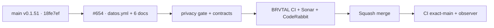

# BRVTAL — Último deploy

  
  
  

> Snapshot de **solo el deploy actual**: #654 adopta privacidad como código de Factory con seis documentos canónicos. Base exacta `main` v0.1.51 `18fe7ef118645d791653916ca7d65e2699bb1435`; candidata **v0.1.52**.

## Progress convention

- ✅ ~~Struck through~~ = completed and verified through the required delivery gates.
- 🚧 Normal text = pending or currently in progress.

## Estado del deploy

| Señal | Estado | Evidencia |
| --- | --- | --- |
| Work line | 🚧 **#654 · privacy as code** | `work/issue-654`; reserva `a84619b3-90b8-4847-8bfd-9f7c2d2597f7` |
| Base exacta | ✅ ~~main v0.1.51~~ | `18fe7ef118645d791653916ca7d65e2699bb1435` |
| Versión objetivo | 🚧 **v0.1.52** | `config/version.php` + `package.json` |
| CI/Sonar/CodeRabbit | 🚧 pendiente | revalidar HEAD final |
| Producción | 🚧 pendiente | merge → exact-main → observer → validación |

## Huella del cambio

<!-- brvtal:git-delta -->

| Archivos | Inserciones | Eliminaciones | Neto |
| ---: | ---: | ---: | ---: |
| **17** | **+844** | **−47** | **+797** |

## Calidad y entrega

<!-- brvtal:gate-plan -->

| Control | Estado / contrato |
| --- | --- |
| Gates esperados | **preflight · coordination · fast[PHP+JS] · database · chromium · real-stack · webkit · recovery** |
| PR + snapshot exacto | Issue #654 · reserva `a84619b3-90b8-4847-8bfd-9f7c2d2597f7` |
| Privacy gate | Factory `4b2be9fcf827278631caa3e3e68603b6e2a680d7`, seis documentos |
| CodeRabbit / Sonar | 🚧 revisión del HEAD estable |
| CI del SHA exacto de main | 🚧 después del merge |

## Flujo de entrega

## Qué se hizo

- Documenta identidad/admin, contraseña, TOTP y recuperación sin secretos ni PII real.
- Documenta contacto público como entrega transitoria; no afirma persistencia en la base BRVTAL.
- Documenta rate limits mediante hashes derivados; la retención física queda `review_required` mientras las ventanas operativas de 15 minutos se verifican por contrato.
- Declara Google Analytics solo para la capa pública GTM respaldada por código; configuración externa y retención siguen `review_required`.
- Mantiene desconocido el proveedor real de correo/MTA en vez de inventarlo.
- Genera exactamente seis documentos desde Factory y conserva responsable/bases/consentimientos como `[COMPLETAR POR EL DUEÑO]` / `review_required`.
- Añade callers mínimos, sin secretos, fijados a Factory `4b2be9fcf827278631caa3e3e68603b6e2a680d7`.
- El contrato reconstruye desde `datos.yml` las filas/bloques relevantes de política, aviso, registro y retención, sin fijar snapshots SHA-256 permanentes.
- Compacta `AGENTS.md` de 362 a 359 líneas sin eliminar reglas, restaurando el contrato heredado de máximo 360 líneas.
- Asegura que cambios solo en `docs/privacidad/` ejecuten el contrato PHP y fija esa selección con una regresión de `ci-scope`.
- Refuerza la exclusividad de Google Analytics: solo `public_gtm_measurement` puede declararlo como proveedor.
- Separa retención física de expiración operativa: TOTP pendiente sigue utilizable 10 minutos pero vive como máximo con la sesión de 30 días; los archivos de rate-limit quedan `review_required` hasta existir una política de limpieza observable.
- Restaura un señuelo `data-measure-email` y verifica por eventos reales que ningún valor declarativo, de formulario o query llegue al `dataLayer`.

## Archivos modificados en este deploy

- `.github/workflows/auditoria-privacidad.yml`
- `.github/workflows/privacidad.yml`
- `AGENTS.md`
- `README.md`
- `config/version.php`
- `datos.yml`
- `docs/privacidad/aviso-privacidad.md`
- `docs/privacidad/canal-derechos.md`
- `docs/privacidad/politica-tratamiento.md`
- `docs/privacidad/registro-tratamientos.md`
- `docs/privacidad/retencion.md`
- `docs/privacidad/terminos-condiciones.md`
- `package.json`
- `scripts/ci-scope.sh`
- `tests/ci-scope-contract.php`
- `tests/e2e/public-measurement.spec.mjs`
- `tests/privacy-as-code-contract.php`

## Validación

- 🚧 BRVTAL CI debe validar contratos PHP/JS, MariaDB, Chromium, real-stack y WebKit sobre el HEAD final.
- 🚧 Privacy reusable debe comparar `datos.yml` y los seis documentos contra Factory.
- 🚧 Sonar y CodeRabbit deben revisar el HEAD estable antes del merge.
- La revisión jurídica humana permanece separada; estos documentos no declaran cumplimiento legal.

## Qué sigue

| Lane | Trabajo |
| --- | --- |
| **NOW** | 🚧 [#654](https://github.com/pl0n3r/brvtal/issues/654): cerrar privacidad como código con gates verdes. |
| **NEXT** | 🚧 [Factory #54](https://github.com/pl0n3r/factory/issues/54): revalidar adopciones Condor/GrindFlow/BRVTAL. |
| **LATER** | 🚧 [#533](https://github.com/pl0n3r/brvtal/issues/533): continuar Roadmap tras TANDA 1. |
| **BLOCKED / EXTERNAL** | 🚧 revisión jurídica material y Factory `v1.0.0` permanecen separados del merge técnico. |

## Panorama general pendiente

- 🚧 **NOW**: integrar #654 sin inventar proveedor de correo ni configuración GTM externa.
- 🚧 **NEXT**: aportar evidencia de BRVTAL a Factory #54.
- 🚧 **LATER**: mantener producción verde durante el cierre de TANDA 1.
- 🚧 **BLOCKED / EXTERNAL**: TANDA 2 sigue prohibida hasta Factory `v1.0.0`.
