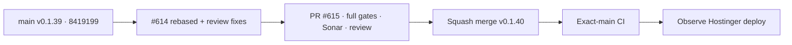

# BRVTAL — Último deploy

  
  
  

> **Development dashboard** · snapshot de **solo el deploy actual** para Issue #614.

## Progress convention

- ✅ ~~Struck through~~ = completed and verified through the required delivery gates.
- 🚧 Normal text = pending or currently in progress.

## Estado del deploy

| Señal | Estado | Evidencia |
| --- | --- | --- |
| Work line | 🚧 **#614 · Media Engine v3 incremental + traceable** | PR #615 recuperado y rebasado sobre main limpio |
| Base exacta | ✅ ~~main v0.1.39 exact-main CI verde~~ | `841919920f6e2b1ac5407813ccb199ea48891caf` |
| Versión | 🚧 **0.1.40 candidate** | runtime/media deploy-bound |
| Producción | 🚧 pendiente merge + exact-main + observación Hostinger | migración #610 sigue separada y manual |

## Huella del cambio

<!-- brvtal:git-delta -->

| Archivos | Inserciones | Eliminaciones | Neto |
| ---: | ---: | ---: | ---: |
| **11** | **+935** | **−133** | **+802** |

## Calidad y entrega

<!-- brvtal:gate-plan -->

| Control | Estado / contrato |
| --- | --- |
| Gates | **preflight · coordination · fast[PHP+JS] · database · chromium · real-stack · webkit** |
| PR integrity | **PR + snapshot exacto** · Issue #614 · `work/issue-614` · UUID `24fceb63-6137-4181-bff4-a297e3030804` |
| Incremental generation | 🚧 source/policy/focal-aware reuse · selective crops · missing derivative repair |
| Physical dedup | 🚧 `w1920 → display` alias cuando el output es equivalente |
| Atomicity | 🚧 staged variants + rollback + sidecar commit |
| Transform serialization | 🚧 row lock `FOR UPDATE` durante generación/commit/cleanup |
| Operator feedback | 🚧 decode/runtime causes separados · un solo aviso accesible por degradación |
| Test isolation | 🚧 fixtures únicos + cleanup garantizado al salir |
| Sonar | 🚧 stable-head analysis |
| CodeRabbit | 🚧 stable-head review after addressed findings |
| CI del SHA exacto de main | 🚧 después del squash merge |

## Flujo de entrega

## Qué se hizo

- Media Engine v3 conserva el original como autoridad y decide por variante entre **reuse / repair / generate** según source hash, policy y focal point.
- Los crops dependientes del focal se regeneran de forma selectiva; los preserve-aspect válidos se reutilizan.
- `w1920` puede aliasar físicamente `display` sin romper las claves públicas lógicas.
- Sidecar y derivados se preparan en staging, con rollback si la generación queda incompleta.
- DISCADMIN expone estado de optimización, huella física/lógica y degradación sin presentar éxito falso.
- La revisión detectó y se corrigió concurrencia entre transforms: la fila del asset queda bloqueada hasta terminar sidecar + cleanup.
- Se separó `IMAGE_DECODE_FAILED` de `GD_WEBP_UNAVAILABLE`, se eliminó el toast duplicado y los fixtures de optimización quedaron aislados/autolimpiables.
- #616 ya eliminó la carrera ajena al Media Engine que bloqueaba Chromium; #615 fue rebasado sobre ese `main` exacto.

## Archivos modificados en este deploy

- `README.md`
- `api/media-library.php`
- `config/media.php`
- `config/version.php`
- `discadmin/media-library.css`
- `discadmin/media-library.js`
- `docs/BRVTAL-SPEC.md`
- `package.json`
- `tests/e2e/discadmin-media.spec.mjs`
- `tests/media-library-contract.php`
- `tests/media-optimization-contract.php`

## Validación

- Base exacta `841919920f6e2b1ac5407813ccb199ea48891caf`: **BRVTAL CI success** (run 35858679073).
- El mismo SHA: **Production Deploy Observer success** (35858679071) y **Production Performance success** (35858913918).
- La reserva de #614 fue recuperada canónicamente; PR #615 quedó `behind_by=0` y mergeable antes del snapshot final.
- Los cuatro hallazgos funcionales de CodeRabbit se verificaron contra el código y se corrigieron en el nuevo HEAD.
- Pendiente: nueva matriz completa sobre HEAD estable, revisión final, squash merge, exact-main y observación de deploy.

## Qué sigue

| Lane | Trabajo |
| --- | --- |
| **NOW** | 🚧 [#614](https://github.com/pl0n3r/brvtal/issues/614) / PR #615 · cerrar gates y revisión de Media Engine v3. |
| **NEXT** | 🚧 [#531](https://github.com/pl0n3r/brvtal/issues/531) · cerrar el frente Media Library smarter después de v0.1.40. |
| **LATER** | 🚧 [#398](https://github.com/pl0n3r/brvtal/issues/398) · archivo cultural conectado; [#530](https://github.com/pl0n3r/brvtal/issues/530) · recycle bin. |
| **BLOCKED / EXTERNAL** | 🚧 `migration_media_content_hash_01.sql` requiere autorización explícita y no forma parte de #615. |

## Panorama general pendiente

| Lane | Frente | Issues |
| --- | --- | --- |
| **NOW** | 🚧 Media Engine v3 | 🚧 [#614](https://github.com/pl0n3r/brvtal/issues/614), [#531](https://github.com/pl0n3r/brvtal/issues/531) |
| **NEXT** | 🚧 Archive / public cultural graph | 🚧 [#398](https://github.com/pl0n3r/brvtal/issues/398) |
| **LATER** | 🚧 Admin resilience / editorial debt | 🚧 [#530](https://github.com/pl0n3r/brvtal/issues/530), [#528](https://github.com/pl0n3r/brvtal/issues/528) |
