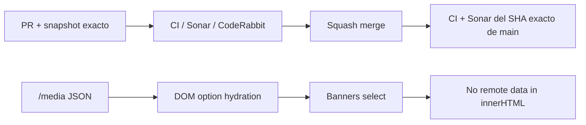

# BRVTAL — Último deploy

  
  
  

> **Development dashboard** · snapshot profesional de **solo el deploy actual**.

## Progress convention

- ✅ ~~Struck through~~ = completed and verified through the required delivery gates.
- 🚧 Normal text = pending or currently in progress.
- Completed roadmap items remain visible and crossed out.

## Estado del deploy

| Señal | Estado | Evidencia |
| --- | --- | --- |
| Work line | 🚧 **#553 SONAR SECURITY HOTFIX** | Banners Media pickers: datos remotos → DOM seguro |
| Base exacta | ✅ **VALIDATED IN CODE** | `main` `bb15923a431ba072fef76212cec8e5e4350864f3` · #554 mergeado; exact-main Sonar detectó `jssecurity:S5696` |
| Version | 🚧 **0.1.8 → 0.1.9** | patch hotfix · pre-1.0 |
| Producción | ⛔ **BLOCKED / EXTERNAL** | Hostinger marker tracked in [#534](https://github.com/pl0n3r/brvtal/issues/534) |

## Huella del cambio

<!-- brvtal:git-delta -->

| Archivos | Inserciones | Eliminaciones | Neto |
| ---: | ---: | ---: | ---: |
| **5** | **+75** | **−52** | **+23** |

## Calidad y entrega

<!-- brvtal:gate-plan -->

| Control | Estado / contrato |
| --- | --- |
| Gates seleccionados | **preflight · fast[JS] · chromium** |
| Security | `/media` title/path no entra en HTML; opciones creadas con DOM APIs + `textContent` |
| Browser | payloads con forma de markup permanecen texto inerte dentro de los Media pickers |
| Sonar + CodeRabbit | ejecutados en paralelo; objetivo exact-main: Security Rating **A** / 0 vulnerabilidades nuevas |
| Exact-main | CI del SHA exacto de main + Sonar obligatorios tras squash merge |

## Flujo de entrega

## Qué se hizo

- Diagnostica el fallo exact-main de Sonar mediante su API pública y confirma `discadmin/hero-slider.js` / `jssecurity:S5696`.
- Elimina el flujo de `file_path` / title remotos hacia el HTML del editor de Banners.
- Mantiene el shell del editor estático y llena cada selector de Media con `document.createElement('option')`, `value` y `textContent`.
- Añade regresión Playwright con valores Media que parecen markup ejecutable.
- Retira el workflow diagnóstico temporal antes del merge.
- Documenta la frontera de seguridad durable y sube BRVTAL a **0.1.9**.

## Archivos modificados en este deploy

- `AGENTS.md` — frontera durable para Media/API → Banners.
- `README.md` — snapshot exacto de esta hotfix.
- `config/version.php` — versión humana 0.1.9.
- `discadmin/hero-slider.js` — hidratación DOM segura de Media pickers.
- `tests/e2e/discadmin-hero-slider-security.spec.mjs` — regresión XSS de Media Library.

## Validación

- La fuente remota `/media` ya no puede construir `<option>` mediante concatenación HTML.
- El selector conserva path/título literales aunque contengan caracteres con forma de markup.
- El flujo de edición existente sigue usando el mismo input/select y la misma selección de assets.
- El workflow diagnóstico temporal no forma parte del diff final.
- No hay migración, SQL ni operación destructiva de producción.

## Qué sigue

| Lane | Trabajo |
| --- | --- |
| **NOW** | 🚧 [#553](https://github.com/pl0n3r/brvtal/issues/553) · lograr exact-main Sonar Security Rating A y cerrar la hotfix. |
| **NEXT** | 🚧 [#523](https://github.com/pl0n3r/brvtal/issues/523) · optimizar primer load de Banners. |
| **LATER** | 🚧 [#480](https://github.com/pl0n3r/brvtal/issues/480), [#193](https://github.com/pl0n3r/brvtal/issues/193), [#216](https://github.com/pl0n3r/brvtal/issues/216) · cerrar Phase 2. |
| **BLOCKED / EXTERNAL** | 🚧 [#534](https://github.com/pl0n3r/brvtal/issues/534) · Hostinger Git auto-deploy marker. |

## Panorama general pendiente

| Lane | Frente | Issues |
| --- | --- | --- |
| **DONE** | ✅ ~~Phase 1 + Admin IA + Appearance + Premium Admin + Settings~~ | ✅ ~~[#527](https://github.com/pl0n3r/brvtal/issues/527), [#520](https://github.com/pl0n3r/brvtal/issues/520), [#521](https://github.com/pl0n3r/brvtal/issues/521), [#526](https://github.com/pl0n3r/brvtal/issues/526), [#522](https://github.com/pl0n3r/brvtal/issues/522), [#479](https://github.com/pl0n3r/brvtal/issues/479), [#517](https://github.com/pl0n3r/brvtal/issues/517), [#221](https://github.com/pl0n3r/brvtal/issues/221), [#348](https://github.com/pl0n3r/brvtal/issues/348), [#149](https://github.com/pl0n3r/brvtal/issues/149), [#514](https://github.com/pl0n3r/brvtal/issues/514), [#516](https://github.com/pl0n3r/brvtal/issues/516)~~ |
| **NOW** | 🚧 Security quality | 🚧 [#553](https://github.com/pl0n3r/brvtal/issues/553) |
| **NEXT** | 🚧 Phase 2 closeout | 🚧 [#523](https://github.com/pl0n3r/brvtal/issues/523), [#480](https://github.com/pl0n3r/brvtal/issues/480), [#193](https://github.com/pl0n3r/brvtal/issues/193), [#216](https://github.com/pl0n3r/brvtal/issues/216) |
| **LATER** | 🚧 Editorial productivity | 🚧 [#519](https://github.com/pl0n3r/brvtal/issues/519), [#518](https://github.com/pl0n3r/brvtal/issues/518), [#257](https://github.com/pl0n3r/brvtal/issues/257), [#525](https://github.com/pl0n3r/brvtal/issues/525), [#524](https://github.com/pl0n3r/brvtal/issues/524), [#528](https://github.com/pl0n3r/brvtal/issues/528), [#529](https://github.com/pl0n3r/brvtal/issues/529) |
| **LATER** | 🚧 Operational dashboards | 🚧 [#513](https://github.com/pl0n3r/brvtal/issues/513), [#515](https://github.com/pl0n3r/brvtal/issues/515), [#532](https://github.com/pl0n3r/brvtal/issues/532) |
| **BLOCKED / EXTERNAL** | 🚧 Deploy observation | 🚧 [#534](https://github.com/pl0n3r/brvtal/issues/534) |
