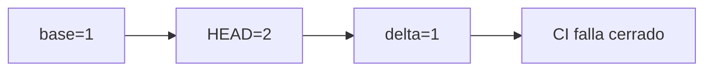

# BRVTAL — Último deploy

> Snapshot de **solo el deploy actual** y del cambio repository-only #695: preserva errores globales duplicados en PHPStan incremental. Sin cambios de producto, versión, Hostinger, DB o producción.

## Progress convention
- ✅ ~~Struck through~~ = completed and verified through required gates.
- 🚧 Normal text = pending/in progress.
- ⛔ = active production blocker.

## Estado del deploy
| Señal | Estado | Evidencia |
| --- | --- | --- |
| Work line | 🚧 **#695 · PHPStan multiset** | `work/issue-695` · reserva `db81cf2a-7c97-4065-a488-d5fe145133b0` |
| Base exacta | ✅ **main v0.1.58** | `10e4c827ccfda4db92aa7e9119fb7b803fb6879d` |
| Versión de producto | ✅ **v0.1.58 sin cambio** | repository-only |
| Producción | ⛔ **NO GREEN · #681** | health 503; registry de migraciones |
| Factory labels | ⛔ **#694** | pendiente Factory v1.0.5 |

## Huella del cambio
<!-- brvtal:git-delta -->
| Archivos | Inserciones | Eliminaciones | Neto |
| ---: | ---: | ---: | ---: |
| **3** | **+59** | **−64** | **−5** |

## Calidad y entrega
<!-- brvtal:gate-plan -->
| Control | Estado / contrato |
| --- | --- |
| Gates esperados | **preflight · coordination · fast[PHP+JS]** |
| PR + snapshot exacto | **Issue #695 · mismo runtime/versionado** |
| Roles | **Software Engineering · QA · Security** |
| Trust boundary | solo PHPStan JSON; ningún secreto o dato personal |
| Review | BRVTAL CI / validate + Sonar/CodeQL/CodeRabbit |
| CI del SHA exacto de main | 🚧 verificar en entrega |
| Production GREEN | ⛔ bloqueado por #681 y #694; fuera de alcance |

## Flujo de entrega

## Qué se hizo
- Cuenta globales repetidos con un Counter de iterable, no un dict que los colapsa.
- Regresión base=1/HEAD=2; duplicados heredados o reducidos no introducen deuda.
- Preserva matching por archivo, normalización de rutas y códigos CLI.
- Sin dependencias, permisos, cambios productivos ni SQL.

## Archivos modificados en este deploy
- `README.md`
- `scripts/phpstan_diff.py`
- `tests/test_phpstan_diff.py`

## Validación
- 🚧 `python3 -m unittest tests.test_phpstan_diff` y gates exact-head.
- 🚧 README exacto y revisión de seguridad antes del merge.

## Qué sigue
| Lane | Trabajo |
| --- | --- |
| **NOW** | 🚧 [#695](https://github.com/pl0n3r/brvtal/issues/695): validar multiset. |
| **NEXT** | 🚧 [#653](https://github.com/pl0n3r/brvtal/issues/653): PHPStan/Rector. |
| **LATER** | 🚧 [#630](https://github.com/pl0n3r/brvtal/issues/630): adopción Factory. |
| **BLOCKED / EXTERNAL** | 🚧 [#681](https://github.com/pl0n3r/brvtal/issues/681) recovery · [#694](https://github.com/pl0n3r/brvtal/issues/694) Factory @v1. |

## Panorama general pendiente
- 🚧 **NOW:** #695 regresión PHPStan.
- 🚧 **NEXT:** #653 análisis incremental.
- 🚧 **LATER:** #630 adopción Factory.
- 🚧 **BLOCKED / EXTERNAL:** #681 health 503; #694 Factory Labels.
