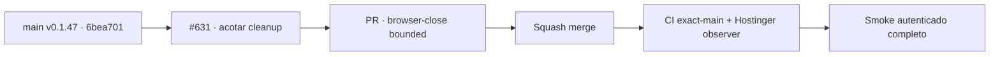

# BRVTAL — Último deploy

  
  
  

> **Production incident #631** · snapshot de **solo el deploy actual**: v0.1.47 exact `main` `6bea701a2f69501c61713a3d0ce95cd50a399f53` tiene CI exact-main y Deploy Observer verdes. Smoke autenticado #35940837144 fue ejecutado con watchdog acotado; la auditoría en vivo detectó que el cleanup podía desactivar el watchdog antes de `browser.close()`. **Engineering roles:** SRE / production incident responder, QA automation engineer.

## Progress convention

- ✅ ~~Struck through~~ = completed and verified through the required delivery gates.
- 🚧 Normal text = pending or currently in progress.

## Estado del deploy

| Señal | Estado | Evidencia |
| --- | --- | --- |
| Work line | 🚧 **#631 · bounded smoke cleanup** | `work/issue-631`; reserva `53201ee4-e329-438f-95fd-e89b7dcdbba5` |
| Base exacta | ✅ ~~main v0.1.47~~ | `6bea701a2f69501c61713a3d0ce95cd50a399f53` |
| Versión | ✅ ~~v0.1.47 sin incremento~~ | mantenimiento exclusivo de prueba/documentación |
| CI del SHA exacto de main | ✅ ~~success~~ | [#35940651923](https://github.com/pl0n3r/brvtal/actions/runs/35940651923) |
| Deploy Observer base | ✅ ~~success~~ | [#35940651930](https://github.com/pl0n3r/brvtal/actions/runs/35940651930) |
| Smoke autenticado base | 🚧 **executed / diagnostic** | [#35940837144](https://github.com/pl0n3r/brvtal/actions/runs/35940837144) · exact `6bea701a…`; cleanup sin bound efectivo detectado |
| Entrega candidata | 🚧 cleanup acotado | preservar fallo primario y terminar proceso si Chromium no cierra |

## Huella del cambio

<!-- brvtal:git-delta -->

| Archivos | Inserciones | Eliminaciones | Neto |
| ---: | ---: | ---: | ---: |
| **2** | **+49** | **−33** | **+16** |

## Calidad y entrega

<!-- brvtal:gate-plan -->

| Control | Estado / contrato |
| --- | --- |
| Gates | **preflight · coordination · fast[JS] · chromium** |
| PR + snapshot exacto | Issue #631 · reserva `53201ee4-e329-438f-95fd-e89b7dcdbba5` |
| CodeRabbit / Sonar | 🚧 validar HEAD estable; máximo 3 rondas automáticas |
| CI del SHA exacto de main | 🚧 después del merge |
| Producción | 🚧 ejecutar smoke nuevo y exigir terminación + evidencia completa |

## Flujo de entrega

## Qué se hizo

- Mantener activo el watchdog global durante el cierre de Chromium.
- Tratar `browser.close()` como operación acotada de cleanup (máximo 10 s por defecto), persistiendo `cleanupError` si falla.
- Preservar el error primario cuando ya existe; un fallo adicional de cleanup no borra la causa inicial.
- Forzar salida no-cero después de persistir evidencia si Chromium no termina, de modo que los pasos `always()` puedan publicar el artefacto.
- Mantener el smoke estrictamente read-only y sin cambios de runtime/producto.

## Archivos modificados en este deploy

- `README.md` — snapshot exacto del segundo cierre de #631.
- `tests/e2e/production-authenticated-smoke.mjs` — cleanup de Chromium acotado y evidencia de fallo de cleanup.

## Validación

- ✅ ~~Base v0.1.47 exacta: CI #35940651923 y observer #35940651930 aprobaron sobre `6bea701a…`.~~
- 🚧 Smoke #35940837144 se ejecutó sobre la base exacta; el resultado no constituye GREEN mientras el proceso no termine y el artefacto no acredite todas las aserciones.
- ✅ ~~Auditoría estática: el watchdog anterior se limpiaba antes de `browser.close()`, dejando una ruta de hang fuera de su protección.~~
- 🚧 PR CI/Chromium, revisión, merge y smoke ejecutado final pendientes; **no declarar PRODUCTION GREEN** antes.

## Qué sigue

| Lane | Trabajo |
| --- | --- |
| **NOW** | 🚧 [#631](https://github.com/pl0n3r/brvtal/issues/631): cerrar cleanup, mergear y ejecutar smoke final. |
| **NEXT** | 🚧 [#533](https://github.com/pl0n3r/brvtal/issues/533): publicar `🟢 PRODUCTION GREEN` solo con las cinco evidencias. |
| **LATER** | 🚧 retomar backlog de producto después de GREEN y de la barrera global de Tanda 1. |
| **BLOCKED / EXTERNAL** | 🚧 Tanda 2 requiere factory `v1.0.0` y GREEN en los tres repos. |

## Panorama general pendiente

- 🚧 **NOW**: smoke final debe terminar y acreditar health/SHA/DB, Home/Admin/Dashboard, Events/date, Sets, Hero y ausencia de 5xx.
- 🚧 **NEXT**: cerrar #631 y registrar GREEN en #533.
- 🚧 **LATER**: esperar la Tanda 1 global antes de adoptar el kit factory.
- 🚧 **BLOCKED / EXTERNAL**: BRVTAL sigue sin GREEN hasta smoke final aprobado.
