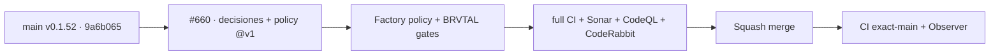

# BRVTAL — Último deploy

  
  
  

> Snapshot de **solo el deploy actual**: #660 inicia TANDA 2 adoptando decisiones como código y
> el gate de política publicado por `pl0n3r/factory@v1`. Base exacta
> `main 9a6b065db608de1a53a09a98d415a2cb7bd18a95` / v0.1.52, con exact-main CI,
> Deploy Observer y CodeQL verdes. Es gobernanza/CI: no cambia runtime ni versión de producto.

## Progress convention

- ✅ ~~Struck through~~ = completed and verified through the required delivery gates.
- 🚧 Normal text = pending or currently in progress.

## Estado del deploy

| Señal | Estado | Evidencia |
| --- | --- | --- |
| Work line | 🚧 **#660 · Factory policy** | `work/issue-660`; reserva `213940b9-aa7e-4833-9def-2c23887865e5` |
| Base exacta | ✅ ~~main v0.1.52~~ | `9a6b065db608de1a53a09a98d415a2cb7bd18a95` |
| Versión producto | ✅ ~~v0.1.52 sin cambio~~ | gobernanza/CI; no deploy-bound |
| Factory channel | ✅ ~~`@v1` publicado~~ | caller usa el canal mayor protegido; sin `kit_ref` dinámico |
| CI/Sonar/CodeRabbit | 🚧 pendiente | revalidar HEAD final |
| Producción | ✅ ~~sin cambio de runtime~~ | Observer base verde; este slice no escribe producción |

## Huella del cambio

<!-- brvtal:git-delta -->

| Archivos | Inserciones | Eliminaciones | Neto |
| ---: | ---: | ---: | ---: |
| **6** | **+156** | **−33** | **+123** |

## Calidad y entrega

<!-- brvtal:gate-plan -->

| Control | Estado / contrato |
| --- | --- |
| Gates esperados | **preflight · coordination · fast[PHP+JS] · database · chromium · real-stack · webkit · recovery** |
| PR + snapshot exacto | Issue #660 · reserva `213940b9-aa7e-4833-9def-2c23887865e5` |
| Factory policy | `decisiones.yml` schema v1 · review rounds ≤ 3 · caller `politica.yml@v1` |
| Existing gates | BRVTAL CI, Privacy, Sonar, CodeQL y CodeRabbit permanecen activos |
| CI del SHA exacto de main | 🚧 después del merge |

## Flujo de entrega

## Qué se hizo

- Añade `decisiones.yml` con las cinco decisiones compartidas ya publicadas por Factory y límite de tres rondas automáticas.
- Añade caller read-only para `pl0n3r/factory/.github/workflows/politica.yml@v1` usando el número real del PR.
- El caller no acepta `kit_ref`, no hereda secretos y no usa `pull_request_target` ni `workflow_dispatch`.
- Añade contrato PHP que congela esquema, IDs de decisiones, límites de seguridad y frontera del caller.
- Clasifica `decisiones.yml` como gobernanza no deploy-bound, pero ejecuta el contrato PHP cuando cambia.
- Mantiene intactos CI, Privacy, Sonar, CodeQL, CodeRabbit, runtime, datos y versión de producto.

## Archivos modificados en este deploy

- `.github/workflows/factory-policy.yml`
- `README.md`
- `decisiones.yml`
- `scripts/ci-scope.sh`
- `tests/ci-scope-contract.php`
- `tests/factory-policy-contract.php`

## Validación

- 🚧 BRVTAL CI debe ejecutar matriz completa porque cambia el clasificador `scripts/ci-scope.sh`.
- 🚧 El workflow Factory Policy debe validar `decisiones.yml` y el límite observado de reviews en el PR real.
- 🚧 Sonar, CodeQL y CodeRabbit deben terminar sobre el HEAD estable antes del merge.
- No se retira ningún gate existente ni se realiza escritura productiva.

## Qué sigue

| Lane | Trabajo |
| --- | --- |
| **NOW** | 🚧 [#660](https://github.com/pl0n3r/brvtal/issues/660): decisiones como código + policy Factory v1. |
| **NEXT** | 🚧 [#630](https://github.com/pl0n3r/brvtal/issues/630): siguiente slice reusable del kit tras exact-main. |
| **LATER** | 🚧 [#533](https://github.com/pl0n3r/brvtal/issues/533): continuar roadmap canónico. |
| **BLOCKED / EXTERNAL** | 🚧 Factory v1.0.1 sigue owner-gated en factory#108; no bloquea este policy slice. |

## Panorama general pendiente

- 🚧 **NOW**: validar #660 con política reusable y matriz completa.
- 🚧 **NEXT**: elegir el siguiente componente Factory sin retirar gates BRVTAL antes de evidencia equivalente.
- 🚧 **LATER**: avanzar #630 por PRs pequeños hasta prueba end-to-end/rollback.
- 🚧 **BLOCKED / EXTERNAL**: catálogo nuevo de Factory espera publicación v1.0.1 si el siguiente slice lo requiere.
