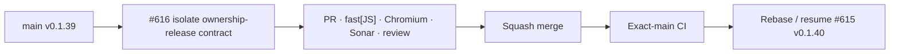

# BRVTAL — Último deploy

  
  
  

> **Development dashboard** · snapshot de **solo el deploy actual** para Issue #616.

## Progress convention

- ✅ ~~Struck through~~ = completed and verified through the required delivery gates.
- 🚧 Normal text = pending or currently in progress.

## Estado del deploy

| Señal | Estado | Evidencia |
| --- | --- | --- |
| Work line | 🚧 **#616 · isolate Dashboard V2 ownership-release test** | CI debt discovered while validating #615 |
| Base exacta | ✅ ~~main v0.1.39 exact-main CI verde~~ | `3dfd4e676a04c0bb75276ad9703584180125befe` |
| Versión | ✅ ~~0.1.39 sin bump~~ | cambio test-only; runtime intacto |
| Producción | ✅ ~~sin cambio de runtime/schema~~ | migración Media #610 sigue separada y manual |

## Huella del cambio

<!-- brvtal:git-delta -->

| Archivos | Inserciones | Eliminaciones | Neto |
| ---: | ---: | ---: | ---: |
| **2** | **+40** | **−43** | **-3** |

## Calidad y entrega

<!-- brvtal:gate-plan -->

| Control | Estado / contrato |
| --- | --- |
| Gates | **preflight · coordination · fast[JS] · chromium** |
| PR integrity | **PR + snapshot exacto** · Issue #616 · `work/issue-616` · UUID `963a350c-4923-4835-9e5b-7799fd121850` |
| Ownership release | 🚧 response gate invalida Dashboard V2 y exige liberar el root reservado |
| Fallback ownership | ✅ ~~validado en test independiente existente; no se mezcla con este timing contract~~ |
| Runtime scope | ✅ ~~Dashboard V2 / Health / Activity production JS unchanged~~ |
| Reproduction | ✅ ~~mismo fallo de Admin Activity reproducido en dos Chromium runs de #615~~ |
| Sonar | 🚧 stable-head analysis |
| CodeRabbit | 🚧 stable-head review |
| CI del SHA exacto de main | 🚧 después del squash merge |

## Flujo de entrega

## Qué se hizo

- #613 eliminó correctamente la primera carrera reemplazando `overviewDelay` por un gate explícito.
- Quedaba una segunda carrera en el mismo test: después de liberar el root, volvía a `state.section='dashboard'` y montaba Health + Admin Activity.
- La primera mutación legacy despierta correctamente el `MutationObserver` de Dashboard V2, que vuelve a reservar ownership; si Activity termina después, su guard también correctamente decide no renderizar.
- Por tanto, ese bloque medía scheduling entre tres módulos en vez del contrato de **ownership release**.
- El test #616 se limita a comprobar que un render invalidado libera el root y no deja paneles legacy en una sección no-dashboard.
- El fallback Health/Activity continúa cubierto por el test separado ya existente: `legacy Health and Activity remain available as fallback when Dashboard V2 is absent`.
- No se modifica código de producción.

## Archivos modificados en este deploy

- `README.md` — snapshot exacto de #616 y gates test-only.
- `tests/e2e/discadmin-dashboard-v2-authority.spec.mjs` — separa ownership release del fallback remount.

## Validación

- Base exacta `3dfd4e676a04c0bb75276ad9703584180125befe`: main v0.1.39.
- El fallo ocurrió dos veces sobre #615 con **402 tests Chromium verdes y solo este caso rojo**; fast, database, real-stack, WebKit y Sonar estaban verdes.
- #616 está reservado por el coordinador y no toca archivos de #615.
- Pendiente: CI test-only, revisión, squash, exact-main y actualización limpia de #615 sobre el nuevo main.

## Qué sigue

| Lane | Trabajo |
| --- | --- |
| **NOW** | 🚧 [#616](https://github.com/pl0n3r/brvtal/issues/616) · eliminar la carrera residual del authority test. |
| **NEXT** | 🚧 [#614](https://github.com/pl0n3r/brvtal/issues/614) / PR #615 · revalidar Media Engine v3 sobre main limpio. |
| **LATER** | 🚧 [#531](https://github.com/pl0n3r/brvtal/issues/531) · cerrar Media Library smarter; [#398](https://github.com/pl0n3r/brvtal/issues/398) · archivo cultural. |
| **BLOCKED / EXTERNAL** | 🚧 `migration_media_content_hash_01.sql` sigue requiriendo autorización explícita. |

## Panorama general pendiente

| Lane | Frente | Issues |
| --- | --- | --- |
| **NOW** | 🚧 CI determinism | 🚧 [#616](https://github.com/pl0n3r/brvtal/issues/616) |
| **NEXT** | 🚧 Media Engine v3 | 🚧 [#614](https://github.com/pl0n3r/brvtal/issues/614), [#531](https://github.com/pl0n3r/brvtal/issues/531) |
| **LATER** | 🚧 Archive / Admin resilience | 🚧 [#398](https://github.com/pl0n3r/brvtal/issues/398), [#530](https://github.com/pl0n3r/brvtal/issues/530), [#528](https://github.com/pl0n3r/brvtal/issues/528) |
