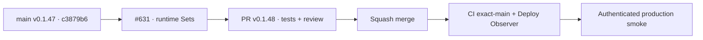

# BRVTAL — Último deploy

  
  
  

> **Production incident #631** · el smoke real #35944835692 sobre exact `main` `c3879b6472a03d0fffc50ac25ac728a794e4b7e1` (v0.1.47) localizó el fallo en la navegación a Sets: `admin-reliability.js` esperaba la hidratación auxiliar Artists/Events antes de ejecutar el render nativo. **Engineering roles:** SRE / production incident responder, frontend reliability engineer, QA automation engineer.

## Progress convention

- ✅ ~~Struck through~~ = completed and verified through the required delivery gates.
- 🚧 Normal text = pending or currently in progress.

## Estado del deploy

| Señal | Estado | Evidencia |
| --- | --- | --- |
| Work line | 🚧 **#631 · unblock Sets relation hydration** | `work/issue-631`; reserva `7b79ca5d-bd6a-45b4-b561-33a4528d8469` |
| Base exacta | ✅ ~~main v0.1.47~~ | `c3879b6472a03d0fffc50ac25ac728a794e4b7e1` |
| Versión | 🚧 **v0.1.48 candidate** | cambio runtime DISCADMIN + smoke/regresiones |
| CI exact-main base | ✅ ~~success~~ | [#35944335454](https://github.com/pl0n3r/brvtal/actions/runs/35944335454) |
| Deploy Observer base | ✅ ~~success~~ | [#35944335357](https://github.com/pl0n3r/brvtal/actions/runs/35944335357) |
| Smoke base | ⛔ **failure / diagnostic** | [#35944835692](https://github.com/pl0n3r/brvtal/actions/runs/35944835692) · `sets-workspace-ready` timeout |
| Entrega candidata | 🚧 navegación Sets no bloqueante + hidratación acotada | pendiente gates, merge y smoke fresco |

## Huella del cambio

<!-- brvtal:git-delta -->

| Archivos | Inserciones | Eliminaciones | Neto |
| ---: | ---: | ---: | ---: |
| **7** | **+155** | **−64** | **+91** |

## Calidad y entrega

<!-- brvtal:gate-plan -->

| Control | Estado / contrato |
| --- | --- |
| Gates esperados | **preflight · coordination · fast[PHP+JS] · chromium**; ampliar según classifier |
| PR + snapshot exacto | Issue #631 · reserva `7b79ca5d-bd6a-45b4-b561-33a4528d8469` |
| CodeRabbit / Sonar | 🚧 revisar HEAD estable; máximo 3 rondas automáticas |
| CI del SHA exacto de main | 🚧 después del merge |
| Producción | 🚧 smoke real debe acreditar Sets + Hero además de health/Home/Admin/Events/date |

## Flujo de entrega

## Qué se hizo

- El artefacto del smoke #35944835692 acreditó release exacto v0.1.47 / `c3879b64…`, health **200**, DB **connected**, Home **200**, DISCADMIN **200**, dashboard visible en **873 ms** sin 5xx, versión Admin exacta, Events workspace PASS y Event #6 date PASS.
- El fallo quedó etiquetado como `failureStage=sets-relations` / `failureOperation=sets-workspace-ready`; Sets/Hero no llegaron a acreditarse.
- La causa runtime está en `admin-reliability.js`: `go('sets')` esperaba dos lecturas auxiliares de relaciones antes del `nativeGo('sets')`, por lo que una lectura lenta impedía montar el workspace.
- La navegación ahora ejecuta primero el `nativeGo`; la hidratación Artists/Events corre después con `AbortController`, usa una sola promesa compartida y el modal reutiliza esa hidratación si sigue en curso.
- El smoke espera el host canónico `[data-admin-grid-host="sets"]`, espera la promesa real de `openModal('sets')` y persiste evidencia de relaciones antes de pasar a Hero.
- Se añadió regresión E2E que demuestra que Sets renderiza sin esperar la hidratación y que navegación/modal comparten las mismas dos lecturas acotadas.
- Sin SQL, migraciones ni mutaciones de contenido productivo.

## Archivos modificados en este deploy

- `README.md` — snapshot exacto del incidente y gates.
- `config/version.php` — candidato v0.1.48.
- `discadmin/admin-reliability.js` — navegación Sets no bloqueante e hidratación acotada/compartida.
- `package.json` — versión v0.1.48.
- `tests/admin-reliability-quick-wins-contract.php` — contrato del flujo Sets.
- `tests/e2e/admin-reliability-quick-wins.spec.mjs` — regresión de navegación/hidratación.
- `tests/e2e/production-authenticated-smoke.mjs` — readiness/modal/evidencia de Sets.

## Validación

- ✅ ~~CI exact-main #35944335454 y Deploy Observer #35944335357 aprobaron la base `c3879b64…`.~~
- ✅ ~~Smoke #35944835692 falló rápido y de forma diagnóstica en `sets-workspace-ready`, no por watchdog global.~~
- ✅ ~~Artefacto: health/SHA/DB, Home/Admin/Dashboard y Events/date aprobados; cero mutaciones bloqueadas.~~
- 🚧 Gates de la candidata v0.1.48, revisión, merge y smoke final pendientes; **no declarar PRODUCTION GREEN** antes.

## Qué sigue

| Lane | Trabajo |
| --- | --- |
| **NOW** | 🚧 [#631](https://github.com/pl0n3r/brvtal/issues/631): validar v0.1.48, mergear y ejecutar smoke productivo completo. |
| **NEXT** | 🚧 [#533](https://github.com/pl0n3r/brvtal/issues/533): publicar `🟢 PRODUCTION GREEN` solo con las cinco evidencias. |
| **LATER** | 🚧 retomar backlog únicamente después de GREEN y de la barrera global de Tanda 1. |
| **BLOCKED / EXTERNAL** | 🚧 factory `v1.0.0` aún no existe; Tanda 2 permanece bloqueada. |

## Panorama general pendiente

- 🚧 **NOW**: completar #631 con smoke real Sets/Hero.
- 🚧 **NEXT**: cerrar incidente y registrar GREEN en #533.
- 🚧 **LATER**: esperar finalización global de Tanda 1 antes del factory kit.
- 🚧 **BLOCKED / EXTERNAL**: Tanda 2 no inicia mientras falte factory `v1.0.0` o GREEN en cualquiera de los tres repos.
