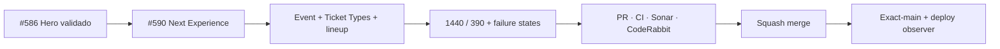

# BRVTAL — Último deploy

  
  
  

> **Development dashboard** · snapshot de **solo el deploy actual** para Issue #590.

## Progress convention

- ✅ ~~Struck through~~ = completed and verified through the required delivery gates.
- 🚧 Normal text = pending or currently in progress.

## Estado del deploy

| Señal | Estado | Evidencia |
| --- | --- | --- |
| Work line | 🚧 **#590 · Concept 05 Next Experience authored 1440/390** | parent #583 |
| Base exacta | ✅ ~~main v0.1.27 validado y observado~~ | `7f74376689fca26fd66c16642aa7ee80839e841c` |
| Versión | 🚧 **0.1.28** | cambio visible de producto/runtime público |
| Producción | 🚧 pendiente de merge + observación | sin migración de esquema |

## Huella del cambio

<!-- brvtal:git-delta -->

| Archivos | Inserciones | Eliminaciones | Neto |
| ---: | ---: | ---: | ---: |
| **10** | **+1088** | **−74** | **+1014** |

## Calidad y entrega

<!-- brvtal:gate-plan -->

| Control | Estado / contrato |
| --- | --- |
| Gates | **preflight · coordination · fast[PHP+JS] · database · chromium · real-stack · webkit** |
| Reservation | Issue #590 · `work/issue-590` · UUID `5923f15a-d866-4b2a-a9af-c5096a382528` |
| PR integrity | **PR + snapshot exacto** contra `main` |
| Browser | 🚧 nueva geometría authored 1440/390 + long-copy/media failure coverage |
| Sonar / CodeRabbit | 🚧 pendientes sobre el head estable del PR |
| Exact-main | **CI del SHA exacto de main** después del squash merge |

## Flujo de entrega

## Qué se hizo

- NEXT EXPERIENCE pasa a ser el módulo dominante inmediatamente después del Hero; el manifesto heredado queda después del takeover.
- Desktop 1440 usa composición editorial en dos campos: artwork documental enmarcado + bloque de información/evento con reglas físicas.
- Mobile 390 es una composición propia vertical: artwork mayor, título integrado al límite visual, facts compactos, ticket state, lineup y CTAs en flujo.
- El selector de Event existente sigue siendo la única fuente de verdad; no se creó un segundo selector frontend.
- Ticket Types canónicos proyectan nombre, precio, moneda y sold-out state; hasta dos tiers pueden mostrar Preventa/Door sin inventar valores.
- El CTA de compra solo aparece cuando existe una URL HTTP(S) pública válida y el Event/ticketing sigue elegible; sold-out no ofrece compra.
- Lineup continúa viniendo de relaciones Event↔Artist publicadas y la nota editorial usa la descripción administrable del Event.
- Artwork usa `cover_image` canónico y falla cerrado ante referencias rotas; cuando no hay media no se sustituye con contenido ficticio.
- El CSS reutiliza tokens Theme Studio/Concept 05 y el runtime nuevo no toma ownership de GSAP; motion sigue centralizado y respeta visual-test/reduced motion.
- Se añadió cobertura PHP y Playwright para orden Hero→Experience, proyección de datos, pricing, sold-out, 1440/390, long copy, no-overflow y broken media.

## Archivos modificados en este deploy

- `README.md` — snapshot exacto de #590.
- `config/public_home.php` — Event/Ticket Types/lineup projection, pricing, fail-safe CTA y orden Hero→Experience.
- `config/version.php` — versión 0.1.28.
- `css/public-concept05-experience.css` — composición authored desktop/mobile.
- `js/public-concept05-experience.js` — media fail-closed sin duplicar motion.
- `package.json` — versión 0.1.28.
- `tests/e2e/public-concept05-experience.spec.mjs` — geometría y comportamiento real 1440/390.
- `tests/public-concept05-dressing-contract.php` — assets/idempotencia Concept 05.
- `tests/public-home-contract.php` — renderer, datos canónicos y orden documental.
- `tests/public-home-phase-a-contract.php` — precios/ticketing/sold-out.

## Validación

- Base exacta `7f74376689fca26fd66c16642aa7ee80839e841c`: BRVTAL CI completo, Production Deploy Observer y Production Performance verdes.
- #586 está cerrado como `status: completed`; #590 fue reservado de forma atómica antes de modificar su rama.
- No hay migraciones ni cambios de esquema en este slice.
- La validación final se decide exclusivamente sobre el head estable del PR y se repite sobre exact-main después del merge.
- Producción se observa por separado; CI verde no se presenta como prueba de deploy.

## Qué sigue

| Lane | Trabajo |
| --- | --- |
| **NOW** | 🚧 [#590](https://github.com/pl0n3r/brvtal/issues/590) · Next Experience authored 1440/390. |
| **NEXT** | 🚧 [#583](https://github.com/pl0n3r/brvtal/issues/583) · continuar con 02 / NIGHTS + 03 / ARTISTS. |
| **LATER** | 🚧 [#398](https://github.com/pl0n3r/brvtal/issues/398), [#351](https://github.com/pl0n3r/brvtal/issues/351), [#252](https://github.com/pl0n3r/brvtal/issues/252). |
| **BLOCKED / EXTERNAL** | 🚧 Ningún bloqueo externo activo para #590. |

## Panorama general pendiente

| Lane | Frente | Issues |
| --- | --- | --- |
| **NOW** | 🚧 Concept 05 event takeover | 🚧 [#590](https://github.com/pl0n3r/brvtal/issues/590) |
| **NEXT** | 🚧 Concept 05 public fidelity | 🚧 [#583](https://github.com/pl0n3r/brvtal/issues/583), [#398](https://github.com/pl0n3r/brvtal/issues/398) |
| **LATER** | 🚧 customization / media trust | 🚧 [#351](https://github.com/pl0n3r/brvtal/issues/351), [#252](https://github.com/pl0n3r/brvtal/issues/252), [#531](https://github.com/pl0n3r/brvtal/issues/531) |
