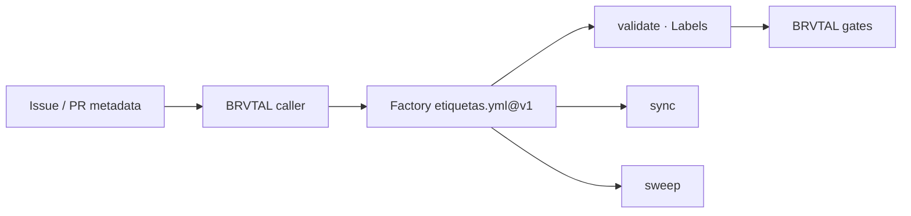

# BRVTAL — Último deploy

  
  
  

> Snapshot de **solo el deploy actual**: trabajo repository-only de gobernanza para #627. Adopta el lifecycle central de etiquetas de Factory v1; no cambia runtime, producto, Hostinger ni la versión v0.1.58. El incidente #681 continúa bloqueado por reconciliación externa de producción.

## Progress convention

- ✅ ~~Struck through~~ = completed and verified through the required delivery gates.
- 🚧 Normal text = pending or currently in progress.
- ⛔ = active production blocker.

## Estado del deploy

| Señal | Estado | Evidencia |
| --- | --- | --- |
| Work line | 🚧 **#627 · Factory labels adoption** | `work/issue-627`; reservation `3ff8cec6-1268-4b52-bb00-9a6fb1a71975` |
| Base exacta | ✅ **main v0.1.58** | `027421db0ba9c47e94dda6e6c73c3c8ef962fe33` |
| Versión de producto | ✅ **v0.1.58 sin cambio** | repository-only / no deploy-bound runtime |
| Factory labels | 🚧 **caller central @v1** | validate + sync + sweep, `language: en` |
| Production | ⛔ **#681 sigue bloqueado** | este PR no afirma GREEN ni toca DB/Hostinger |

## Huella del cambio

<!-- brvtal:git-delta -->

| Archivos | Inserciones | Eliminaciones | Neto |
| ---: | ---: | ---: | ---: |
| **3** | **+176** | **−50** | **+126** |

## Calidad y entrega

<!-- brvtal:gate-plan -->

| Control | Estado / contrato |
| --- | --- |
| Gates esperados | **preflight · coordination · fast[PHP+JS] · database · chromium · real-stack** |
| PR + snapshot exacto | **Issue #627 · Factory labels lifecycle** |
| Roles | **Infrastructure · Security · QA** |
| Trust boundary | metadata-only; no checkout ni ejecución de código del PR |
| Permisos | contents: read · issues: write · pull-requests: read |
| Review | BRVTAL CI + Factory Policy + Privacy + Sonar/CodeQL/CodeRabbit |
| CI del SHA exacto de main | 🚧 después del merge |
| Production GREEN | 🚧 independiente; #681 permanece abierto |

## Flujo de entrega

## Qué se hizo

- Añade un único caller BRVTAL para el reusable central de Factory.
- Usa `language: en` y delega `sync`, `validate` y `sweep`.
- Mantiene el PR path metadata-only y sin `actions/checkout` local.
- Limita permisos al mínimo requerido por el reusable.
- Añade contrato Python que falla si se introduce lógica local divergente o permisos ampliados.
- No cambia versión, runtime, base de datos, deploy ni Hostinger.

## Archivos modificados en este deploy

- `.github/workflows/factory-labels.yml` — caller reusable de etiquetas Factory v1.
- `README.md` — snapshot exacto del trabajo repository-only.
- `tests/test_factory_labels_adoption.py` — contrato consumidor y regresiones de seguridad.

## Validación

- 🚧 Criterios de aceptación ejecutables deben pasar sobre el HEAD estable.
- 🚧 BRVTAL CI / validate debe pasar con el gate plan exacto del diff.
- 🚧 Factory Policy, Privacy, Sonar, CodeQL y CodeRabbit deben cerrar sin hallazgos bloqueantes.
- No se considera #681 resuelto ni producción GREEN por este cambio.

## Qué sigue

| Lane | Trabajo |
| --- | --- |
| **NOW** | 🚧 [#627](https://github.com/pl0n3r/brvtal/issues/627): integrar lifecycle central de labels. |
| **NEXT** | 🚧 [#630](https://github.com/pl0n3r/brvtal/issues/630): continuar TANDA 2 del kit Factory. |
| **LATER** | 🚧 [#683](https://github.com/pl0n3r/brvtal/issues/683): staff API para ControlBot cuando sus dependencias estén listas. |
| **BLOCKED / EXTERNAL** | 🚧 [#681](https://github.com/pl0n3r/brvtal/issues/681): reconciliación Hostinger/DB requiere transporte autorizado y backup previo. |

## Panorama general pendiente

- 🚧 **NOW:** #627 consolidar gobernanza de etiquetas en Factory v1.
- 🚧 **NEXT:** #630 continuar adopción común sin duplicación local.
- 🚧 **LATER:** #653 y roadmap de producto tras prioridades Factory.
- 🚧 **BLOCKED / EXTERNAL:** #681 requiere reconciliación productiva fuera de este PR.
