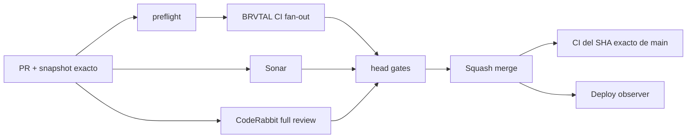

# BRVTAL — Development delivery dashboard

  

> Snapshot del deploy actual. No es un changelog acumulativo.

## Estado del deploy

| Señal | Estado | Evidencia |
| --- | --- | --- |
| Base exacta | ✅ **VALIDATED IN CODE** | `main` `1cb65b32ff99f07fce1a5748d380c0c9587e5949` · exact-main BRVTAL CI verde |
| Git delta | 📐 **8 files · 227 insertions · 92 deletions · net +135** | base `1cb65b32ff99f07fce1a5748d380c0c9587e5949` → head del PR |
| Alcance | ⚡ **#534 DELIVERY LEAD TIME** | preflight + fan-out + fast scope + deploy observer |
| Gates | 🔀 **PARALLEL BY DEFAULT** | CI/Sonar + CodeRabbit sobre el mismo head estable |
| Producción | ⚪ **No validada** | deploy marker ≠ validación funcional en producción |

## Flujo de entrega

## Qué se hizo

- Separa la clasificación de cambios en un `preflight` corto.
- MariaDB, Chromium, real-stack, WebKit y recovery ya no esperan a que termine `fast`.
- `fast` evita PHP/JS innecesarios en cambios de documentación/política.
- PHP lint y JavaScript syntax usan paralelismo acotado.
- CodeRabbit final se solicita en paralelo con CI/Sonar una vez fijado el head.
- El push a `main` inicia un observador liviano del marcador exacto de Hostinger mientras corre exact-main CI.
- Los lotes multiarchivo usan blob → tree → commit → ref para evitar tormentas de pushes.

## Archivos modificados en este deploy

- `.github/workflows/update-release-metadata.yml` — preflight y fan-out concurrente.
- `.github/workflows/production-deploy-observer.yml` — observación temprana del SHA desplegado.
- `scripts/ci-scope.sh` — selección PHP/JS además de gates pesados.
- `scripts/php85-compatibility.sh` — lint PHP paralelo y acotado.
- `tests/ci-scope-contract.php` — contratos del nuevo pipeline.
- `tests/backup-recovery-rehearsal-contract.php` — alinea el gate de recovery con el planner `preflight`.
- `AGENTS.md` — política durable de commits atómicos y gates concurrentes.
- `README.md` — snapshot/dashboard de #534.

## Validación

- `tests/ci-scope-contract.php` cubre docs-only, runtime, tooling, manual full matrix, preflight/fan-out y deploy observer.
- `validate` sigue agregando todos los gates aplicables; no se elimina cobertura.
- Sonar continúa separado de BRVTAL CI.
- CodeRabbit se revisa sobre el mismo head que CI/Sonar.
- El observador solo confirma identidad de deploy; nunca **VALIDATED IN PRODUCTION**.

## Qué sigue

| Lane | Trabajo |
| --- | --- |
| **NOW** | [#534](https://github.com/pl0n3r/brvtal/issues/534) · medir wall time y cerrar si los gates confirman el diseño. |
| **NEXT** | [#527](https://github.com/pl0n3r/brvtal/issues/527) · completar README como dashboard profesional. |
| **LATER** | [#533](https://github.com/pl0n3r/brvtal/issues/533) · continuar quick wins y fases posteriores. |

## Panorama general pendiente

| Lane | Frente | Siguiente foco |
| --- | --- | --- |
| **NOW** | ⚡ Delivery | [#534](https://github.com/pl0n3r/brvtal/issues/534) |
| **NEXT** | 📊 Development dashboard | [#527](https://github.com/pl0n3r/brvtal/issues/527) |
| **NEXT** | 🧭 Admin quick wins | [#520](https://github.com/pl0n3r/brvtal/issues/520), [#521](https://github.com/pl0n3r/brvtal/issues/521), [#526](https://github.com/pl0n3r/brvtal/issues/526), [#522](https://github.com/pl0n3r/brvtal/issues/522) |
| **LATER** | 🧩 Configurable Dashboard | [#513](https://github.com/pl0n3r/brvtal/issues/513) |
| **LATER** | 🎛️ Admin UX | [#348](https://github.com/pl0n3r/brvtal/issues/348), [#149](https://github.com/pl0n3r/brvtal/issues/149), [#514](https://github.com/pl0n3r/brvtal/issues/514) |
| **LATER** | ✍️ Editorial | [#518](https://github.com/pl0n3r/brvtal/issues/518), [#519](https://github.com/pl0n3r/brvtal/issues/519), [#525](https://github.com/pl0n3r/brvtal/issues/525), [#528](https://github.com/pl0n3r/brvtal/issues/528) |
| **LATER** | 🗃️ Cultural archive | [#398](https://github.com/pl0n3r/brvtal/issues/398) |
| **LATER** | 💾 Resilience | [#389](https://github.com/pl0n3r/brvtal/issues/389), [#530](https://github.com/pl0n3r/brvtal/issues/530) |
