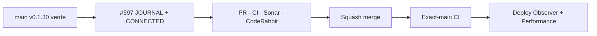

# BRVTAL — Último deploy

  
  
  

> **Development dashboard** · snapshot de **solo el deploy actual** para Issue #597.

## Progress convention

- ✅ ~~Struck through~~ = completed and verified through the required delivery gates.
- 🚧 Normal text = pending or currently in progress.

## Estado del deploy

| Señal | Estado | Evidencia |
| --- | --- | --- |
| Work line | 🚧 **#597 · Concept 05 JOURNAL + CONNECTED authored 1440/390** | parent #583 |
| Base exacta | ✅ ~~main v0.1.30 validado + deploy/performance observados~~ | `86c2d2410fd11b1d1c67e02a25d2930a77c43c9f` |
| Versión | 🚧 **0.1.31** | cambio visible de producto/runtime público |
| Producción | 🚧 pendiente de PR → merge → exact-main | sin migración de esquema |

## Huella del cambio

<!-- brvtal:git-delta -->

| Archivos | Inserciones | Eliminaciones | Neto |
| ---: | ---: | ---: | ---: |
| **11** | **+980** | **−105** | **+875** |

## Calidad y entrega

<!-- brvtal:gate-plan -->

| Control | Estado / contrato |
| --- | --- |
| Gates | **preflight · coordination · fast[PHP+JS] · database · chromium · real-stack · webkit** |
| PR integrity | **PR + snapshot exacto** · Issue #597 · `work/issue-597` · UUID `b2c93a85-2f28-4a99-9b29-e92fd3bda92f` |
| Browser | 🚧 geometría/behavior 1440 + 390 + broken cover + zero-relations + reduced motion |
| Sonar | 🚧 Quality Gate sobre head estable |
| CodeRabbit | 🚧 review final sobre head estable |
| Exact-main | 🚧 **CI del SHA exacto de main** después del squash merge |

## Flujo de entrega

## Qué se hizo

- **06 / JOURNAL** reutiliza `public-transmissions.js` y Blog como única fuente editorial.
- El primer post real se convierte en feature zine/newspaper con `cover_image`, fecha, tags, excerpt y relaciones públicas reales; el resto conserva un índice editorial compacto.
- Cada entrada usa `/blog/{slug}`; relaciones Blog → Event/Artist/Set/Release solo aparecen cuando resuelven a entidades públicas con slug canónico.
- Cover ausente o roto falla cerrado sin broken-image chrome y sin perder titular/ruta/copy.
- El Home corrige el orden visual heredado para respetar **05 MEMORIES → 06 JOURNAL → 07 CONNECTED**.
- **07 / CONNECTED** usa exclusivamente `payload.relations.counts`; cada línea SVG y cada ledger item existe solo si el backend reporta al menos una relación real.
- Conteos de nodos vienen de Events activos+archivo deduplicados, Artists, Sets, Releases y Memories; cero relaciones no produce líneas falsas.
- Los nodos navegan solo a superficies públicas existentes (`#events`, `#artists`, `#sets`, `/releases`, `#media`).
- Desktop 1440 usa feature editorial + índice lateral y grafo horizontal; mobile 390 refluye a feature vertical + grafo 2-columnas touch-safe.
- No se añadió fetch, CMS, grafo ni ownership GSAP paralelo.

## Archivos modificados en este deploy

- `README.md` — snapshot exacto del deploy y gates.
- `config/public_home.php` — asset authored y markup relacional real de CONNECTED.
- `config/version.php` — versión pública 0.1.31.
- `css/public-concept05-journal-connected.css` — geometría authored 1440/390 de JOURNAL + CONNECTED.
- `index.html` — orden canónico MEMORIES → JOURNAL en el fallback/base público.
- `index.php` — framing público de TRANSMISSIONS como JOURNAL.
- `js/public-concept05-connected.js` — conteos y edges agregados solo desde relaciones verificadas.
- `js/public-transmissions.js` — feature/index Journal, cover fail-closed y rutas/relaciones canónicas.
- `package.json` — sincronización de versión 0.1.31.
- `tests/e2e/public-concept05-journal-connected.spec.mjs` — regresión 1440/390, graph edges, zero-relations y media rota.
- `tests/public-concept05-dressing-contract.php` — contrato de assets, orden canónico y superficies CONNECTED.

## Validación

- Base exacta `86c2d2410fd11b1d1c67e02a25d2930a77c43c9f`: BRVTAL CI, Sonar, Deploy Observer y Production Performance verdes antes de iniciar #597.
- #597 fue reservado atómicamente antes de modificar `work/issue-597`.
- Cobertura nueva verifica Blog canónico, relaciones resueltas, payload compartido, 1440/390, media rota, cero relaciones, touch targets y reduced motion.
- CONNECTED nunca deriva líneas de decoración: cada edge depende de un contador real del grafo público.
- No hay nuevo fetch, migraciones ni cambios de esquema.
- Producción se observa por separado; CI verde no se presenta como prueba de deploy.

## Qué sigue

| Lane | Trabajo |
| --- | --- |
| **NOW** | 🚧 [#597](https://github.com/pl0n3r/brvtal/issues/597) · cerrar JOURNAL + CONNECTED y validar exact-main. |
| **NEXT** | 🚧 [#583](https://github.com/pl0n3r/brvtal/issues/583) · Footer + mobile navigation final fidelity. |
| **LATER** | 🚧 Theme Studio/Admin controls y Preview; luego #398/#351 según roadmap. |
| **BLOCKED / EXTERNAL** | 🚧 Ningún bloqueo externo activo; reviewers externos son advisory salvo finding accionable. |

## Panorama general pendiente

| Lane | Frente | Issues |
| --- | --- | --- |
| **NOW** | 🚧 Concept 05 JOURNAL + CONNECTED | 🚧 [#597](https://github.com/pl0n3r/brvtal/issues/597) |
| **NEXT** | 🚧 Concept 05 public fidelity | 🚧 [#583](https://github.com/pl0n3r/brvtal/issues/583) |
| **LATER** | 🚧 visión pública / customization | 🚧 [#398](https://github.com/pl0n3r/brvtal/issues/398), [#351](https://github.com/pl0n3r/brvtal/issues/351) |
