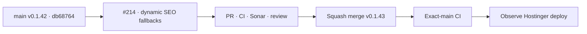

# BRVTAL — Último deploy

  
  
  

> **Development dashboard** · snapshot de **solo el deploy actual** para Issue #214.

## Progress convention

- ✅ ~~Struck through~~ = completed and verified through the required delivery gates.
- 🚧 Normal text = pending or currently in progress.

## Estado del deploy

| Señal | Estado | Evidencia |
| --- | --- | --- |
| Work line | 🚧 **#214 · SEO fallbacks dinámicos / overrides explícitos** | rama reservada `work/issue-214` |
| Base exacta | ✅ ~~main v0.1.42 exact-main CI/deploy/performance verde~~ | `db68764fe880b396c5e671e7e43faeeddaf0bc93` |
| Versión | 🚧 **0.1.43 candidate** | SEO editorial integrity |
| Producción | 🚧 pendiente PR + merge + exact-main + observación Hostinger | sin migraciones ni mutaciones manuales de SEO real |

## Huella del cambio

<!-- brvtal:git-delta -->

| Archivos | Inserciones | Eliminaciones | Neto |
| ---: | ---: | ---: | ---: |
| **15** | **+508** | **−184** | **+324** |

## Calidad y entrega

<!-- brvtal:gate-plan -->

| Control | Estado / contrato |
| --- | --- |
| Gates | **preflight · coordination · fast[PHP+JS] · database · chromium · real-stack · webkit** |
| PR integrity | **PR + snapshot exacto** · Issue #214 · `work/issue-214` · UUID `5d7b8107-977e-4e0e-a492-dd55b265c214` |
| Auto semantics | 🚧 fallback automático vive en preview/effective state; no se escribe en el campo persistible |
| Manual semantics | 🚧 solo una edición explícita crea override; limpiar vuelve a auto |
| Split SEO API | 🚧 PUT vacío persiste NULL, no el fallback calculado |
| Event atomicity | 🚧 Content Core transporta vacío en auto y texto solo en manual dentro del workflow atómico |
| Blog / Pages | 🚧 saves vacíos dejan SEO vacío para que public delivery derive el fallback vigente |
| Durable coverage | 🚧 browser contracts + PHP normalization + isolated MariaDB persistence/audit contract |
| Sonar | 🚧 stable-head analysis |
| CodeRabbit | 🚧 stable-head review |
| CI del SHA exacto de main | 🚧 después del squash merge |

## Flujo de entrega

## Qué se hizo

- Los defaults SEO automáticos dejan de escribir físicamente los inputs: se mantienen como fallback visual/dinámico.
- El estado del editor distingue `auto` de `manual`; limpiar un override vuelve a `auto` sin congelar el fallback actual.
- Legacy Events/Artists/Sets, Releases y el Event workflow atómico serializan vacío en modo automático y solo texto explícito en modo manual.
- El endpoint SEO separado normaliza vacío a NULL; public delivery ya deriva title/description desde el contenido fuente cuando no hay override.
- Blog y Pages dejan de recibir defaults materializados por un wrapper de fetch: un save sin override conserva ausencia de override.
- Se amplía cobertura browser para preview dinámico, transición auto↔manual, Event workflow y Release metadata, más contrato PHP del boundary de persistencia.

## Archivos modificados en este deploy

- `README.md`
- `api/seo-metadata.php`
- `config/seo_defaults.php`
- `config/seo_persistence.php`
- `config/version.php`
- `discadmin/event-workflow-seo.js`
- `discadmin/seo-editorial-defaults.js`
- `discadmin/seo-metadata.js`
- `docs/BRVTAL-SPEC.md`
- `package.json`
- `tests/e2e/discadmin-seo-defaults.spec.mjs`
- `tests/e2e/discadmin-seo-metadata.spec.mjs`
- `tests/integration/seo-persistence.php`
- `tests/seo-defaults-contract.php`

## Validación

- Base exacta `db68764fe880b396c5e671e7e43faeeddaf0bc93`: BRVTAL CI/`validate`, Production Deploy Observer y Production Performance verdes para v0.1.42.
- #214 tiene reserva canónica activa y `work/issue-214` partió idéntica a `main`.
- Pendiente: PR, gates del HEAD estable, Sonar, revisión, squash merge, exact-main y observación de deploy.

## Qué sigue

| Lane | Trabajo |
| --- | --- |
| **NOW** | 🚧 [#214](https://github.com/pl0n3r/brvtal/issues/214) · mantener los defaults SEO realmente dinámicos y no destructivos. |
| **NEXT** | 🚧 [#390](https://github.com/pl0n3r/brvtal/issues/390) · siguiente frente explícito de publicación/SEO del roadmap. |
| **LATER** | 🚧 [#528](https://github.com/pl0n3r/brvtal/issues/528) · autosave/recovery; [#530](https://github.com/pl0n3r/brvtal/issues/530) · recycle bin. |
| **BLOCKED / EXTERNAL** | 🚧 migraciones o mutaciones de datos SEO en producción requieren autorización explícita. |

## Panorama general pendiente

| Lane | Frente | Issues |
| --- | --- | --- |
| **NOW** | 🚧 SEO override integrity | 🚧 [#214](https://github.com/pl0n3r/brvtal/issues/214) |
| **NEXT** | 🚧 Publication / SEO integrity | 🚧 [#390](https://github.com/pl0n3r/brvtal/issues/390) |
| **LATER** | 🚧 Editorial resilience | 🚧 [#528](https://github.com/pl0n3r/brvtal/issues/528), [#530](https://github.com/pl0n3r/brvtal/issues/530) |
