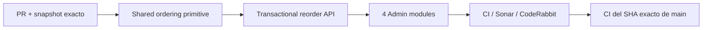

# BRVTAL — Último deploy

  
  
  

> **Development dashboard** · snapshot profesional de **solo el deploy actual**.

## Progress convention

- ✅ ~~Struck through~~ = completed and verified through the required delivery gates.
- 🚧 Normal text = pending or currently in progress.

## Estado del deploy

| Señal | Estado | Evidencia |
| --- | --- | --- |
| Work line | 🚧 **#519 visual content ordering (v0.1.21)** | shared drag/touch/keyboard ordering for Artists · Releases · Sets · Blog |
| Base exacta | ✅ **VALIDATED IN CODE** | `main` `c4f962095e60ef2c61a3f8e798f2ad8949d3ba80` |
| Version | 🚧 **0.1.20 → 0.1.21** | patch deploy |
| Producción | 🚧 **NOT VALIDATED IN PRODUCTION** | bounded Hostinger observer still failed to expose the current release |

## Huella del cambio

<!-- brvtal:git-delta -->

| Archivos | Inserciones | Eliminaciones | Neto |
| ---: | ---: | ---: | ---: |
| **23** | **+1487** | **−146** | **+1341** |

## Calidad y entrega

<!-- brvtal:gate-plan -->

| Control | Estado / contrato |
| --- | --- |
| Gates | **preflight · fast[PHP+JS] · database · chromium · real-stack · webkit** |
| Ordering API | exact-set · transaction · row locks · contiguous normalization · rollback |
| Interaction | pointer/touch drag · keyboard arrows · visible focus · autosave |
| Partial views | search/filter disables reorder; no subset writes |
| Public order | Artists · Sets · Releases · Blog consume canonical `sort_order` first |
| Sonar + CodeRabbit | parallel on stable head |
| Exact-main | CI of resulting main SHA after squash merge |

## Flujo de entrega

## Qué se hizo

- Artists, Releases, Sets y Blog comparten un único componente visual de ordering.
- Drag usa Pointer Events y cubre mouse/touch; el handle también admite Arrow Up/Down.
- El reorder se guarda automáticamente y revierte el DOM al snapshot previo si el servidor falla.
- Búsquedas/filtros desactivan el reorder para impedir escribir colecciones parciales.
- El endpoint valida IDs positivos/únicos, exige el set completo actual, bloquea filas con `FOR UPDATE`, normaliza posiciones 0..N-1 y registra cambios en Admin Activity.
- Los formularios ya no exponen Sort Order numérico; editar conserva la posición y crear añade al final.
- El API público prioriza `sort_order` para Releases/Blog; Artists/Sets ya lo hacían.
- Versión **0.1.21**.

## Archivos modificados en este deploy

- `AGENTS.md` — contrato operativo durable y ownership del roadmap.
- `README.md` — snapshot visual exacto de este deploy.
- `api/blog.php` — lectura editorial de Blog con orden canónico.
- `api/index.php` — orden canónico para colecciones Admin.
- `api/public.php` — Releases/Blog públicos respetan `sort_order`.
- `api/reorder.php` — endpoint transaccional, stale detection y errores seguros.
- `config/content_ordering.php` — whitelist y validación compartida de ordering.
- `config/version.php` — release runtime v0.1.21.
- `discadmin/admin-modules.js` — preservación/append del orden interno.
- `discadmin/blog.js` — ordering visual de Blog.
- `discadmin/content-ordering.css` — estilos compartidos de handles/estado.
- `discadmin/content-ordering.js` — drag, teclado, autosave, rollback y observer acotado.
- `discadmin/index-core.php` — ordering Artists/Sets y thumbnails normalizados.
- `discadmin/index.php` — carga del primitive compartido.
- `discadmin/releases.js` — ordering visual de Releases.
- `docs/BRVTAL-SPEC.md` — decisión funcional durable de ordering.
- `package.json` — versión e integración MariaDB del contrato.
- `tests/blog-contract.php` — contrato Blog actualizado.
- `tests/content-ordering-contract.php` — contrato + endpoint real sobre MariaDB aislada.
- `tests/discadmin-editor-accessibility-contract.php` — accesibilidad tras retirar Sort Order numérico.
- `tests/e2e/content-core-real-stack.spec.mjs` — stale Dashboard y rutas canónicas Media/Sets aisladas sobre el shell autenticado real.
- `tests/e2e/discadmin-content-ordering.spec.mjs` — teclado, touch, rollback, filtros y stores con observer aislado y aserciones multi-handle deterministas.
- `tests/project-operations-contract.php` — valida #533 como única fuente del orden de ejecución.

## Validación

- Base exacta `c4f9620`: BRVTAL CI / `validate` success.
- Production Deploy Observer de esa base: failure externo; no se declara producción validada.
- Contrato PHP cubre whitelist, IDs, exact-set, CSRF, row lock y ausencia de inputs Sort Order.
- Playwright cubre teclado, Pointer Events tipo touch, rollback, filtros y sincronización de stores.
- CI, Sonar y CodeRabbit deben cerrar sobre el head estable antes del merge.

## Qué sigue

| Lane | Trabajo |
| --- | --- |
| **NOW** | 🚧 [#519](https://github.com/pl0n3r/brvtal/issues/519) · completar y validar visual ordering. |
| **NEXT** | 🚧 [#571](https://github.com/pl0n3r/brvtal/issues/571) · multi-agent coordination and PR collision prevention. |
| **LATER** | 🚧 [#518](https://github.com/pl0n3r/brvtal/issues/518), [#257](https://github.com/pl0n3r/brvtal/issues/257), [#525](https://github.com/pl0n3r/brvtal/issues/525) · data grid + editor protection + rich Blog editor. |
| **EVIDENCE** | 🚧 [#564](https://github.com/pl0n3r/brvtal/issues/564) · gather more samples before Phase D. |
| **BLOCKED / EXTERNAL** | 🚧 [#534](https://github.com/pl0n3r/brvtal/issues/534) · Hostinger production freshness. |

## Panorama general pendiente

| Lane | Frente | Issues |
| --- | --- | --- |
| **NOW** | 🚧 Visual content ordering closeout | 🚧 [#519](https://github.com/pl0n3r/brvtal/issues/519) |
| **NEXT** | 🚧 Multi-agent coordination / collision prevention | 🚧 [#571](https://github.com/pl0n3r/brvtal/issues/571) |
| **LATER** | 🚧 Admin editorial productivity | 🚧 [#518](https://github.com/pl0n3r/brvtal/issues/518), [#257](https://github.com/pl0n3r/brvtal/issues/257), [#525](https://github.com/pl0n3r/brvtal/issues/525), [#524](https://github.com/pl0n3r/brvtal/issues/524), [#528](https://github.com/pl0n3r/brvtal/issues/528), [#529](https://github.com/pl0n3r/brvtal/issues/529) |
| **EVIDENCE** | 🚧 CI throughput Phase D decision | 🚧 [#564](https://github.com/pl0n3r/brvtal/issues/564) |
| **BLOCKED / EXTERNAL** | 🚧 Hostinger production freshness | 🚧 [#534](https://github.com/pl0n3r/brvtal/issues/534) |
