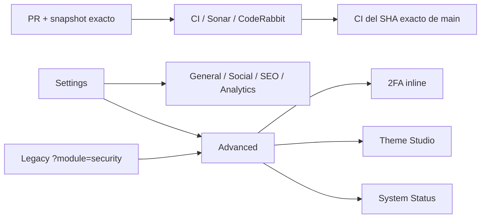

# BRVTAL — Último deploy

  
  
  

> **Development dashboard** · snapshot profesional de **solo el deploy actual**.

## Progress convention

- ✅ ~~Struck through~~ = completed and verified through the required delivery gates.
- 🚧 Normal text = pending or currently in progress.
- Completed roadmap items remain visible and crossed out.

## Estado del deploy

| Señal | Estado | Evidencia |
| --- | --- | --- |
| Work line | 🚧 **#516 SETTINGS ADVANCED** | configuración real + 2FA consolidado dentro de Settings |
| Base exacta | ✅ **VALIDATED IN CODE** | `main` `a228f82b17582131a52a41b7a2ac356bfb1692b2` · exact-main `validate` verde |
| Version | 🚧 **0.1.6 → 0.1.7** | patch deploy bump · pre-1.0 |
| Producción | ⛔ **BLOCKED / EXTERNAL** | Hostinger marker tracked in [#534](https://github.com/pl0n3r/brvtal/issues/534) |

## Huella del cambio

<!-- brvtal:git-delta -->

| Archivos | Inserciones | Eliminaciones | Neto |
| ---: | ---: | ---: | ---: |
| **11** | **+224** | **−138** | **+86** |

## Calidad y entrega

<!-- brvtal:gate-plan -->

| Control | Estado / contrato |
| --- | --- |
| Gates seleccionados | **preflight · fast[PHP+JS] · chromium · real-stack** |
| Security | 2FA conserva endpoints, CSRF y sesión existentes; no se modifican secretos |
| Browser | Advanced sin Raw Settings; Security inline; rutas Theme/System funcionales |
| Real stack | administrador E2E aislado confirma Security/2FA real dentro de Settings |
| Sonar + CodeRabbit | ejecutados en paralelo sobre el head estable |
| Exact-main | CI del SHA exacto de main obligatorio tras squash merge |

## Flujo de entrega

## Qué se hizo

- Reemplaza Settings → Advanced basado en Raw Settings por configuración realmente útil.
- Embebe el flujo real de Security / 2FA dentro de Advanced usando el fragmento y endpoints existentes.
- Mantiene Theme Studio y System Status como destinos especializados propiedad de Settings.
- Retira de la UI normal Raw Settings, Raw Edit y New Advanced Setting.
- Canonicaliza navegación legacy de Security hacia Settings → Advanced.
- Mantiene capacidad interna de compatibilidad para records desconocidos sin presentarla como interfaz normal.
- Hace que el módulo 2FA embebido herede Dark / Light / Glass para evitar una isla oscura.
- Añade browser tests y smoke real-stack autenticado sin mutar la configuración 2FA.
- Incrementa BRVTAL a **0.1.7**.

## Archivos modificados en este deploy

- `AGENTS.md`
- `README.md`
- `config/version.php`
- `discadmin/settings-v2.js`
- `discadmin/settings-v2.css`
- `discadmin/admin-route-aliases.js`
- `discadmin/admin-appearance.css`
- `tests/settings-control-plane-contract.php`
- `tests/e2e/discadmin-settings-v2.spec.mjs`
- `tests/e2e/discadmin-settings-theme-active.spec.mjs`
- `tests/e2e/discadmin-premium-real-stack.spec.mjs`

## Validación

- Advanced carga Security / 2FA real dentro del mismo shell y sin una navegación separada.
- No existen controles visibles para edición/creación arbitraria de Settings.
- Deep link legacy Security converge a Settings → Advanced.
- Theme Studio y System Status siguen accesibles desde Advanced.
- Light / Dark / Glass comparten superficies semánticas para el módulo Security.
- No hay migración ni operación destructiva de producción.

## Qué sigue

| Lane | Trabajo |
| --- | --- |
| **NOW** | 🚧 [#516](https://github.com/pl0n3r/brvtal/issues/516) · cerrar gates, squash y exact-main. |
| **NEXT** | 🚧 [#523](https://github.com/pl0n3r/brvtal/issues/523) · medir/corregir primer load de Banners. |
| **NEXT** | 🚧 [#480](https://github.com/pl0n3r/brvtal/issues/480) · hero desktop overlap/clipping. |
| **BLOCKED / EXTERNAL** | 🚧 [#534](https://github.com/pl0n3r/brvtal/issues/534) · Hostinger Git auto-deploy marker. |

## Panorama general pendiente

| Lane | Frente | Issues |
| --- | --- | --- |
| **DONE** | ✅ ~~Phase 1 + Admin IA + Appearance + Premium Admin~~ | ✅ ~~[#527](https://github.com/pl0n3r/brvtal/issues/527), [#520](https://github.com/pl0n3r/brvtal/issues/520), [#521](https://github.com/pl0n3r/brvtal/issues/521), [#526](https://github.com/pl0n3r/brvtal/issues/526), [#522](https://github.com/pl0n3r/brvtal/issues/522), [#479](https://github.com/pl0n3r/brvtal/issues/479), [#517](https://github.com/pl0n3r/brvtal/issues/517), [#221](https://github.com/pl0n3r/brvtal/issues/221), [#348](https://github.com/pl0n3r/brvtal/issues/348), [#149](https://github.com/pl0n3r/brvtal/issues/149), [#514](https://github.com/pl0n3r/brvtal/issues/514)~~ |
| **NOW** | 🚧 Settings | 🚧 [#516](https://github.com/pl0n3r/brvtal/issues/516) |
| **NEXT** | 🚧 Phase 2 closeout | 🚧 [#523](https://github.com/pl0n3r/brvtal/issues/523), [#480](https://github.com/pl0n3r/brvtal/issues/480), [#193](https://github.com/pl0n3r/brvtal/issues/193), [#216](https://github.com/pl0n3r/brvtal/issues/216) |
| **LATER** | 🚧 Editorial productivity | 🚧 [#519](https://github.com/pl0n3r/brvtal/issues/519), [#518](https://github.com/pl0n3r/brvtal/issues/518), [#257](https://github.com/pl0n3r/brvtal/issues/257), [#525](https://github.com/pl0n3r/brvtal/issues/525), [#524](https://github.com/pl0n3r/brvtal/issues/524), [#528](https://github.com/pl0n3r/brvtal/issues/528), [#529](https://github.com/pl0n3r/brvtal/issues/529) |
| **LATER** | 🚧 Operational dashboards | 🚧 [#513](https://github.com/pl0n3r/brvtal/issues/513), [#515](https://github.com/pl0n3r/brvtal/issues/515), [#532](https://github.com/pl0n3r/brvtal/issues/532) |
| **BLOCKED / EXTERNAL** | 🚧 Deploy observation | 🚧 [#534](https://github.com/pl0n3r/brvtal/issues/534) |
