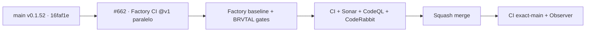

# BRVTAL — Último deploy

  
  
  

> Snapshot de **solo el deploy actual**: #662 ejecuta el CI reusable de `pl0n3r/factory@v1`
> en paralelo al CI propio de BRVTAL. Base exacta `main 16faf1ef3ac4e3b8b08a268fe55ddfbc8dffccfa`
> / v0.1.52, con BRVTAL CI, Deploy Observer y CodeQL verdes. Es CI/gobernanza:
> no cambia runtime, datos ni versión de producto.

## Progress convention

- ✅ ~~Struck through~~ = completed and verified through the required delivery gates.
- 🚧 Normal text = pending or currently in progress.

## Estado del deploy

| Señal | Estado | Evidencia |
| --- | --- | --- |
| Work line | 🚧 **#662 · Factory CI paralelo** | `work/issue-662`; reserva `0be9f2a0-2cbd-47a5-864d-19536ce1820f` |
| Base exacta | ✅ ~~main v0.1.52~~ | `16faf1ef3ac4e3b8b08a268fe55ddfbc8dffccfa` |
| Versión producto | ✅ ~~v0.1.52 sin cambio~~ | repository-only; no deploy-bound |
| Factory channel | ✅ ~~`@v1` publicado~~ | caller sin `kit_ref` dinámico |
| CI/Sonar/CodeRabbit | 🚧 pendiente | revalidar HEAD final |
| Producción | ✅ ~~sin cambio de runtime~~ | este slice no escribe producción |

## Huella del cambio

<!-- brvtal:git-delta -->

| Archivos | Inserciones | Eliminaciones | Neto |
| ---: | ---: | ---: | ---: |
| **3** | **+165** | **−42** | **+123** |

## Calidad y entrega

<!-- brvtal:gate-plan -->

| Control | Estado / contrato |
| --- | --- |
| Gates esperados | **preflight · coordination · fast[PHP+JS]** |
| PR + snapshot exacto | Issue #662 · reserva `0be9f2a0-2cbd-47a5-864d-19536ce1820f` |
| Factory CI | `ci.yml@v1` · PHP 8.5 · phase live · Node genérico desactivado |
| Existing gates | BRVTAL CI, Policy, Privacy, Sonar, CodeQL y CodeRabbit permanecen activos |
| Equivalencia | Factory cubre baseline PHP/preflight; BRVTAL conserva JS, MariaDB, Chromium, real-stack, WebKit y recovery |
| CI del SHA exacto de main | 🚧 después del merge |

## Flujo de entrega

## Qué se hizo

- Añade `.github/workflows/factory-ci.yml` como caller PR-only y read-only de `pl0n3r/factory/.github/workflows/ci.yml@v1`.
- Mapea BRVTAL a `stack: php`, PHP 8.5, dominio HTTPS, `config/version.php`, idioma `en` y fase `live`.
- Mantiene `node_enabled: false`: el job Node genérico de Factory no modela los servicios MariaDB/Playwright que exige `npm test` en BRVTAL.
- Añade contrato negativo contra `pull_request_target`, `workflow_dispatch`, `secrets: inherit`, permisos write y refs dinámicas.
- No retira ni debilita ningún gate existente.

## Archivos modificados en este deploy

- `.github/workflows/factory-ci.yml`
- `README.md`
- `tests/factory-ci-contract.php`

## Validación

- 🚧 Factory CI debe terminar en success sobre el mismo HEAD del PR.
- 🚧 BRVTAL CI debe conservar `validate` verde; este diff selecciona `fast[PHP+JS]`.
- 🚧 Sonar, CodeQL y CodeRabbit deben cerrar sobre el HEAD estable antes del merge.
- El gap de JS/DB/browser/recovery queda explícito; no se declara equivalencia total.

## Qué sigue

| Lane | Trabajo |
| --- | --- |
| **NOW** | 🚧 [#662](https://github.com/pl0n3r/brvtal/issues/662): Factory CI reusable en paralelo. |
| **NEXT** | 🚧 [#630](https://github.com/pl0n3r/brvtal/issues/630): medir gaps y elegir siguiente reusable sin retirar gates. |
| **LATER** | 🚧 [#533](https://github.com/pl0n3r/brvtal/issues/533): continuar roadmap canónico. |
| **BLOCKED / EXTERNAL** | 🚧 Factory v1.0.1 sigue owner-gated en factory#108; no bloquea este caller de CI. |

## Panorama general pendiente

- 🚧 **NOW**: validar Factory CI y BRVTAL CI sobre el mismo HEAD.
- 🚧 **NEXT**: documentar equivalencia observada/gaps en #630.
- 🚧 **LATER**: avanzar #630 por slices pequeños hacia deploy/rollback.
- 🚧 **BLOCKED / EXTERNAL**: catálogo nuevo de Factory espera v1.0.1 si un slice posterior lo requiere.