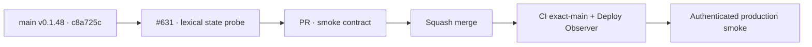

# BRVTAL — Último deploy

  
  
  

> **Production incident #631** · snapshot de **solo el deploy actual**: v0.1.48 exact `main` `c8a725c266180087f6e7003cec2ccfa582d59877` tiene CI y Deploy Observer verdes. Smoke #35949810190 acreditó release/health/Home/Admin/dashboard/Events/date y falló en `navigate:sets` porque el smoke consultaba `window.state`, pero DISCADMIN declara `let state` como binding léxico. **Engineering roles:** SRE / production incident responder, QA automation engineer.

## Progress convention

- ✅ ~~Struck through~~ = completed and verified through the required delivery gates.
- 🚧 Normal text = pending or currently in progress.

## Estado del deploy

| Señal | Estado | Evidencia |
| --- | --- | --- |
| Work line | 🚧 **#631 · lexical Admin state probe** | `work/issue-631`; reserva `afff06c5-1729-4da5-99aa-c11144b9714a` |
| Base exacta | ✅ ~~main v0.1.48~~ | `c8a725c266180087f6e7003cec2ccfa582d59877` |
| Versión | ✅ ~~v0.1.48 sin incremento~~ | solo pruebas/diagnóstico |
| CI exact-main base | ✅ ~~success~~ | [#35949759746](https://github.com/pl0n3r/brvtal/actions/runs/35949759746) |
| Deploy Observer base | ✅ ~~success~~ | [#35949759721](https://github.com/pl0n3r/brvtal/actions/runs/35949759721) |
| Smoke base | ⛔ **failure / false state probe** | [#35949810190](https://github.com/pl0n3r/brvtal/actions/runs/35949810190) · `navigate:sets` |
| Entrega candidata | 🚧 observar binding léxico `state.section` | sin cambio de runtime ni versión |

## Huella del cambio

<!-- brvtal:git-delta -->

| Archivos | Inserciones | Eliminaciones | Neto |
| ---: | ---: | ---: | ---: |
| **3** | **+22** | **−22** | **+0** |

## Calidad y entrega

<!-- brvtal:gate-plan -->

| Control | Estado / contrato |
| --- | --- |
| Gates esperados | **preflight · coordination · fast[PHP+JS] · chromium** |
| PR + snapshot exacto | Issue #631 · reserva `afff06c5-1729-4da5-99aa-c11144b9714a` |
| CodeRabbit / Sonar | 🚧 HEAD estable; máximo 3 rondas automáticas |
| CI del SHA exacto de main | 🚧 después del merge |
| Producción | 🚧 smoke debe completar Sets/Hero además de lo ya acreditado |

## Flujo de entrega

## Qué se hizo

- Smoke #35949810190 observó v0.1.48 / `c8a725c2…` exactos.
- Health **200**, DB **connected**, Home **200**, DISCADMIN **200**, dashboard **892 ms** sin 5xx, versión Admin, Events y Event #6 date pasaron.
- El fallo quedó en `sets-relations / navigate:sets`, sin 5xx ni mutaciones bloqueadas.
- `navigate()` mantiene el click real y la espera causal, pero el probe usaba `window.state`; DISCADMIN declara `let state`, que no se refleja en `window`.
- La candidata observa el binding léxico `state.section === target`, preservando el límite de 20 s.
- Se descartó la optimización v0.1.49 no demostrada; sin cambios de runtime, SQL ni datos productivos.

## Archivos modificados en este deploy

- `README.md` — snapshot exacto.
- `tests/e2e/production-authenticated-smoke.mjs` — observa correctamente el binding léxico del estado Admin.
- `tests/production-smoke-contract.php` — contrato contra regresión a `window.state`.

## Validación

- ✅ ~~Base v0.1.48: CI #35949759746 y Deploy Observer #35949759721 verdes.~~
- ✅ ~~Smoke #35949810190 acreditó todo hasta Events/date y expuso el falso probe `window.state`; cero 5xx y mutaciones bloqueadas.~~
- 🚧 PR CI/revisión, merge y smoke final pendientes; **no declarar PRODUCTION GREEN** antes.

## Qué sigue

| Lane | Trabajo |
| --- | --- |
| **NOW** | 🚧 [#631](https://github.com/pl0n3r/brvtal/issues/631): validar, mergear y repetir smoke real. |
| **NEXT** | 🚧 [#533](https://github.com/pl0n3r/brvtal/issues/533): publicar `🟢 PRODUCTION GREEN` con las cinco evidencias. |
| **LATER** | 🚧 detener BRVTAL después de GREEN mientras Tanda 1 global siga abierta. |
| **BLOCKED / EXTERNAL** | 🚧 Condor/GrindFlow sin GREEN y factory `v1.0.0` ausente; no iniciar Tanda 2. |

## Panorama general pendiente

- 🚧 **NOW**: cerrar #631 con smoke completo.
- 🚧 **NEXT**: verificar incidentes/`[AUTO]` y registrar GREEN en #533.
- 🚧 **LATER**: esperar la barrera global.
- 🚧 **BLOCKED / EXTERNAL**: no adoptar todavía el kit factory.
