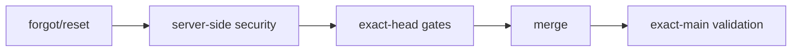

# BRVTAL — Último deploy

> Snapshot de **solo el deploy actual** para #629 / PR #700: recuperación segura de contraseña DISCADMIN, revocación de sesiones y entrega server-side. No declara producción GREEN.

## Progress convention
- ✅ ~~Struck through~~ = completed and verified through required gates.
- 🚧 Normal text = pending/in progress.
- ⛔ = active production blocker.

## Estado del deploy
| Señal | Estado | Evidencia |
| --- | --- | --- |
| Work line | 🚧 **#629 · password recovery** | `work/issue-629` · reserva `0556f401-370b-4b10-b83e-af575f4b1889` |
| Base exacta | ✅ **main** | `d0da2a8503889e14685f9036c919a2f90fed8232` |
| Versión de producto | 🚧 **v0.1.60** | `config/version.php` + `package.json` |
| Producción | ⛔ **NO GREEN · #681** | recuperación de migraciones pendiente |
| PR | 🚧 **#700 draft** | 10 commits · branch mergeable |

## Huella del cambio
<!-- brvtal:git-delta -->
| Archivos | Inserciones | Eliminaciones | Neto |
| ---: | ---: | ---: | ---: |
| **37** | **+1513** | **−81** | **+1432** |

## Calidad y entrega
<!-- brvtal:gate-plan -->
| Control | Estado / contrato |
| --- | --- |
| Gates esperados | **preflight · coordination · fast[PHP+JS] · database · chromium · real-stack · webkit · recovery** |
| PR + snapshot exacto | **#700 · #629 password recovery** |
| Roles | **Security · Software Engineering · QA · SRE** |
| Review | BRVTAL CI + Factory Policy/Privacy + Sonar/CodeRabbit |
| CI del SHA exacto de main | 🚧 obligatorio después del merge |
| Production GREEN | ⛔ fuera de alcance mientras #681 siga abierto |

## Flujo de entrega

## Qué se hizo
- Cambio autenticado de contraseña con revocación de sesiones mediante credential epoch.
- Reset hash-only, one-use, expiración, reemisión y límites independientes por IP/sujeto.
- PHPMailer SMTP server-side, enlaces con token en fragment y páginas con CSP/no-referrer.
- Correcciones de recovery UI, migración idempotente y contratos Factory/Hostinger.
- Spec real-stack aislado del Chromium genérico; real-stack conserva el servidor PHP/MariaDB.
- Documentación de privacidad regenerada desde `datos.yml` con el kit canónico de Factory.

## Archivos modificados en este deploy
- `README.md`
- `api/index.php`
- `composer.json`
- `config/admin_auth.php`
- `config/admin_mailer.php`
- `config/admin_password_security.php`
- `config/admin_session_revalidation.php`
- `config/migration_reconcile.php`
- `config/version.php`
- `database/migration_admin_password_security_01.sql`
- `database/schema.sql`
- `datos.yml`
- `discadmin/forgot-password.php`
- `discadmin/index-core.php`
- `discadmin/password-recovery.css`
- `discadmin/password-recovery.js`
- `discadmin/reset-password.php`
- `discadmin/security.css`
- `discadmin/security.js`
- `docs/privacidad/aviso-privacidad.md`
- `docs/privacidad/politica-tratamiento.md`
- `docs/privacidad/registro-tratamientos.md`
- `docs/privacidad/retencion.md`
- `ops/admin-password-mail-worker.php`
- `ops/factory/build`
- `package.json`
- `playwright.config.mjs`
- `scripts/php-static-analysis.sh`
- `tests/admin-session-revalidation-contract.php`
- `tests/content-ordering-contract.php`
- `tests/e2e/discadmin-password-recovery-real-stack.spec.mjs`
- `tests/e2e/run-content-core-real-stack.sh`
- `tests/factory-deploy-adapters-contract.php`
- `tests/integration/admin-password-security.php`
- `tests/integration/admin-session-revalidation.php`
- `tests/privacy-as-code-contract.php`
- `tests/test_admin_password_security.py`

## Validación
- ✅ Coordination, database, Chromium, real-stack, WebKit y recovery-rehearsal pasaron en la ronda previa del commit 10.
- ✅ Factory Policy pasó.
- 🚧 Revalidar fast/Factory CI/Privacy sobre el HEAD amend final.
- 🚧 CodeRabbit/Sonar terminales requeridos antes de sacar #700 de draft y fusionar.

## Qué sigue
| Lane | Trabajo |
| --- | --- |
| **NOW** | 🚧 [#629](https://github.com/pl0n3r/brvtal/issues/629): cerrar gates y revisión terminal de PR #700. |
| **NEXT** | 🚧 [#683](https://github.com/pl0n3r/brvtal/issues/683): continuar staff API D-060 tras #629. |
| **LATER** | 🚧 [#533](https://github.com/pl0n3r/brvtal/issues/533): continuar roadmap canónico después de las dependencias activas. |
| **BLOCKED / EXTERNAL** | 🚧 [#681](https://github.com/pl0n3r/brvtal/issues/681): producción no GREEN por registry de migraciones. |

## Panorama general pendiente
- 🚧 **NOW:** #629 recovery/password security.
- 🚧 **NEXT:** #683 staff API D-060.
- 🚧 **LATER:** #533 roadmap canónico.
- 🚧 **BLOCKED / EXTERNAL:** #681 producción.
