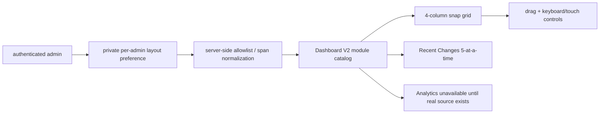

# BRVTAL — Último deploy

> Snapshot de **solo el deploy actual** para #513: Dashboard modular y configurable por administrador dentro del shell canónico. No declara producción GREEN.

## Progress convention
- ✅ ~~Struck through~~ = completed and verified through required gates.
- 🚧 Normal text = pending/in progress.
- 🚧 = active production blocker.

## Estado del deploy
| Señal | Estado | Evidencia |
| --- | --- | --- |
| Work line | 🚧 **#513 · configurable Dashboard** | `work/issue-513` · reserva `09c602e1-8b7c-4c6e-a0c8-fd625b526ec3` |
| Base exacta | ✅ **main** | `d5f10842843fb17d58e53fddcddbcf71d07f6120` |
| Versión de producto | 🚧 **v0.1.64** | `config/version.php` + `package.json` |
| Producción | 🚧 **NO GREEN · #681** | recovery de migraciones sigue bloqueado |
| Factory Labels | 🚧 **#694** | Factory `@v1` todavía falla por alias/canónica |
| PR | 🚧 **#705** | exact-head gates obligatorios |

## Huella del cambio
<!-- brvtal:git-delta -->
| Archivos | Inserciones | Eliminaciones | Neto |
| ---: | ---: | ---: | ---: |
| **12** | **+628** | **−64** | **+564** |

## Calidad y entrega
<!-- brvtal:gate-plan -->
| Control | Estado / contrato |
| --- | --- |
| Gates esperados | **preflight · coordination · fast[PHP+JS] · database · chromium · real-stack · webkit · recovery** |
| PR + snapshot exacto | **#705 · #513 Dashboard modular/configurable** |
| Roles | **Software Engineering · Frontend · UX · QA · Security** |
| Review | BRVTAL CI + Factory Policy/Privacy + Sonar/CodeRabbit |
| CI del SHA exacto de main | 🚧 obligatorio después del merge |
| Production GREEN | 🚧 fuera de alcance mientras #681 siga abierto |

## Flujo de entrega

## Qué se hizo
- Preferencias privadas `admin.dashboard.<admin_id>.layout`, reutilizando la tabla `settings` sin migración.
- Endpoint dedicado con autenticación + CSRF; las claves privadas quedan fuera del Settings genérico.
- Catálogo canónico de módulos con orden, visibilidad, ancho 1–4 y alto 1–2 validados en servidor.
- Dashboard V2 conserva **WHAT NEEDS ATTENTION NOW** y el shell único.
- Reordenamiento por drag-and-drop y fallback de botones para teclado/touch.
- Resize por spans de grid, sin posicionamiento libre por píxeles.
- Add/remove mediante biblioteca de módulos y **Reset to default**.
- Recent Changes carga 5 registros iniciales y **View more** agrega los siguientes 5 mediante cursor.
- Active Events y Media Assets son contadores accionables hacia destinos reales.
- Analytics se ofrece como módulo opcional, oculto por defecto y fail-closed: **DATA UNAVAILABLE** sin métricas inventadas.
- Persistencia y aislamiento por administrador cubiertos por contratos e integración.
- E2E cubre persistencia, hide/show, reorder, resize, reset, navegación y feed progresivo.

## Archivos modificados en este deploy
- `api/admin-dashboard-preferences.php`
- `api/index.php`
- `config/admin_dashboard.php`
- `config/version.php`
- `discadmin/dashboard-v2.css`
- `discadmin/dashboard-v2.js`
- `package.json`
- `tests/admin-dashboard-preferences-contract.php`
- `tests/dashboard-v2-contract.php`
- `tests/e2e/discadmin-dashboard-config.spec.mjs`
- `tests/integration/admin-dashboard-preferences.php`
- `README.md`

## Validación
- 🚧 BRVTAL CI sobre HEAD exacto del PR.
- 🚧 Factory Policy/Privacy y Sonar/CodeRabbit terminales antes de merge.
- 🚧 Validación exact-main obligatoria tras integración.
- No se inventan métricas Analytics ni se amplían permisos/autorización.

## Qué sigue
| Lane | Trabajo |
| --- | --- |
| **NOW** | 🚧 [#513](https://github.com/pl0n3r/brvtal/issues/513): cerrar gates del Dashboard configurable. |
| **NEXT** | 🚧 [#515](https://github.com/pl0n3r/brvtal/issues/515): System Status configurable/reliable sobre primitives reutilizables. |
| **LATER** | 🚧 [#533](https://github.com/pl0n3r/brvtal/issues/533): roadmap canónico. |
| **BLOCKED / EXTERNAL** | 🚧 [#681](https://github.com/pl0n3r/brvtal/issues/681): producción no GREEN. |
| **BLOCKED / FACTORY** | 🚧 [#694](https://github.com/pl0n3r/brvtal/issues/694): Factory Labels `@v1`. |

## Panorama general pendiente
- 🚧 **NOW**: [#513](https://github.com/pl0n3r/brvtal/issues/513) cerrar Dashboard modular/configurable y gates exact-head.
- 🚧 **NEXT**: [#515](https://github.com/pl0n3r/brvtal/issues/515) reutilizar la base de configuración en System Status.
- 🚧 **LATER**: [#533](https://github.com/pl0n3r/brvtal/issues/533) continuar el roadmap.
- 🚧 **BLOCKED / EXTERNAL**: [#681](https://github.com/pl0n3r/brvtal/issues/681) mantiene producción NO GREEN.
