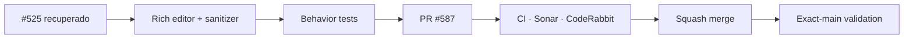

# BRVTAL — Último deploy

  
  
  

> **Development dashboard** · snapshot de **solo el deploy actual** para Issue #525 / PR #587.

## Progress convention

- ✅ ~~Struck through~~ = completed and verified through the required delivery gates.
- 🚧 Normal text = pending or currently in progress.

## Estado del deploy

| Señal | Estado | Evidencia |
| --- | --- | --- |
| Work line | 🚧 **#525 · rich Blog editor + safe HTML source mode** | PR #587 |
| Base exacta | ✅ ~~main validado~~ | `67f56cc1b97bda9e321b25ee9b275a40b0e386c6` |
| Versión | 🚧 **0.1.26** | cambio de producto/runtime Admin + Blog público |
| Producción | 🚧 pendiente de merge + observación | sin migración de esquema en este slice |

## Huella del cambio

<!-- brvtal:git-delta -->

| Archivos | Inserciones | Eliminaciones | Neto |
| ---: | ---: | ---: | ---: |
| **11** | **+880** | **−103** | **+777** |

## Calidad y entrega

<!-- brvtal:gate-plan -->

| Control | Estado / contrato |
| --- | --- |
| Gates | **preflight · coordination · fast[PHP+JS] · database · chromium · real-stack · webkit** |
| Reservation | Issue #525 · `work/issue-525` · UUID `c875c468-977c-4382-a6cc-923bccf46442` |
| PR integrity | **PR + snapshot exacto** contra `main` |
| BRVTAL CI | 🚧 nuevo head en validación tras corregir coordinación, accesibilidad y browser regressions |
| Sonar / CodeRabbit | 🚧 Quality Gate previo pasó; findings accionables de save rebinding y behavior tests corregidos en el head actual |
| Exact-main | **CI del SHA exacto de main** después del squash merge |

## Flujo de entrega

## Qué se hizo

- Se reemplaza el Body plano del Blog por un editor visual con modo HTML/source, headings, énfasis, listas, links, citas, alineación, undo/redo y pegado como texto limpio.
- La inserción de imágenes reutiliza Media Library y conserva rutas/alt compatibles con el renderer público.
- Un sanitizador allowlist compartido protege mutaciones y render público frente a scripts, handlers, embeds, URLs peligrosas y estilos fuera del contrato.
- La limpieza destructiva deja warnings visibles; un POST creado con warnings se rebindea al ID persistido para que el siguiente guardado sea PUT.
- El renderer público conserva HTML semántico permitido dentro de `.entity-rich-body` con estilos responsive.
- Se añadió cobertura PHP de seguridad/idempotencia y Playwright de round-trip Visual↔HTML, paste, Media Library, preview sanitizado y warning-aware save.
- Se mantiene el Blog sin controles manuales de taxonomía y se preservan relaciones existentes cuando una fuente relacionada falla.

## Archivos modificados en este deploy

- `README.md` — snapshot exacto de PR #587.
- `api/blog.php` — sanitización canónica y warnings en mutaciones.
- `config/blog_html.php` — allowlist HTML compartida y segura.
- `config/public_page.php` — proyección de rich Blog HTML en página pública.
- `config/version.php` — versión 0.1.26.
- `css/public-entity.css` — tipografía/layout del cuerpo editorial público.
- `discadmin/blog.css` — UI del rich editor.
- `discadmin/blog.js` — editor visual/source, preview, Media Library y save lifecycle.
- `package.json` — versión 0.1.26.
- `tests/blog-rich-editor-contract.php` — contratos de seguridad del HTML.
- `tests/e2e/discadmin-blog.spec.mjs` — comportamiento real del editor.

## Validación

- Base exacta: `67f56cc1b97bda9e321b25ee9b275a40b0e386c6`.
- Los gates de base/main quedaron verdes antes de recuperar #525.
- La corrida anterior de PR confirmó database, real-stack y WebKit verdes; los fallos concretos de coordination, accessibility y el E2E de Blog fueron corregidos.
- Sonar Quality Gate previo pasó con 0 Security Hotspots; el único finding de complejidad marcado FAILURE fue refactorizado.
- No se hace merge hasta revalidar el head final, reviews y snapshot exacto.

## Qué sigue

| Lane | Trabajo |
| --- | --- |
| **NOW** | 🚧 [#525](https://github.com/pl0n3r/brvtal/issues/525) / PR #587 · cerrar rich Blog editor v0.1.26. |
| **NEXT** | 🚧 [#586](https://github.com/pl0n3r/brvtal/issues/586) · Concept 05 Hero authored 1440/390. |
| **LATER** | 🚧 [#524](https://github.com/pl0n3r/brvtal/issues/524), [#528](https://github.com/pl0n3r/brvtal/issues/528), [#529](https://github.com/pl0n3r/brvtal/issues/529). |
| **BLOCKED / EXTERNAL** | 🚧 Ningún bloqueo externo activo para #525. |

## Panorama general pendiente

| Lane | Frente | Issues |
| --- | --- | --- |
| **NOW** | 🚧 editorial productivity | 🚧 [#525](https://github.com/pl0n3r/brvtal/issues/525) |
| **NEXT** | 🚧 Concept 05 public fidelity | 🚧 [#583](https://github.com/pl0n3r/brvtal/issues/583), [#586](https://github.com/pl0n3r/brvtal/issues/586) |
| **LATER** | 🚧 membership / drafts / preview | 🚧 [#524](https://github.com/pl0n3r/brvtal/issues/524), [#528](https://github.com/pl0n3r/brvtal/issues/528), [#529](https://github.com/pl0n3r/brvtal/issues/529) |
