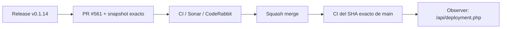

# BRVTAL — Último deploy

  
  
  

> **Development dashboard** · snapshot profesional de **solo el deploy actual**.

## Progress convention

- ✅ ~~Struck through~~ = completed and verified through the required delivery gates.
- 🚧 Normal text = pending or currently in progress.

## Estado del deploy

| Señal | Estado | Evidencia |
| --- | --- | --- |
| Work line | 🚧 **#193 Native navigation transaction (v0.1.14), PR #561** | state + URL rollback on authoritative navigation failure |
| Base exacta | ✅ **VALIDATED IN CODE** | `main` `32c41b6d17bc76d7c24a2f5faa66a92b10bfd70a` |
| Version | 🚧 **0.1.13 → 0.1.14** | patch deploy |
| Producción | 🚧 **PENDING MERGE / OBSERVATION** | release `v0.1.14` after squash merge |

## Huella del cambio

<!-- brvtal:git-delta -->

| Archivos | Inserciones | Eliminaciones | Neto |
| ---: | ---: | ---: | ---: |
| **6** | **+86** | **−51** | **+35** |

## Calidad y entrega

<!-- brvtal:gate-plan -->

| Control | Estado / contrato |
| --- | --- |
| Gates seleccionados | **preflight · fast[PHP+JS] · database · chromium · real-stack** |
| Navegación | estado/rows se comprometen solo tras lectura autoritativa exitosa |
| Latest-wins | respuestas stale no pueden restaurar ni sobrescribir el destino vigente |
| Browser regression | fallo vigente conserva workspace, rows y URL previos |
| Sonar + CodeRabbit | paralelo sobre head estable |
| Exact-main | CI del SHA exacto de main tras squash merge |

## Flujo de entrega

## Qué se hizo

- La navegación nativa deja de cambiar `state.section` antes de que el GET autoritativo termine correctamente.
- La capa de Information Architecture restaura sección, filas y URL si falla la navegación vigente.
- La protección latest-wins se mantiene: una navegación stale no puede revertir un destino más nuevo.
- Playwright reproduce el fallo de Pages desde Artists y exige que el workspace anterior permanezca coherente.
- Versión **0.1.14**.

## Archivos modificados en este deploy

- `README.md`
- `config/version.php`
- `discadmin/admin-information-architecture.js`
- `discadmin/index-core.php`
- `package.json`
- `tests/e2e/discadmin-information-architecture.spec.mjs`

## Validación

- Regresión browser dirigida incluida para el fallo vigente de navegación nativa.
- La corrección no cambia datos ni ejecuta migraciones.
- BRVTAL CI, Sonar y CodeRabbit deben cerrar sobre el head estable antes del merge.
- No se declara producción validada desde CI.

## Qué sigue

| Lane | Trabajo |
| --- | --- |
| **NOW** | 🚧 [#193](https://github.com/pl0n3r/brvtal/issues/193) · cerrar PR #561 y exact-main. |
| **NEXT** | 🚧 [#216](https://github.com/pl0n3r/brvtal/issues/216), [#558](https://github.com/pl0n3r/brvtal/issues/558) · lifecycle de modales + deflake de navegación. |
| **LATER** | 🚧 [#174](https://github.com/pl0n3r/brvtal/issues/174), [#519](https://github.com/pl0n3r/brvtal/issues/519), [#518](https://github.com/pl0n3r/brvtal/issues/518) · protección de edición y productividad editorial. |
| **BLOCKED / EXTERNAL** | 🚧 [#534](https://github.com/pl0n3r/brvtal/issues/534) · observación Hostinger continúa separada del desarrollo independiente. |

## Panorama general pendiente

| Lane | Frente | Issues |
| --- | --- | --- |
| **DONE** | ✅ ~~Phase 1 + Phase 2 visual/Admin foundation~~ | ✅ ~~[#514](https://github.com/pl0n3r/brvtal/issues/514), [#516](https://github.com/pl0n3r/brvtal/issues/516), [#523](https://github.com/pl0n3r/brvtal/issues/523), [#480](https://github.com/pl0n3r/brvtal/issues/480)~~ |
| **NOW** | 🚧 Navigation reliability | 🚧 [#193](https://github.com/pl0n3r/brvtal/issues/193) · PR #561 |
| **NEXT** | 🚧 Browser/navigation closeout | 🚧 [#216](https://github.com/pl0n3r/brvtal/issues/216), [#558](https://github.com/pl0n3r/brvtal/issues/558), [#174](https://github.com/pl0n3r/brvtal/issues/174) |
| **LATER** | 🚧 Editorial productivity | 🚧 [#519](https://github.com/pl0n3r/brvtal/issues/519), [#518](https://github.com/pl0n3r/brvtal/issues/518), [#257](https://github.com/pl0n3r/brvtal/issues/257) |
| **BLOCKED / EXTERNAL** | 🚧 Hostinger deploy observation | 🚧 [#534](https://github.com/pl0n3r/brvtal/issues/534) |
