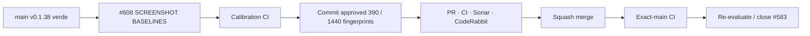

# BRVTAL — Último deploy

  
  
  

> **Development dashboard** · snapshot de **solo el deploy actual** para Issue #608.

## Progress convention

- ✅ ~~Struck through~~ = completed and verified through the required delivery gates.
- 🚧 Normal text = pending or currently in progress.

## Estado del deploy

| Señal | Estado | Evidencia |
| --- | --- | --- |
| Work line | 🚧 **#608 · Concept 05 screenshot regression baselines** | último child de QA de #583 |
| Base exacta | ✅ ~~main v0.1.38 exact-main CI + Sonar + Deploy Observer + Production Performance verdes~~ | `ac239e9e2af244f01ebf76032432384483965181` |
| Versión | ✅ ~~0.1.38 sin bump~~ | test/QA únicamente |
| Producción | ✅ ~~v0.1.38 observada y medida~~ | este slice no modifica runtime |

## Huella del cambio

<!-- brvtal:git-delta -->

| Archivos | Inserciones | Eliminaciones | Neto |
| ---: | ---: | ---: | ---: |
| **2** | **+164** | **−34** | **+130** |

## Calidad y entrega

<!-- brvtal:gate-plan -->

| Control | Estado / contrato |
| --- | --- |
| Gates | **preflight · coordination · fast[JS] · chromium** |
| PR integrity | **PR + snapshot exacto** · Issue #608 · `work/issue-608` · UUID `711755a1-5912-432e-a15d-d6b77948e1ed` |
| Canonical screenshots | ✅ ~~390×844 · 1440×900 calibrated~~ |
| Baseline model | ✅ ~~screenshot real → dHash estructural + RGB grid cuantizado → aggregate SHA-256~~ |
| Existing matrix | ✅ ~~390 · 430 · 768 · 1024 · 1280 · 1440 · 1728 · 1920~~ |
| Sonar | 🚧 análisis del HEAD final |
| CodeRabbit | 🚧 full review sobre HEAD final |
| CI del SHA exacto de main | 🚧 después del squash merge |

## Flujo de entrega

## Qué se hizo

- Se reutiliza el fixture integrado Concept 05 ya validado por #606; no se creó otro renderer ni otra fuente de verdad.
- Se capturan screenshots reales de Hero, Next Experience, Nights, Artists, Sound, Memories, Journal, Connected y footer.
- Cada screenshot se reduce a una firma estructural perceptual y una rejilla RGB cuantizada para detectar cambios materiales sin depender del hash binario exacto del PNG.
- Las firmas regionales se agregan por viewport en dos hashes compactos: **structure** y **color**.
- La captura fuerza `animations: disabled`, oculta caret y conserva `c5-visual-test` para eliminar ruido deliberadamente no determinista.
- La corrida de calibración produjo únicamente los dos fallos esperados de baseline pendiente; todos los tests Concept 05 existentes siguieron verdes.
- Los fingerprints aprobados de 390/1440 quedaron committed y cualquier cambio visual exige refresh manual explícito + revisión.

## Archivos modificados en este deploy

- `README.md` — snapshot exacto de #608 y estrategia de baseline visual.
- `tests/e2e/public-concept05-fidelity-matrix.spec.mjs` — fingerprints de screenshots 390/1440 sobre los módulos canónicos.

## Validación

- Base exacta `ac239e9e2af244f01ebf76032432384483965181`: v0.1.38 con exact-main CI, Sonar, Deploy Observer y Production Performance verdes.
- #608 está reservado por el coordinador; `work/issue-608` nació idéntica a esa base y no existe PR competidor.
- #583 permanece abierto hasta que las dos baselines visuales queden calibradas y exact-main valide el child.
- Pendiente: CI final sobre las baselines fijadas, full review, squash y exact-main.

## Qué sigue

| Lane | Trabajo |
| --- | --- |
| **NOW** | 🚧 [#608](https://github.com/pl0n3r/brvtal/issues/608) · fijar regresión visual canónica 390/1440. |
| **NEXT** | 🚧 [#583](https://github.com/pl0n3r/brvtal/issues/583) · consolidar evidencia y cerrar el contrato Concept 05 si no quedan gaps. |
| **LATER** | 🚧 [#398](https://github.com/pl0n3r/brvtal/issues/398) · archivo cultural conectado; [#531](https://github.com/pl0n3r/brvtal/issues/531) · Media Library smarter. |
| **BLOCKED / EXTERNAL** | 🚧 Sin bloqueos externos activos. |

## Panorama general pendiente

| Lane | Frente | Issues |
| --- | --- | --- |
| **NOW** | 🚧 Visual regression closeout | 🚧 [#608](https://github.com/pl0n3r/brvtal/issues/608) |
| **NEXT** | 🚧 Parent visual contract | 🚧 [#583](https://github.com/pl0n3r/brvtal/issues/583) |
| **LATER** | 🚧 Public archive / media scale | 🚧 [#398](https://github.com/pl0n3r/brvtal/issues/398), [#531](https://github.com/pl0n3r/brvtal/issues/531) |
