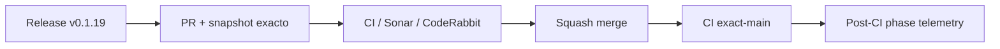

# BRVTAL — Último deploy

  
  
  

> **Development dashboard** · snapshot profesional de **solo el deploy actual**.

## Progress convention

- ✅ ~~Struck through~~ = completed and verified through the required delivery gates.
- 🚧 Normal text = pending or currently in progress.

## Estado del deploy

| Señal | Estado | Evidencia |
| --- | --- | --- |
| Work line | 🚧 **#564 browser phase telemetry (v0.1.19)** | setup/cache/infra/test medidos desde timestamps de GitHub |
| Base exacta | ✅ **VALIDATED IN CODE** | `main` `5fba8a5e651c21f178be0d1061cc67c830a479f1` |
| Version | 🚧 **0.1.18 → 0.1.19** | patch deploy |
| Producción | 🚧 **EXTERNAL BLOCKER OBSERVED** | Hostinger continúa fuera de sincronía; no se infiere validación de producción |

## Huella del cambio

<!-- brvtal:git-delta -->

| Archivos | Inserciones | Eliminaciones | Neto |
| ---: | ---: | ---: | ---: |
| **8** | **+406** | **−96** | **+310** |

## Calidad y entrega

<!-- brvtal:gate-plan -->

| Control | Estado / contrato |
| --- | --- |
| Gates | **preflight · fast[PHP+JS] · database · chromium · real-stack · webkit** |
| Telemetry | post-CI; no añade dependencias ni segundos al DAG de validación |
| Browser phases | dependencies/cache · browser/system · infrastructure · test · other |
| Sonar + CodeRabbit | paralelo sobre head estable |
| Exact-main | CI del SHA exacto de main tras squash merge |

## Flujo de entrega

## Qué se hizo

- La telemetría post-CI ahora conserva tiempos por step y agrega fases comparables para Chromium, WebKit y real-stack.
- Se separan **dependency/cache**, **browser/system setup**, **infrastructure**, **test** y **other** sin insertar timers ni pasos adicionales dentro de los jobs críticos.
- Un contrato con fixture local protege clasificación, tiempos, skipped steps y la semántica de critical path.
- La primera evidencia real ya mostró que WebKit está dominado por setup, mientras Chromium dedica más tiempo al test; todavía no se shardeará desde una sola muestra.
- Versión **0.1.19**.

## Archivos modificados en este deploy

- `.github/workflows/ci-throughput-telemetry.yml` — delega el reporte post-CI al procesador testeado.
- `AGENTS.md` — fija la regla evidence-first para optimización de throughput.
- `README.md` — snapshot visual del deploy actual.
- `config/version.php` — declara la release runtime `0.1.19`.
- `docs/TESTING.md` — documenta fases, semántica y uso de múltiples muestras.
- `package.json` — alinea la versión del proyecto con `0.1.19`.
- `scripts/ci-throughput-report.py` — procesa timestamps de jobs/steps y genera JSON + Job Summary.
- `tests/ci-throughput-report-contract.php` — valida critical path y desglose setup/test con fixtures locales.

## Validación

- Base exacta `5fba8a5`: BRVTAL CI / validate success.
- El nuevo Production Performance ya demostró coordinación-only success cuando CI terminó antes del Deploy Observer, sin setup ni medición duplicada.
- El contrato ejecutable de throughput ya pasó en fast; el artifact post-CI debe confirmar el schema en una corrida real.
- Sonar detectó rutas de archivo controlables por CLI en el primer head; el procesador se endurece a stdin/stdout, ya no acepta paths externos y elimina el return redundante reportado después.
- BRVTAL CI, Sonar y CodeRabbit deben cerrar sobre el head estable antes del merge.
- No se declara producción validada desde CI, telemetría ni deployment marker.

## Qué sigue

| Lane | Trabajo |
| --- | --- |
| **NOW** | 🚧 [#564](https://github.com/pl0n3r/brvtal/issues/564) · acumular muestras y decidir con datos si existe una optimización de setup suficientemente rentable. |
| **NEXT** | 🚧 [#174](https://github.com/pl0n3r/brvtal/issues/174) · proteger cambios sin guardar en Banners. |
| **LATER** | 🚧 [#519](https://github.com/pl0n3r/brvtal/issues/519), [#518](https://github.com/pl0n3r/brvtal/issues/518), [#257](https://github.com/pl0n3r/brvtal/issues/257) · productividad editorial y protección general de editores. |
| **BLOCKED / EXTERNAL** | 🚧 [#534](https://github.com/pl0n3r/brvtal/issues/534) · producción sigue exponiendo una release antigua y requiere revisión Hostinger/hPanel. |

## Panorama general pendiente

| Lane | Frente | Issues |
| --- | --- | --- |
| **NOW** | 🚧 CI throughput evidence | 🚧 [#564](https://github.com/pl0n3r/brvtal/issues/564) |
| **NEXT** | 🚧 Unsaved Banners protection | 🚧 [#174](https://github.com/pl0n3r/brvtal/issues/174) |
| **LATER** | 🚧 Editorial productivity | 🚧 [#519](https://github.com/pl0n3r/brvtal/issues/519), [#518](https://github.com/pl0n3r/brvtal/issues/518), [#257](https://github.com/pl0n3r/brvtal/issues/257) |
| **BLOCKED / EXTERNAL** | 🚧 Hostinger configuration | 🚧 [#534](https://github.com/pl0n3r/brvtal/issues/534) |
