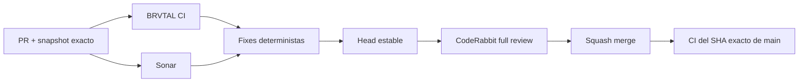

  

# BRVTAL — Último deploy

<strong>Development workflow · stable-head CodeRabbit reviews</strong>

  

> Este README representa **solo el deploy actual**. Se reemplaza en el siguiente deploy y no funciona como changelog acumulativo.

## Estado del deploy

| Señal | Estado | Evidencia |
| --- | --- | --- |
| Base exacta | ✅ **VALIDATED IN CODE** | `main` `3cf0e250646bc1c8e55b3d7186b271646f52c188` · exact-main BRVTAL CI verde |
| Alcance | 🐇 **CodeRabbit workflow** | revisión profunda sobre head estable |
| Incremental review | ⛔ **OFF** | evita re-reviews superpuestas por cada push |
| Perfil | 🔎 **ASSERTIVE** | se conserva la profundidad de revisión |
| Producción | ⚪ **No validada** | CI no equivale a validación de producción |

## Flujo de entrega

## Qué se hizo

- Mantiene CodeRabbit en perfil **Assertive** y conserva la revisión automática inicial.
- Desactiva `auto_incremental_review` para evitar que cada push intermedio dispare otra revisión IA.
- Formaliza el orden: implementar → tests → CI/Sonar → fixes → head estable → una revisión profunda CodeRabbit.
- Exige solicitar la revisión final contra el SHA exacto del head estable.
- Si CodeRabbit queda procesando indefinidamente sin findings/reviews/threads, no se declara “passed”; se documenta su estado y no bloquea indefinidamente cuando los gates canónicos requeridos están verdes y GitHub permite el merge.
- La regla queda persistida en `AGENTS.md` para futuras sesiones/agentes.

## Archivos modificados en este deploy

- `.coderabbit.yaml` — desactiva revisión incremental por cada push.
- `AGENTS.md` — política durable de revisión CodeRabbit sobre head estable.
- `README.md` — snapshot exacto de este cambio de workflow.

## Validación

- Base exacta `3cf0e250646bc1c8e55b3d7186b271646f52c188`: exact-main BRVTAL CI verde tras #509.
- Este PR debe pasar el gate aplicable de BRVTAL CI y Sonar sin issues nuevos.
- CodeRabbit puede efectuar revisión inicial, pero la revisión profunda final se solicita solo cuando el head queda estable.
- Tras squash merge se verificará BRVTAL CI sobre el SHA exacto de `main`.
- No se declara **VALIDATED IN PRODUCTION** desde CI.

## Qué sigue

1. Cerrar este ajuste de workflow y verificar exact-main.
2. Continuar #398 — profundizar el archivo cultural y la navegación relacional.
3. Mantener los tests nuevos bajo la política behavior-first ya registrada en AGENTS.

## Panorama general pendiente

| Frente | Estado / siguiente foco |
| --- | --- |
| 🗃️ **Archivo cultural** | #398 · siguiente prioridad activa |
| 🎛️ **Apariencia** | #149 · completar Light en módulos modernos |
| 🖼️ **Hero Slider** | #221 integridad editorial · #480 regresión visual desktop |
| 🔐 **Seguridad editorial** | #257, #216, #174, #193 |
| 📈 **Analytics** | #427 · completar eventos `brvtal_*` en GTM/GA4 |
| ✍️ **Content / edición** | #224, #252 |
| 🧾 **Activity / operaciones** | #232, #195 |
| 📚 **Bulk Actions** | #275 · registros >500 sin falsa exhaustividad |
| 🌐 **Idioma** | #212 · español canónico + inglés automático por fases |
| 💾 **Backups** | #389 · scheduling seguro + Drive opcional |

---

BRVTAL · Rave till Grave · deploy snapshot

