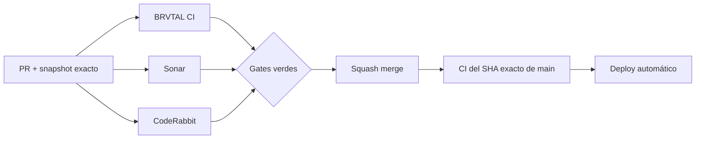

  

# BRVTAL — Último deploy

  <strong>Sonar · Python runtime contract</strong>

  

> Este README representa **solo el deploy actual**. Se reemplaza en el siguiente deploy y no funciona como changelog acumulativo.

## Estado del deploy

| Señal | Estado | Evidencia |
| --- | --- | --- |
| Base exacta | ✅ **VALIDATED IN CODE** | `main` `1e3ef8bde35c39c218feecf44cd8445fd3ad4ea1` · BRVTAL CI #1029 |
| Sonar Python | 🧪 **En corrección** | Se declara explícitamente Python 3.12 para análisis automático |
| CI runtime | 🛡️ **Guardado** | El job `fast` falla si la versión real de Python deja de estar declarada |
| Alcance | 🎯 **Configuración** | Sin cambios de API, DB, rutas ni comportamiento de producto |
| Producción | ⚪ **No validada por este PR** | CI verde no equivale a validación de producción |

## Flujo de entrega

## Qué se hizo

- La configuración automática de Sonar ahora declara `sonar.python.version=3.12`, en lugar de analizar Python como cualquier versión 3.
- Se conserva `.sonarcloud.properties` como fuente canónica del análisis automático; no se añade un scanner Sonar duplicado al CI.
- BRVTAL CI verifica en cada ejecución que la versión `major.minor` del comando `python` del runner esté incluida en `sonar.python.version`.
- Si GitHub cambia `ubuntu-latest` a un runtime Python distinto, el gate falla de forma explícita para obligar a revisar la compatibilidad de Sonar.
- No hay cambios de aplicación, datos ni producción.

## Archivos modificados en este deploy

- `.github/workflows/update-release-metadata.yml` — añade el contrato entre Python del runner y Sonar.
- `.sonarcloud.properties` — fija Python 3.12 para el análisis automático.
- `README.md` — snapshot visual exacto del deploy.

## Validación

- Base exacta: `main` `1e3ef8bde35c39c218feecf44cd8445fd3ad4ea1`.
- La base pasó **BRVTAL CI #1029** y queda **VALIDATED IN CODE**.
- El PR debe pasar BRVTAL CI, SonarQube Cloud y CodeRabbit sobre su SHA exacto.
- El job `fast` debe validar tanto el contrato Python/Sonar como este README y su lista exacta de archivos.
- Tras el squash merge se verificará BRVTAL CI sobre el SHA exacto resultante de `main`.
- Ningún gate de CI implica por sí solo **VALIDATED IN PRODUCTION**.

## Qué sigue

1. Tachar el warning de configuración Python en #451 solo después de merge + exact-main CI verde.
2. Diagnosticar por separado el fallo de Production Performance #716 sin asumir todavía una regresión de producción.
3. Continuar #451 con los P2 que todavía reproduzcan en el código actual.
4. Mantener #479, #480 y #481 como frentes independientes.
5. Reconciliar PR #434 / Memories contra el `main` actual sin ejecutar migraciones de producción automáticamente.

## Panorama general pendiente

| Frente | Estado / siguiente foco |
| --- | --- |
| 🧪 **Sonar / calidad** | #451 — Python config en este PR; luego P2 vigentes |
| ⚡ **Performance** | Production Performance #716 falló sobre `1e3ef8b`; diagnóstico separado pendiente |
| 🎛️ **Apariencia** | #149 — completar Light en módulos modernos |
| 🖼️ **Hero Slider** | #221 integridad editorial de media · #480 regresión visual desktop |
| 🔐 **Seguridad editorial** | #257, #216, #174, #193 |
| 🔎 **SEO / entrega pública** | #182, #214, #204, #272 → #390 · #479 alt · #481 IndexNow |
| ✍️ **Content / edición** | #224, #252 |
| 🧾 **Activity / operaciones** | #232, #195 |
| 📚 **Bulk Actions** | #275 — catálogos >500 sin truncado silencioso |
| 🧭 **Dashboard / Theme** | #348, #351 |
| 🗃️ **Archivo cultural** | #398, #403 |
| 🧠 **Memories** | #415 / PR #434 pendiente; sin migración automática |
| 🌐 **Idioma** | #212 — español canónico + inglés automático por fases |
| 💾 **Backups** | #389 — scheduling seguro + Drive opcional |

---

BRVTAL · Rave till Grave · snapshot operativo, no historial acumulativo

