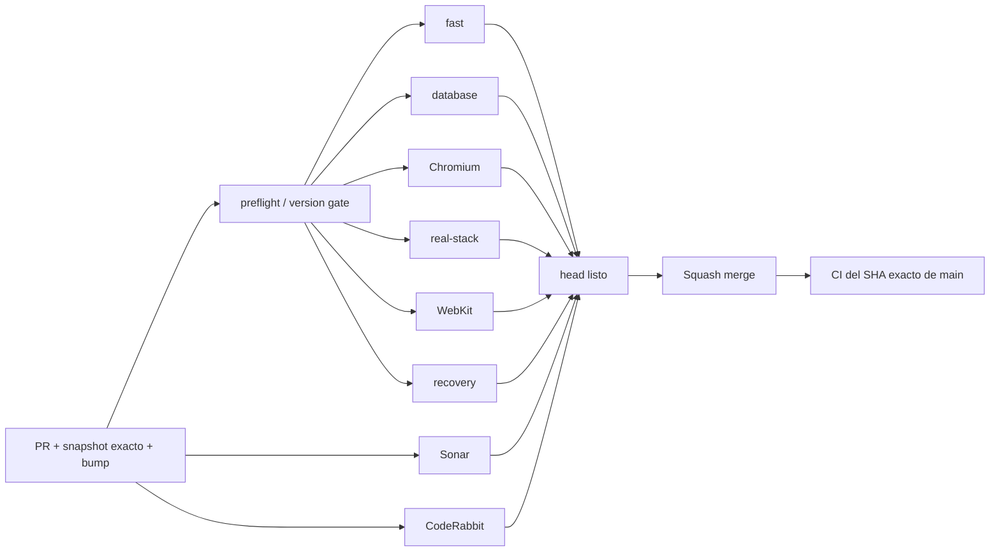

# BRVTAL — Último deploy

  
  
  

> **Development dashboard** · snapshot profesional de **solo el deploy actual**.

## Estado del deploy

| Señal | Estado | Evidencia |
| --- | --- | --- |
| Work line | 🏷️ **#517 HUMAN PRODUCT VERSION** | **BRVTAL v0.1.1** primary · SHA secondary |
| Base exacta | ✅ **VALIDATED IN CODE** | `main` `18e544f02f25c99ef7f25fe9859a962b6b57aa6e` · exact-main `validate` verde |
| Version | 🚀 **0.1.0 → 0.1.1** | patch deploy bump · pre-1.0 |
| Producción | ⛔ **BLOCKED / EXTERNAL** | Hostinger marker en [#534](https://github.com/pl0n3r/brvtal/issues/534) |

## Huella del cambio

<!-- brvtal:git-delta -->

| Archivos | Inserciones | Eliminaciones | Neto |
| ---: | ---: | ---: | ---: |
| **17** | **+281** | **−55** | **+226** |

## Calidad y entrega

<!-- brvtal:gate-plan -->

| Control | Estado / contrato |
| --- | --- |
| Gates seleccionados | **preflight · fast[PHP+JS] · database · chromium · real-stack · webkit · recovery** |
| Version gate | cada deploy-bound PR incrementa patch exactamente una vez |
| Product identity | **BRVTAL v0.1.1 · Production** |
| Technical identity | SHA secundario; fallback nunca se presenta como SHA exacto |
| Sonar | Clean-as-You-Code en paralelo |
| CodeRabbit | full review del head estable en paralelo |
| Exact-main | obligatorio después del squash merge |

## Flujo de entrega

## Qué se hizo

- La versión humana avanza de **0.1.0** a **0.1.1**.
- DISCADMIN prioriza **BRVTAL v0.1.1** y **Production**; el SHA queda como detalle técnico secundario.
- Dashboard y System Status muestran la misma versión humana como señal primaria y la identidad técnica debajo.
- Si solo existe metadata fallback, la UI muestra **SOURCE UNAVAILABLE** en lugar de fingir un SHA exacto.
- System Status usa la misma versión humana y conserva source SHA para diagnóstico cuando es exacto.
- `preflight` valida cada transición de versión sin crear commits automáticos.
- Patch es el incremento normal; minor requiere milestone deliberado; **1.0.0** queda reservado a decisión explícita del administrador.
- `config/version.php` se clasifica como metadata liviana para que el bump obligatorio no expanda por sí solo los gates futuros.

## Archivos modificados en este deploy

- `.github/workflows/update-release-metadata.yml` — gate de transición en preflight.
- `AGENTS.md` — contrato durable de versionado.
- `README.md` — dashboard exacto de #517.
- `api/deployment.php` — exactness + versión pública.
- `api/health.php` — identidad de versión/deploy consistente.
- `config/deployment.php` — diferencia source exacto vs fallback.
- `config/version.php` — versión canónica 0.1.1.
- `discadmin/index-core.php` — versión humana primaria en footer.
- `discadmin/dashboard-v2.js` — versión humana primaria en Operations; source SHA secundario.
- `discadmin/system-status-v2.js` — producto primario / SHA secundario.
- `discadmin/technical.php` — exactness en payload operacional.
- `scripts/ci-scope.sh` — bump aislado no activa runtime gates.
- `scripts/release-version.py` — validación Git de transición semántica.
- `tests/deployment-traceability-contract.php` — contrato de producto vs deploy.
- `tests/e2e/discadmin-admin-shell.spec.mjs` — regresión del footer.
- `tests/e2e/discadmin-dashboard-v2-authority.spec.mjs` — regresión de versión humana en Dashboard.
- `tests/e2e/discadmin-system-status-v2.spec.mjs` — regresión de System Status.

## Validación

- transición `0.1.0 → 0.1.1` verificada contra base/head Git;
- versión consistente en footer, Dashboard, API y System Status;
- exact SHA sigue disponible cuando proviene de entorno/Git checkout;
- release fallback no se muestra como exact deployed source;
- CI valida la transición pero nunca escribe ni commitea `config/version.php`.

## Qué sigue

| Lane | Trabajo |
| --- | --- |
| **NOW** | Cerrar [#517](https://github.com/pl0n3r/brvtal/issues/517). |
| **NEXT** | [#221](https://github.com/pl0n3r/brvtal/issues/221) · impedir Banners/Hero activos sin media válida. |
| **BLOCKED / EXTERNAL** | [#534](https://github.com/pl0n3r/brvtal/issues/534) · Hostinger Git auto-deploy/hPanel. |
| **LATER** | Phase 2: [#348](https://github.com/pl0n3r/brvtal/issues/348), [#149](https://github.com/pl0n3r/brvtal/issues/149), [#514](https://github.com/pl0n3r/brvtal/issues/514). |

## Panorama general pendiente

| Lane | Frente | Issues |
| --- | --- | --- |
| **NOW** | Release identity | [#517](https://github.com/pl0n3r/brvtal/issues/517) |
| **NEXT** | Banner integrity | [#221](https://github.com/pl0n3r/brvtal/issues/221) |
| **BLOCKED / EXTERNAL** | Deploy | [#534](https://github.com/pl0n3r/brvtal/issues/534) |
| **LATER** | Admin IA / appearance | [#348](https://github.com/pl0n3r/brvtal/issues/348), [#149](https://github.com/pl0n3r/brvtal/issues/149), [#514](https://github.com/pl0n3r/brvtal/issues/514) |
| **LATER** | Editorial productivity | [#518](https://github.com/pl0n3r/brvtal/issues/518), [#519](https://github.com/pl0n3r/brvtal/issues/519), [#525](https://github.com/pl0n3r/brvtal/issues/525), [#528](https://github.com/pl0n3r/brvtal/issues/528) |
