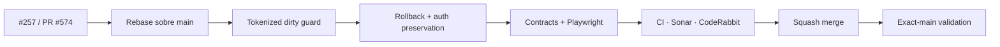

# BRVTAL — Último deploy

  
  
  

> **Development dashboard** · snapshot de **solo el deploy actual** para PR #574 / v0.1.24.

## Progress convention

- ✅ ~~Struck through~~ = completed and verified through the required delivery gates.
- 🚧 Normal text = pending or currently in progress.

## Estado del deploy

| Señal | Estado | Evidencia |
| --- | --- | --- |
| Work line | 🚧 **#257 · unsaved editor protection v0.1.24** | PR #574 · revisión final en validación |
| Base exacta | ✅ ~~main validado~~ | `f1eeb5c355ea2a799b016493e2100afd35510c57` · BRVTAL CI / Sonar / Deploy Observer success |
| Versión | 🚧 **0.1.23 → 0.1.24** | cambio deploy-bound de DISCADMIN |
| Producción base | ✅ ~~release observado~~ | identidad del release base; no implica comportamiento validado |

## Huella del cambio

<!-- brvtal:git-delta -->

| Archivos | Inserciones | Eliminaciones | Neto |
| ---: | ---: | ---: | ---: |
| **9** | **+294** | **−33** | **+261** |

## Calidad y entrega

<!-- brvtal:gate-plan -->

| Control | Estado / contrato |
| --- | --- |
| Gates | **preflight · coordination · fast[PHP+JS] · database · chromium · real-stack · webkit · recovery** |
| Reservation | Issue #257 · `work/issue-257` · UUID vigente |
| PR integrity | **PR + snapshot exacto** · rebase lógico sobre el main actual |
| Dirty-state | snapshot + lock + operation token; completion stale = no-op |
| Navigation | mutación tardía = rollback de workspace/URL + editor dirty preservado |
| Auth expiry | 401/Logout no pueden renderizar y destruir cambios sin guardar |
| Lifecycle | roots desconectados se podan del tracking para no retener subárboles desmontados |
| Sonar / CodeRabbit | nueva revisión sobre el head estable |
| Exact-main | **CI del SHA exacto de main** después del squash merge |

## Flujo de entrega

## Qué se hizo

- Se conserva un único manager de cambios sin guardar para CRUD legacy, Lineup, Releases, Blog y Content Core.
- Navegaciones asíncronas y Logout ahora poseen token de operación; una respuesta stale no puede liberar el lock de otra operación.
- El snapshot se revalida antes del commit; una mutación tardía restaura workspace y URL previos sin perder el editor dirty.
- Logout coordina Unsaved Changes + Hero guard y evita render/commit dependiente si el snapshot cambió.
- Un 401 administrativo con cambios dirty conserva el DOM editable y muestra estado explícito de sesión terminada.
- El manager elimina roots desconectados cuando un módulo desmonta un editor, evitando retención innecesaria de su subárbol DOM.
- Playwright cubre carrera de navegación, rollback, Logout y expiración de sesión.
- Los findings nuevos de Sonar se corrigen en el mismo head: retornos uniformes para las transacciones de navegación y menor complejidad en expiración de sesión.

## Archivos modificados en este deploy

- `.github/workflows/update-release-metadata.yml` — CI principal con límites, pins y contratos de resiliencia.
- `AGENTS.md` — política durable de reintentos y autoauditoría.
- `README.md` — snapshot exacto de esta entrega de mejora continua.
- `scripts/ci_retry.py` — reintentos acotados solo para dependencias externas transitorias.
- `scripts/ci_self_audit.py` — verificador reutilizable de seguridad de workflows.
- `tests/backup-recovery-rehearsal-contract.php` — acepta evidencia con acción fijada por SHA.
- `tests/ci-self-audit-contract.py` — contrato de detección de drift de workflows.
- `tests/project-operations-contract.php` — acepta acciones de artifacts fijadas por SHA.
- `tests/test_ci_retry.py` — contrato de límites y clasificación de reintentos.

## Validación

- Base exacta `f1eeb5c355ea2a799b016493e2100afd35510c57`: BRVTAL CI / `validate`, Sonar y Deploy Observer success.
- El head final de #574 debe volver a pasar los gates aplicables, Sonar y CodeRabbit.
- Sin migraciones ni operaciones destructivas de producción.
- Deploy observado no se confundirá con **VALIDATED IN PRODUCTION**.

## Qué sigue

| Lane | Trabajo |
| --- | --- |
| **NOW** | 🚧 [#257](https://github.com/pl0n3r/brvtal/issues/257) / PR #574 · cerrar revisión y v0.1.24. |
| **NEXT** | 🚧 [#525](https://github.com/pl0n3r/brvtal/issues/525) · rich Blog editor + safe HTML source mode. |
| **LATER** | 🚧 [#524](https://github.com/pl0n3r/brvtal/issues/524), [#528](https://github.com/pl0n3r/brvtal/issues/528), [#529](https://github.com/pl0n3r/brvtal/issues/529). |
| **BLOCKED / EXTERNAL** | 🚧 Sin bloqueo externo activo para #257. |

## Panorama general pendiente

| Lane | Frente | Issues |
| --- | --- | --- |
| **NOW** | 🚧 Unsaved editor protection | 🚧 [#257](https://github.com/pl0n3r/brvtal/issues/257) |
| **NEXT** | 🚧 Rich Blog editor | 🚧 [#525](https://github.com/pl0n3r/brvtal/issues/525) |
| **LATER** | 🚧 Membership / drafts / preview | 🚧 [#524](https://github.com/pl0n3r/brvtal/issues/524), [#528](https://github.com/pl0n3r/brvtal/issues/528), [#529](https://github.com/pl0n3r/brvtal/issues/529) |
| **BLOCKED / EXTERNAL** | 🚧 Protected production actions | requieren confirmación explícita cuando apliquen |
