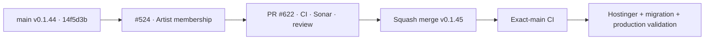

# BRVTAL — Último deploy

  
  
  

> **Development dashboard** · snapshot de **solo el deploy actual** para Issue #524.

## Progress convention

- ✅ ~~Struck through~~ = completed and verified through the required delivery gates.
- 🚧 Normal text = pending or currently in progress.

## Estado del deploy

| Señal | Estado | Evidencia |
| --- | --- | --- |
| Work line | 🚧 **#524 · Artist collective membership simplificada** | `work/issue-524` · PR #622 |
| Base exacta | ✅ ~~main v0.1.44~~ | `14f5d3b5d9d53c259c29a6ef17905ada5c81e08c` |
| Versión | 🚧 **0.1.45 candidate** | un booleano canónico `is_collective_member` |
| Producción | 🚧 pendiente merge/deploy + migración explícita | migración aditiva, preserva legacy e historial |

## Huella del cambio

<!-- brvtal:git-delta -->

| Archivos | Inserciones | Eliminaciones | Neto |
| ---: | ---: | ---: | ---: |
| **35** | **+933** | **−808** | **+125** |

## Calidad y entrega

<!-- brvtal:gate-plan -->

| Control | Estado / contrato |
| --- | --- |
| Gates | **preflight · coordination · fast[PHP+JS] · database · chromium · real-stack · webkit** |
| PR + snapshot exacto | PR #622 · Issue #524 · UUID `a04b7904-e12e-4f6e-bb18-7a03b7dacc6b` |
| Autoridad única | 🚧 checkbox interno `is_collective_member` en Create/Edit Artist |
| Migración | 🚧 `active → 1`; `alumni/none → 0`; legacy e historial no se borran |
| Compatibilidad deploy | 🚧 pre-migration bridge mantiene lecturas/escrituras seguras |
| Admin | 🚧 se elimina Collective Status separado; Artists muestra columna + filtro BRVTAL |
| Público | 🚧 roster/perfil/event lineup leen la misma membresía canónica |
| Cobertura | 🚧 contratos + browser + MariaDB migration + real-stack |
| Sonar | 🚧 pendiente sobre head estable |
| CodeRabbit | 🚧 pendiente revisión final |
| CI del SHA exacto de main | 🚧 después del squash merge |

## Flujo de entrega

## Qué se hizo

- Artist tiene una sola autoridad de membresía actual: `is_collective_member`.
- Create/Edit Artist expone el checkbox **BRVTAL artist / Member of collective**; los códigos `active/alumni/none` dejan de ser controles del administrador.
- La pantalla/workflow separado **Collective Status** se elimina; el listado de Artists incorpora columna y filtro MEMBER / EXTERNAL.
- La migración añade el booleano y mapea únicamente membresía vigente: legacy `active` queda marcado; `alumni` y `none` quedan desmarcados.
- `artist_collective_history` se conserva como auditoría histórica y no vuelve a gobernar estado actual.
- La API pública, roster, perfil Artist y participación de Events comparten el mismo campo canónico.
- Existe puente de compatibilidad para desplegar código antes de ejecutar la migración sin romper Artists.
- La regla operativa del proyecto reconoce producción como entorno mutable de desarrollo mientras BRVTAL siga en desarrollo, manteniendo trazabilidad y preservación de datos.

## Archivos modificados en este deploy

- `AGENTS.md`
- `README.md`
- `api/content-validation.php`
- `api/index.php`
- `api/public.php`
- `config/admin_activity.php`
- `config/admin_grid.php`
- `config/artist_collective_lifecycle.php`
- `config/artist_collective_membership.php`
- `config/public_artist.php`
- `config/version.php`
- `css/public-roster.css`
- `database/migration_artist_collective_membership_01.sql`
- `database/schema.sql`
- `discadmin/admin-data-grid.css`
- `discadmin/admin-data-grid.js`
- `discadmin/admin-information-architecture.js`
- `discadmin/admin-modules.js`
- `discadmin/content-core.js`
- `discadmin/content-core.php`
- `discadmin/index-core.php`
- `docs/BRVTAL-SPEC.md`
- `index.php`
- `js/public-roster.js`
- `package.json`
- `tests/admin-data-grid-contract.php`
- `tests/api-contract.php`
- `tests/artist-collective-lifecycle-contract.php`
- `tests/content-core-form-accessibility-contract.php`
- `tests/e2e/discadmin-content-core-lineup-integrity.spec.mjs`
- `tests/e2e/discadmin-data-grid.spec.mjs`
- `tests/e2e/public-roster-phase-c.spec.mjs`
- `tests/e2e/run-content-core-real-stack.sh`
- `tests/integration/artist-collective-membership-migration.sh`
- `tests/public-roster-contract.php`

## Validación

- Rama reservada #524, 0 commits detrás de `main` al abrir PR #622.
- Migración diseñada como aditiva/idempotente y sin DROP/DELETE de legacy o historial.
- Cobertura dedicada verifica mapping legacy, rerun no destructivo, UI canónica, filtro de Artists y comportamiento público.
- Pendiente: gates completos del PR, Sonar/CodeRabbit, squash merge, exact-main, deploy Hostinger, aplicación de migración y smoke de producción.

## Qué sigue

| Lane | Trabajo |
| --- | --- |
| **NOW** | 🚧 [#524](https://github.com/pl0n3r/brvtal/issues/524) · cerrar PR #622 y entregar v0.1.45. |
| **NEXT** | 🚧 [#528](https://github.com/pl0n3r/brvtal/issues/528) · autosave/recovery del editor. |
| **LATER** | 🚧 [#530](https://github.com/pl0n3r/brvtal/issues/530) · recycle bin / safe restore y backlog según [roadmap #533](https://github.com/pl0n3r/brvtal/issues/533). |
| **BLOCKED / EXTERNAL** | 🚧 ninguno técnico conocido; producción se ejecuta tras merge con herramientas disponibles y rollback seguro. |

## Panorama general pendiente

- 🚧 **Editorial resilience:** #528 autosave/recovery y #530 recycle bin.
- 🚧 **Roadmap:** mantener #533 como fuente de orden/progreso y corregir estados al cerrar cada entrega.
- 🚧 **Producción:** después del deploy v0.1.45 aplicar `migration_artist_collective_membership_01.sql` mediante el flujo explícito de migraciones y validar Artists/roster.
