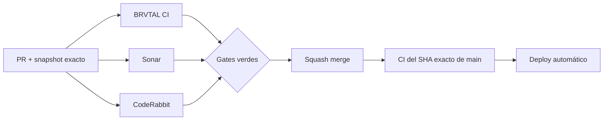

  

# BRVTAL — Último deploy

  <strong>Quality configuration · Python + Sonar alignment</strong>

  

> Este README representa **solo el deploy actual**. Se reemplaza en el siguiente deploy; no es un changelog acumulativo.

## Estado del deploy

| Señal | Estado | Evidencia |
| --- | --- | --- |
| Base exacta | ✅ **VALIDATED IN CODE** | `main` `1e3ef8bde35c39c218feecf44cd8445fd3ad4ea1` · BRVTAL CI #1029 |
| Python CI | 🐍 **3.13 explícito** | `actions/setup-python@v7` |
| Python source | 🧪 **Compilación validada** | `python -m py_compile scripts/update-release-metadata.py` |
| Sonar | 🔎 **Alineado** | `sonar.python.version=3.13` |
| Producción | ⚪ **No validada por este PR** | CI verde no equivale a validación de producción |

## Flujo de entrega

## Qué se hizo

- Se elimina la dependencia implícita del Python incluido por `ubuntu-latest`.
- El job `fast` configura **Python 3.13** mediante `actions/setup-python@v7`.
- El único archivo Python del repo se compila en CI para comprobar que la versión declarada es realmente compatible.
- SonarQube Cloud recibe `sonar.python.version=3.13`, igual que CI.
- Se conserva el análisis automático de Sonar; **no se añade un scanner CI duplicado**.
- No cambia runtime público, DISCADMIN, API, base de datos ni persistencia.

## Archivos modificados en este deploy

- `.github/workflows/update-release-metadata.yml` — configura Python 3.13 y valida sintaxis del script Python.
- `.sonarcloud.properties` — declara `sonar.python.version=3.13`.
- `README.md` — snapshot visual exacto del deploy.

## Validación

- Base exacta: `main` `1e3ef8bde35c39c218feecf44cd8445fd3ad4ea1`.
- La base pasó **BRVTAL CI #1029** y queda **VALIDATED IN CODE**.
- El PR debe pasar el nuevo setup Python, `py_compile`, BRVTAL CI, SonarQube Cloud y CodeRabbit sobre su SHA exacto.
- El propio job `fast` debe validar este README y su lista exacta de 3 archivos.
- Tras squash merge se verificará BRVTAL CI sobre el SHA exacto resultante de `main`.
- Ningún gate de CI implica por sí solo **VALIDATED IN PRODUCTION**.

## Qué sigue

1. Tachar el warning `sonar.python.version` en #451 solo tras merge + exact-main CI verde.
2. Continuar #451 con el siguiente P2 que aún reproduzca en código actual.
3. Mantener #479, #480 y #481 como frentes separados.
4. Reconciliar PR #434 / Memories aparte y sin migraciones automáticas.

## Panorama general pendiente

| Frente | Estado / siguiente foco |
| --- | --- |
| 🧪 **Sonar / calidad** | #451 — Python config en este PR; después P2 vigentes |
| 🎛️ **Apariencia** | #149 — completar Light en módulos modernos |
| 🖼️ **Hero Slider** | #221 integridad editorial · #480 regresión visual desktop |
| 🔐 **Seguridad editorial** | #257, #216, #174, #193 |
| 🔎 **SEO / entrega pública** | #182, #214, #204, #272 → #390 · #479 alt · #481 IndexNow |
| ✍️ **Content / edición** | #224, #252 |
| 🧾 **Activity / operaciones** | #232, #195 |
| 📚 **Bulk Actions** | #275 — catálogos >500 sin truncado silencioso |
| 🧭 **Dashboard / Theme** | #348, #351 |
| 🗃️ **Archivo cultural** | #398, #403 |
| 🧠 **Memories** | #415 / PR #434 pendiente; sin migración automática |
| 🌐 **Idioma** | #212 — español canónico + inglés automático por fases |
| 💾 **Backups** | #389 — scheduling seguro + Drive opcional |

---

BRVTAL · Rave till Grave · snapshot operativo, no historial acumulativo

