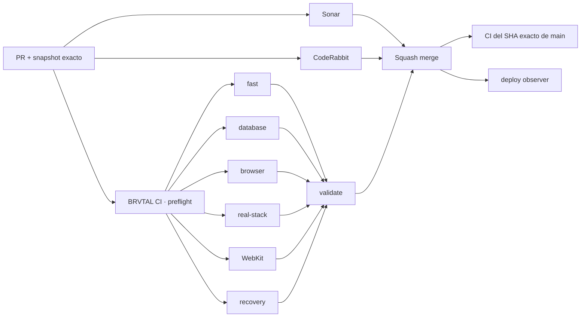

# BRVTAL · Development Dashboard

> Deploy snapshot for [#534](https://github.com/pl0n3r/brvtal/issues/534). This is operational state, not a cumulative changelog.

## Estado del deploy

| Señal | Estado | Evidencia |
| --- | --- | --- |
| Base exacta | ✅ **VALIDATED IN CODE** | `main` `1cb65b32ff99f07fce1a5748d380c0c9587e5949` · exact-main BRVTAL CI green |
| Scope | ⚡ **DELIVERY PIPELINE** | [#534](https://github.com/pl0n3r/brvtal/issues/534) |
| Git delta | 📐 **7 files · 300 insertions · 173 deletions · net +127** | base `1cb65b32…` → current PR head |
| CI topology | 🧵 **PARALLEL FAN-OUT** | short preflight → applicable gates concurrently |
| Review | 🔎 **CONCURRENT** | CI/Sonar + final-head CodeRabbit overlap |
| Production | ⚪ **Not behavior-validated** | deploy marker ≠ production smoke |

## Flujo de entrega

## Qué se hizo

- Separa detección de scope en un **preflight** corto y hace fan-out inmediato de gates independientes.
- Evita PHP/JS setup cuando el diff no lo necesita; paths desconocidos siguen validación conservadora.
- Paraleliza lint PHP y JavaScript con un límite de 4 workers; los contratos PHP siguen secuenciales por seguridad.
- Cambia la política de CodeRabbit: review final corre junto a CI/Sonar sobre el mismo head estable.
- Añade observación del SHA exacto desplegado en Hostinger desde el push a `main`, en paralelo con exact-main CI.
- Adopta escrituras Git multiarchivo atómicas: este cambio se publica como un solo commit lógico.

## Archivos modificados en este deploy

- `.github/workflows/production-deploy-observer.yml` — observación temprana del marcador exacto de deploy.
- `.github/workflows/update-release-metadata.yml` — preflight + fan-out + PHP/JS scope.
- `AGENTS.md` — contrato durable de paralelización, review y deploy observation.
- `README.md` — snapshot visual de #534.
- `scripts/ci-scope.sh` — flags `run_php` / `run_js` y fallback conservador.
- `scripts/php85-compatibility.sh` — lint PHP con paralelismo acotado.
- `tests/ci-scope-contract.php` — contratos ejecutables de la nueva topología/scope.

## Validación

- El contrato CI debe demostrar docs-only sin PHP/JS, JS/CSS selectivo y fallback desconocido conservador.
- BRVTAL CI debe mostrar `preflight` primero y los gates seleccionados arrancando sin esperar al suite PHP completo.
- Sonar debe mantener 0 nuevos issues accionables / hotspots.
- CodeRabbit se solicita sobre el head estable al mismo tiempo que CI/Sonar.
- Tras squash merge se valida el SHA exacto de `main`.
- El observer solo puede declarar **DEPLOYED marker observed**, nunca **VALIDATED IN PRODUCTION**.

## Qué sigue

| Lane | Trabajo |
| --- | --- |
| **NOW** | Terminar [#534](https://github.com/pl0n3r/brvtal/issues/534) y comparar wall time contra la línea base ~106–123s. |
| **NEXT** | [#527](https://github.com/pl0n3r/brvtal/issues/527) · convertir README en dashboard de desarrollo todavía más visual/automatizado. |
| **LATER** | [#533](https://github.com/pl0n3r/brvtal/issues/533) · ejecutar quick wins y luego cambios estructurales. |

## Panorama general pendiente

| Lane | Frente | Siguiente foco |
| --- | --- | --- |
| **NOW** | ⚡ Delivery | [#534](https://github.com/pl0n3r/brvtal/issues/534) |
| **NEXT** | 📊 Repo dashboard | [#527](https://github.com/pl0n3r/brvtal/issues/527) |
| **NEXT** | 🛠️ Admin quick wins | [#520](https://github.com/pl0n3r/brvtal/issues/520), [#521](https://github.com/pl0n3r/brvtal/issues/521), [#526](https://github.com/pl0n3r/brvtal/issues/526), [#522](https://github.com/pl0n3r/brvtal/issues/522) |
| **LATER** | 🎛️ Premium Admin | [#348](https://github.com/pl0n3r/brvtal/issues/348), [#149](https://github.com/pl0n3r/brvtal/issues/149), [#514](https://github.com/pl0n3r/brvtal/issues/514) |
| **LATER** | 🧩 Configurable workspaces | [#513](https://github.com/pl0n3r/brvtal/issues/513), [#515](https://github.com/pl0n3r/brvtal/issues/515) |
| **LATER** | ✍️ Editorial productivity | [#518](https://github.com/pl0n3r/brvtal/issues/518), [#519](https://github.com/pl0n3r/brvtal/issues/519), [#525](https://github.com/pl0n3r/brvtal/issues/525), [#528](https://github.com/pl0n3r/brvtal/issues/528) |
| **LATER** | 🗺️ Master roadmap | [#533](https://github.com/pl0n3r/brvtal/issues/533) |
