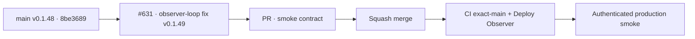

# BRVTAL — Último deploy

  
  
  

> **Production incident #631** · snapshot de **solo el deploy actual**: v0.1.48 exact `main` `8be3689199538ac7e97335bde475ac0c99bb95f6` tiene CI exact-main y Deploy Observer verdes. Smoke #35952488785 demostró Sets API **66 ms** y browser HTTP **200 en 97 ms**, pero la UI quedó bloqueada >20 s. La causa es el `MutationObserver` de ordenamiento: la ayuda usa `data-order-resource`, se auto-clasifica como contenedor y genera una cadena recursiva de ayudas. **Engineering roles:** SRE / production incident responder, frontend reliability engineer, QA automation engineer.

## Progress convention

- ✅ ~~Struck through~~ = completed and verified through the required delivery gates.
- 🚧 Normal text = pending or currently in progress.

## Estado del deploy

| Señal | Estado | Evidencia |
| --- | --- | --- |
| Work line | 🚧 **#631 · stop ordering-help observer loop** | `work/issue-631`; reserva `e23ed40e-13b2-4d89-8556-ad7b090ba39e` |
| Base exacta | ✅ ~~main v0.1.48~~ | `8be3689199538ac7e97335bde475ac0c99bb95f6` |
| Versión | 🚧 **v0.1.49 candidate** | fix runtime DISCADMIN + regresión browser |
| CI exact-main base | ✅ ~~success~~ | [#35952411201](https://github.com/pl0n3r/brvtal/actions/runs/35952411201) |
| Deploy Observer base | ✅ ~~success~~ | [#35952411173](https://github.com/pl0n3r/brvtal/actions/runs/35952411173) |
| Smoke base | ⛔ **failure / frontend observer loop** | [#35952488785](https://github.com/pl0n3r/brvtal/actions/runs/35952488785) · API 66 ms · browser 200/97 ms · UI >20 s |
| Entrega candidata | 🚧 ayuda usa `data-order-help-resource` | observer real cubierto por E2E |

## Huella del cambio

<!-- brvtal:git-delta -->

| Archivos | Inserciones | Eliminaciones | Neto |
| ---: | ---: | ---: | ---: |
| **6** | **+66** | **−28** | **+38** |

## Calidad y entrega

<!-- brvtal:gate-plan -->

| Control | Estado / contrato |
| --- | --- |
| Gates esperados | **preflight · coordination · fast[PHP+JS] · database · chromium · real-stack · webkit** |
| PR + snapshot exacto | Issue #631 · reserva `e23ed40e-13b2-4d89-8556-ad7b090ba39e` |
| CodeRabbit / Sonar | 🚧 HEAD estable; máximo 3 rondas automáticas |
| CI del SHA exacto de main | 🚧 después del merge |
| Producción | 🚧 smoke debe completar Sets/Hero además de lo ya acreditado |

## Flujo de entrega

## Qué se hizo

- Smoke #35952488785 observó v0.1.48 / `8be36891…` exactos.
- Health **200**, DB **connected**, Home **200**, DISCADMIN **200**, dashboard **521 ms** sin 5xx, versión Admin, Events y Event #6 date pasaron.
- Sets API paginado respondió **200 en 66 ms** con 3/3 filas; el navegador recibió el mismo GET **200 en 97 ms**, sin request failure.
- La transición siguió bloqueada >20 s después de recibir la respuesta, aislando el fallo en el frontend/main thread.
- `content-ordering.js` asignaba `data-order-resource` también al bloque `.content-order-help`; su `MutationObserver` observa ese mismo selector, refresca la ayuda como si fuera contenedor y crea otra ayuda recursivamente.
- La candidata cambia la ayuda a `data-order-help-resource`; el contenedor real conserva `data-order-resource`. El observer agrupa también el contenedor padre cuando aparece una fila hija, evitando loops y preservando el auto-enhancement de filas dinámicas.

## Archivos modificados en este deploy

- `README.md` — snapshot exacto.
- `config/version.php` — candidato v0.1.49.
- `discadmin/content-ordering.js` — separa metadatos de ayuda y contenedor para cortar el loop.
- `package.json` — versión v0.1.49.
- `tests/content-ordering-contract.php` — contrato estático contra la colisión de dataset.
- `tests/e2e/discadmin-content-ordering.spec.mjs` — regresión con `MutationObserver` real.

## Validación

- ✅ ~~Base v0.1.48: CI #35952411201 y Deploy Observer #35952411173 verdes.~~
- ✅ ~~Smoke #35952488785 aisló DB/red vs UI: Sets API 66 ms, browser 200/97 ms, bloqueo posterior en frontend.~~
- 🚧 PR CI/revisión, merge y smoke final pendientes; **no declarar PRODUCTION GREEN** antes.

## Qué sigue

| Lane | Trabajo |
| --- | --- |
| **NOW** | 🚧 [#631](https://github.com/pl0n3r/brvtal/issues/631): validar, mergear y repetir smoke real. |
| **NEXT** | 🚧 [#533](https://github.com/pl0n3r/brvtal/issues/533): publicar `🟢 PRODUCTION GREEN` con las cinco evidencias. |
| **LATER** | 🚧 detener BRVTAL después de GREEN mientras Tanda 1 global siga abierta. |
| **BLOCKED / EXTERNAL** | 🚧 Condor/GrindFlow sin GREEN y factory `v1.0.0` ausente; no iniciar Tanda 2. |

## Panorama general pendiente

- 🚧 **NOW**: cerrar #631 con smoke completo.
- 🚧 **NEXT**: verificar incidentes/`[AUTO]` y registrar GREEN en #533.
- 🚧 **LATER**: esperar la barrera global.
- 🚧 **BLOCKED / EXTERNAL**: no adoptar todavía el kit factory.
