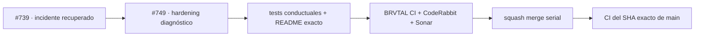

# BRVTAL — Último deploy

> Snapshot de **solo el deploy actual** para [#749](https://github.com/pl0n3r/brvtal/issues/749): endurecer diagnóstico sanitizado de HTTP 5xx en Authenticated Production Smoke sin relajar gates ni mutar producción.

## Progress convention
- ✅ ~~Struck through~~ = completed and verified through required gates.
- 🚧 Normal text = pending/in progress.

## Estado del deploy

| Señal | Estado | Evidencia |
| --- | --- | --- |
| Work line | 🚧 **#749 · smoke diagnostics hardening** | `work/issue-749` · reserva `fe5c1f8a-916c-414a-a8f4-c3dc245f7d3e` |
| Base / producción | ✅ ~~**main exacto**~~ | `da747099e7c67f3cf11b14eed5e63560674a39d4` · v0.1.85 |
| Recuperación previa | ✅ ~~**GREEN**~~ | Authenticated Production Smoke `36553958480`, attempt 2: SUCCESS |
| Versión objetivo | ✅ ~~**v0.1.85 sin bump**~~ | cambio de tests/observabilidad, no runtime de producto |
| PR + snapshot exacto | 🚧 **pendiente** | README se valida contra el diff final |
| Producción candidato | ✅ ~~**sin cambio**~~ | #749 no escribe DB, auth ni producto |

## Huella del cambio

<!-- brvtal:git-delta -->
| Archivos | Inserciones | Eliminaciones | Neto |
| ---: | ---: | ---: | ---: |
| **3** | **+__ADD__** | **−__DEL__** | **__NET__** |

## Calidad y entrega

<!-- brvtal:gate-plan -->
| Control | Estado / contrato |
| --- | --- |
| Gates seleccionados | 🚧 pendiente en HEAD final · **preflight · coordination · fast[PHP+JS] · database · chromium · real-stack** |
| Seguridad | solo campos allowlisted; sin body arbitrario, credenciales, cookies, CSRF, TOTP ni PII |
| Fail-closed | cualquier HTTP 5xx autenticado continúa fallando el smoke |
| Revisión | CodeRabbit + Sonar + contratos BRVTAL sobre HEAD estable |
| CI del SHA exacto de main | obligatorio después del merge |
| Producción | no requiere deploy funcional; smoke exact-main sigue siendo evidencia operativa |

## Flujo de entrega

```mermaid
flowchart LR
  A["#739 · incidente recuperado"] --> B["#749 · hardening diagnóstico"]
  B --> C["tests conductuales + README exacto"]
  C --> D["BRVTAL CI + CodeRabbit + Sonar"]
  D --> E["squash merge serial"]
  E --> F["CI del SHA exacto de main"]
```

## Qué se hizo

- Persiste path, HTTP status, fase y operación del 5xx **antes** del decode opcional.
- Acepta `application/json` y `application/*+json`.
- Limita el decode diagnóstico con timeout propio; un decode lento/roto no borra el 5xx base.
- Solo conserva `error`, `code`, `status` y `database` transformados a evidencia allowlisted y truncada.
- Separa `httpStatus` de `payloadStatus`.
- Clasifica `auth-revalidation`, `db-health` y `application`.
- Los helpers diagnósticos se ejecutan conductualmente desde Python/Node; errores no relacionados hacen fallar la prueba.
- No cambia revalidación de sesión, auth, DB, producto ni estrategia de retry.

## Archivos modificados en este deploy

- `README.md`
- `tests/e2e/production-authenticated-smoke.mjs`
- `tests/test_production_smoke_diagnostics.py`

## Validación

- Base exacta: `da747099e7c67f3cf11b14eed5e63560674a39d4`.
- El 5xx base se escribe antes de iniciar el decode JSON.
- `application/problem+json` queda cubierto por regresión conductual.
- Timeout de decode devuelve evidencia sanitizada vacía sin ocultar el 5xx ya persistido.
- DB unavailable puede clasificarse por `database=error` o códigos allowlisted aun fuera de `/health`.
- Rollback: revertir este PR; no existe migración ni write productivo.

## Qué sigue

| Lane | Trabajo |
| --- | --- |
| **NOW** | 🚧 [#749](https://github.com/pl0n3r/brvtal/issues/749): validar y entregar hardening diagnóstico. |
| **NEXT** | 🚧 [#746](https://github.com/pl0n3r/brvtal/issues/746): README Contract v1 cuando Factory publique el reusable en `@v1`. |
| **LATER** | 🚧 Continuar [roadmap #533](https://github.com/pl0n3r/brvtal/issues/533) por prioridad. |
| **BLOCKED / EXTERNAL** | 🚧 publicación protegida de Factory `@v1`; no bloquea #749. |

## Panorama general pendiente

- **NOW**: 🚧 #749 hardening del smoke productivo.
- **NEXT**: 🚧 #746 README Contract v1.
- **LATER**: 🚧 roadmap #533 y producto.
- **BLOCKED / EXTERNAL**: 🚧 Factory `@v1` sigue protegido por su puerta humana y hardening pendiente.
