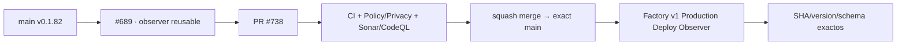

# BRVTAL — Último deploy

> Snapshot de **solo el deploy actual** para #689: adopción del Production Deploy Observer reusable de Factory v1, sin cambio de producto ni autoridad de producción.

## Progress convention
- ✅ ~~Struck through~~ = completed and verified through required gates.
- 🚧 Normal text = pending/in progress.

## Estado del deploy
| Señal | Estado | Evidencia |
| --- | --- | --- |
| Work line | 🚧 **#689 · Factory v1 Production Observer** | `work/issue-689` · reserva `3cb81a3c-b98a-403d-8d8b-9b136d383614` |
| Base | ✅ ~~**main**~~ | `f936dc5869dedef75b9c9c82008a7467a907acbc` · v0.1.82 |
| Versión producto | ✅ ~~**v0.1.82 sin bump**~~ | mantenimiento repository-only |
| PR + snapshot exacto | 🚧 **#738** | reusable observer + contratos |
| Producción candidato | 🚧 **pending** | merge → exact-main CI → observer Factory v1 |

## Huella del cambio
<!-- brvtal:git-delta -->
| Archivos | Inserciones | Eliminaciones | Neto |
| ---: | ---: | ---: | ---: |
| **4** | **+0** | **−0** | **+0** |

## Calidad y entrega
<!-- brvtal:gate-plan -->
| Control | Estado / contrato |
| --- | --- |
| Gates | 🚧 **preflight · coordination · fast[PHP+JS] · database · chromium · real-stack** |
| Acceptance | 🚧 **AC-01 caller v1 · AC-02 SHA/version + lifecycle EN · AC-03 permisos/triggers · AC-04 sin observer duplicado** |
| Factory | 🚧 Factory CI · Policy · Privacy · Labels |
| Review | 🚧 Sonar · CodeQL · CodeRabbit terminal |
| CI del SHA exacto de main | 🚧 BRVTAL CI · Production Deploy Observer reusable |

## Qué se hizo
- Mantiene `production-deploy-observer.yml` como superficie estable, pero delega el comportamiento a `pl0n3r/factory/.github/workflows/observar.yml@v1`.
- Usa `https://www.brvtal.com.co`, `/api/health.php`, `config/version.php` y `BRVTAL_APP_VERSION`.
- Envía el SHA exacto del push, exige `schema_up_to_date=true` y conserva el lifecycle de incidente en inglés.
- Limita el caller a push sobre `main`, `contents: read` e `issues: write`.
- Elimina polling/curl/jq/checkout duplicados del observer local.
- Mantiene intactos authenticated smoke, performance, deploy, migraciones, Hostinger y base de datos.

## Archivos modificados en este deploy
- `.github/workflows/production-deploy-observer.yml` — caller mínimo del observer Factory v1.
- `README.md` — snapshot exacto de #689 / PR #738.
- `tests/ci-scope-contract.php` — contrato global actualizado al observer reusable.
- `tests/test_factory_observer_adoption.py` — AC-01..AC-04 ejecutables.

## Validación
- Base de implementación: `main@f936dc5869dedef75b9c9c82008a7467a907acbc`.
- Factory v1 valida contexto confiable antes del checkout y conserva versión/SHA exactos.
- Sonar y CodeQL se validan sobre el HEAD estable del PR.
- La prueba decisiva ocurre tras merge: el push exacto de `main` debe ejecutar el reusable y observar producción sin crear un incidente.

## Flujo de entrega

```mermaid
flowchart LR
  A["main v0.1.82"] --> B["#689 · observer reusable"]
  B --> C["PR #738"]
  C --> D["CI + Policy/Privacy + Sonar/CodeQL"]
  D --> E["squash merge → exact main"]
  E --> F["Factory v1 Production Deploy Observer"]
  F --> G["SHA/version/schema exactos"]
```

## Qué sigue
| Lane | Trabajo |
| --- | --- |
| **NOW** | 🚧 PR #738: cerrar CI/review sobre HEAD estable. |
| **NEXT** | 🚧 Merge serializado y validar observer sobre SHA exacto de main. |
| **LATER** | 🚧 Recalcular el cierre del épico crítico [#630](https://github.com/pl0n3r/brvtal/issues/630). |
| **BLOCKED / EXTERNAL** | 🚧 [#737](https://github.com/pl0n3r/brvtal/issues/737) sigue siendo decisión legal humana independiente. |

## Panorama general pendiente
- 🚧 **NOW**: #689 / PR #738, terminar adopción del observer Factory v1.
- 🚧 **NEXT**: exact-main BRVTAL CI + observer reusable.
- 🚧 **LATER**: reevaluar #630 contra el estado real de Factory.
- 🚧 **BLOCKED / EXTERNAL**: #737 no se infiere desde trabajo técnico.
