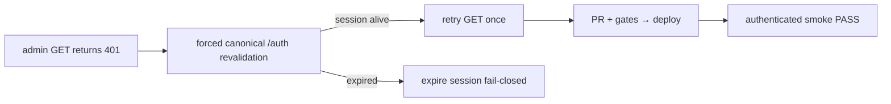

# BRVTAL — Último deploy

> Snapshot de **solo el deploy actual** para #681: recuperar de forma fail-closed un 401 transitorio en GET admin mediante revalidación canónica de sesión.

## Progress convention
- ✅ ~~Struck through~~ = completed and verified through required gates.
- 🚧 Normal text = pending/in progress.
- 🚧 = active production blocker.

## Estado del deploy
| Señal | Estado | Evidencia |
| --- | --- | --- |
| Work line | 🚧 **#681 · Hero Slider / authenticated smoke** | `work/issue-681` · reserva `54a2a330-b566-47f6-b7a4-7eadcf11b27b` |
| Base | ✅ **main** | `7db6e2c1de3ccbd4e0bd85157e387bfdcd21904f` · v0.1.76 |
| Versión | 🚧 **v0.1.77** | patch deploy-bound |
| PR | 🚧 **pending** | `work/issue-681` → `main` |
| Main | 🚧 **pending** | CI del SHA exacto de main tras merge |
| Producción | 🚧 **NO GREEN** | v0.1.76 health/schema/reconcile exactos GREEN; smoke falla solo en Hero Slider intento 2 con `AUTH_REQUIRED` |

## Huella del cambio
<!-- brvtal:git-delta -->
| Archivos | Inserciones | Eliminaciones | Neto |
| ---: | ---: | ---: | ---: |
| **5** | **+248** | **−43** | **+205** |

## Calidad y entrega
<!-- brvtal:gate-plan -->
| Control | Estado / contrato |
| --- | --- |
| Gates | 🚧 **preflight · coordination · fast[PHP+JS] · database · chromium · real-stack · webkit** |
| Factory | 🚧 Policy · Privacy · Labels |
| Snapshot | 🚧 PR + snapshot exacto |
| Main | 🚧 CI del SHA exacto de main tras merge |
| Review | 🚧 Sonar + CodeRabbit |
| Producción | ✅ v0.1.76 health/schema/reconcile exactos · 🚧 authenticated smoke |

## Flujo de entrega

```mermaid
flowchart LR
  A["admin GET returns 401"] --> R["forced canonical /auth revalidation"]
  R -->|session alive| G["retry GET once"]
  R -->|expired| X["expire session fail-closed"]
  G --> M["PR + gates → deploy"]
  M --> S["authenticated smoke PASS"]
```

## Qué se hizo
- v0.1.77 añade una revalidación canónica y acotada para un 401 transitorio de GET admin same-origin: si la sesión sigue válida, el GET se repite exactamente una vez.
- Las mutaciones nunca se revalidan ni se reintentan; un 401 de POST/PUT/PATCH/DELETE expira la sesión de forma fail-closed.
- La generación de autenticación invalida cualquier /auth pendiente cuando la sesión expira, evitando que una respuesta tardía restaure CSRF o habilite un retry después del logout lógico.
- Las regresiones Playwright cubren recuperación GET, mutación 401 y la carrera GET-revalidation vs. mutación-expiry.

## Archivos modificados en este deploy
- `README.md` — snapshot operativo v0.1.77.
- `config/version.php` — versión v0.1.77.
- `discadmin/admin-auth-boundary.js` — revalidación acotada de 401 para GET admin same-origin y expiración inmediata para mutaciones.
- `package.json` — versión runtime sincronizada en v0.1.77.
- `tests/e2e/discadmin-auth-cache.spec.mjs` — regresiones de GET 401 transitorio y mutation 401 fail-closed.

## Validación
- No cambia DB, migraciones, storage ni permisos.
- Solo GET admin same-origin puede revalidarse y repetirse una vez.
- POST/PUT/PATCH/DELETE con 401 no se revalidan ni reintentan y expiran inmediatamente la sesión local.
- Una expiración incrementa la generación de auth; cualquier revalidación pendiente queda obsoleta antes de poder restaurar CSRF.
- Para cerrar #681 deben quedar registradas las pruebas de reconciliación del registry, backup previo a cualquier escritura de DB que haya sido necesaria, `scripts/migrations.php verify-plan __NONE__` exitoso, health HTTP 200 con `schema_up_to_date=true` y versión/SHA exactos, además del authenticated smoke sobre el `main` resultante.
- Este PR no agrega migraciones; no se repite reconcile salvo que exact-main revele un delta de migración.

## Qué sigue
| Lane | Trabajo |
| --- | --- |
| **NOW** | 🚧 [#681](https://github.com/pl0n3r/brvtal/issues/681): publicar v0.1.77 y repetir smoke autenticado. |
| **NEXT** | 🚧 Cerrar #681 solo con evidencia de reconcile/backup/`verify-plan __NONE__`, health exacto y authenticated smoke sobre el `main` resultante. |
| **LATER** | 🚧 [#533](https://github.com/pl0n3r/brvtal/issues/533): retomar roadmap cuando producción vuelva a GREEN. |
| **BLOCKED / EXTERNAL** | ✅ ~~Sin bloqueo externo adicional.~~ |

## Panorama general pendiente
- 🚧 **NOW**: #681, revalidar una sola vez GET admin 401 antes de expirar el shell; mutaciones siguen sin retry.
- 🚧 **NEXT**: declarar GREEN solo con smoke autenticado PASS.
- 🚧 **LATER**: #533 roadmap canónico.
