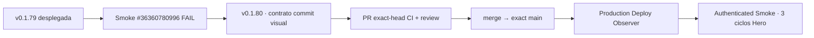

# BRVTAL — Último deploy

> Snapshot de **solo el deploy actual** para #729: v0.1.80 hace que Hero → Dashboard comprometa workspace y navegación visible antes de resolver.

## Progress convention
- ✅ ~~Struck through~~ = completed and verified through required gates.
- 🚧 Normal text = pending/in progress.

## Estado del deploy
| Señal | Estado | Evidencia |
| --- | --- | --- |
| Work line | 🚧 **#729 · Hero/Dashboard navigation commit** | `work/issue-729` · reserva `9d4171ce-ca50-4143-94bd-00f6aa6da769` |
| Base | ✅ **main** | `873ed41e0400f80880ac1ebdf25242438c869745` · v0.1.79 |
| Producción base | ✅ **exacta** | v0.1.79 · observer `36360732198` · health 200 · DB connected |
| Smoke base | ❌ **AC-07 falla** | `36360780996` · Hero intento 1 PASS; Hero → Dashboard no deja nav activo |
| Versión candidato | 🚧 **v0.1.80** | patch deploy-bound |
| PR | 🚧 **#731 en revisión** | `work/issue-729` → `main` |
| Producción candidato | 🚧 **pending** | observer + authenticated smoke exactos |

## Huella del cambio
<!-- brvtal:git-delta -->
| Archivos | Inserciones | Eliminaciones | Neto |
| ---: | ---: | ---: | ---: |
| **8** | **+197** | **−67** | **+130** |

## Calidad y entrega
<!-- brvtal:gate-plan -->
| Control | Estado / contrato |
| --- | --- |
| Gates | 🚧 **preflight · coordination · fast[PHP+JS] · database · chromium · real-stack · webkit** |
| Factory | 🚧 Factory CI · Policy · Privacy · Labels · **PR + snapshot exacto** |
| Review | 🚧 Sonar · CodeQL · CodeRabbit terminal |
| Main | 🚧 **CI del SHA exacto de main** · Production Deploy Observer · Authenticated Production Smoke |

## Qué se hizo
- `go('dashboard')` propaga `BRVTALDashboardV2.mount() === false` en vez de convertir un mount fallido en navegación exitosa.
- Un mount exitoso devuelve `true` explícitamente.
- Admin Information Architecture sincroniza la navegación canónica antes de resolver una navegación exitosa.
- La regresión browser reproduce el contrato observado en producción: al resolver Hero → Dashboard, Dashboard ya debe ser la sección y botón activos.
- No se aumentan retries, no se relaja autenticación y no se modifica esquema ni datos.

## Archivos modificados en este deploy
- `README.md` — evidencia exacta de v0.1.79 y plan de verificación v0.1.80.
- `config/version.php` — versión deploy-bound v0.1.80.
- `package.json` — versión del paquete alineada con el release.
- `discadmin/index-core.php` — propaga el resultado real del mount Dashboard V2.
- `discadmin/admin-information-architecture.js` — compromete el estado visual de navegación antes de resolver `go()`.
- `tests/dashboard-v2-contract.php` — contrato ejecutable de éxito/fallo del mount.
- `tests/e2e/discadmin-information-architecture.spec.mjs` — regresión Hero → Dashboard con active nav sincronizado.
- `tests/test_hero_auth_race.py` — acceptance contract incluye la nueva regresión de commit visual.

## Validación
- Regresión browser: Hero → Dashboard solo resuelve cuando Dashboard ya es la sección y navegación activas.
- Contrato PHP: un `mount() === false` se propaga como navegación fallida; no existe falso positivo.
- Auth single-flight, mutaciones 401 fail-closed y tres ciclos reales de #125 permanecen obligatorios.
- v0.1.79 sirve como evidencia negativa reproducible; v0.1.80 debe superar exactamente el mismo smoke.

## Evidencia base
- PR #730 fue integrado y desplegado en `main@873ed41e0400f80880ac1ebdf25242438c869745`.
- Exact-main BRVTAL CI terminó **success**.
- Production Deploy Observer `36360732198` terminó **success**.
- Authenticated Production Smoke `36360780996` observó v0.1.79/SHA exactos, health 200, DB connected, Events, Sets y Hero intento 1 correctos.
- El fallo exacto fue `hero-slider-dashboard-ready-1`: `window.go('dashboard')` resolvió `true`, pero `[data-admin-nav="dashboard"].active` no apareció.

## Flujo de entrega

```mermaid
flowchart LR
  A["v0.1.79 desplegada"] --> B["Smoke #36360780996 FAIL"]
  B --> C["v0.1.80 · contrato commit visual"]
  C --> D["PR exact-head CI + review"]
  D --> E["merge → exact main"]
  E --> F["Production Deploy Observer"]
  F --> G["Authenticated Smoke · 3 ciclos Hero"]
```

## Qué sigue
| Lane | Trabajo |
| --- | --- |
| **NOW** | 🚧 v0.1.80: cerrar gates del candidato sobre SHA exacto. |
| **NEXT** | 🚧 Exact-main CI + Production Deploy Observer. |
| **LATER** | 🚧 Authenticated Production Smoke fresco: tres ciclos Dashboard ↔ Hero. |
| **BLOCKED / EXTERNAL** | Ninguno conocido. https://github.com/pl0n3r/brvtal/issues/729 solo se cierra con AC-07 verde. |

## Panorama general pendiente
- 🚧 **NOW**: #729 / PR #731, cerrar gates exact-head de v0.1.80.
- 🚧 **NEXT**: merge serializado, exact-main CI y Production Deploy Observer.
- 🚧 **LATER**: Authenticated Production Smoke fresco con tres ciclos Dashboard ↔ Hero; solo entonces cerrar #729.
