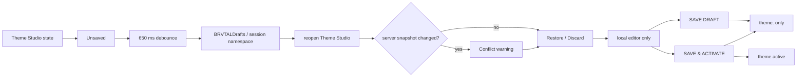

# BRVTAL — Último deploy

> Snapshot de **solo el deploy actual** para #714: recovery local de Theme Studio preservando Save Draft vs Save & Activate. No declara producción GREEN.

## Progress convention
- ✅ ~~Struck through~~ = completed and verified through required gates.
- 🚧 Normal text = pending/in progress.
- 🚧 = active production blocker.

## Estado del deploy
| Señal | Estado | Evidencia |
| --- | --- | --- |
| Work line | 🚧 **#714 · Theme Studio recoverable drafts** | `work/issue-714` · reserva `eda50974-7d35-41fe-a5b5-df7667166383` |
| Base | ✅ **main** | `a143a9e68626cf87b8a0d4e3d3f98c1bc66e14a0` |
| Versión | 🚧 **v0.1.71** | `config/version.php` + `package.json` |
| PR | 🚧 **delivery de #714** | exact-head gates obligatorios antes de merge |
| Producción | 🚧 **NO GREEN · #681** | migration registry parity sigue bloqueado externamente |
| Continuidad | ✅ **separada** | #715 SEO E2E flake · #533 roadmap |

## Huella del cambio
<!-- brvtal:git-delta -->
| Archivos | Inserciones | Eliminaciones | Neto |
| ---: | ---: | ---: | ---: |
| **6** | **+637** | **−50** | **+587** |

## Calidad y entrega
<!-- brvtal:gate-plan -->
| Control | Estado / contrato |
| --- | --- |
| Gates | 🚧 **preflight · coordination · fast[PHP+JS] · database · chromium · real-stack · webkit** |
| Factory | 🚧 Policy · Privacy · Labels |
| Snapshot | 🚧 PR + snapshot exacto |
| Main | 🚧 CI del SHA exacto de main tras merge |
| Review | 🚧 Sonar + CodeRabbit |
| Seguridad | localStorage same-origin por sesión; sin endpoint, proveedor, permiso ni migración nuevos |
| Producción | #681 permanece fuera de alcance; no se declara GREEN |

## Flujo de entrega

```mermaid
flowchart LR
  T["Theme Studio state"] --> U["Unsaved"]
  U --> D["650 ms debounce"]
  D --> L["BRVTALDrafts / session namespace"]
  L --> R["reopen Theme Studio"]
  R --> C{"server snapshot changed?"}
  C -- no --> X["Restore / Discard"]
  C -- yes --> W["Conflict warning"]
  W --> X
  X --> F["local editor only"]
  F --> S["SAVE DRAFT"]
  F --> A["SAVE & ACTIVATE"]
  S --> P["theme.<slug> only"]
  A --> P
  A --> Q["theme.active"]
```

## Qué se hizo
- Theme Studio reutiliza `BRVTALDrafts` directamente; no usa el adapter legacy.
- Autosave local persiste `currentTheme()` con debounce y **no hace POST/PUT**.
- Recovery se identifica por slug y usa una revisión estable derivada de serialización canónica del setting server-side crudo.
- Restore cambia únicamente el editor local; nunca llama Activate ni escribe `theme.active`.
- Save Draft y Save & Activate mantienen rutas explícitas separadas.
- Save exitoso limpia recovery solo si el editor sigue igual al payload enviado.
- Ediciones durante Save y durante el reload post-Save quedan en recovery local sobre la nueva revisión server.
- Mientras un recovery está pendiente de Restore/Discard, nuevas ediciones no sobrescriben ese recovery.
- Los cambios rápidos entre temas usan generation tokens para impedir renders/recovery stale.
- Auth expiry invalida generaciones pendientes y cancela continuaciones async antes de renderizar.
- Failed Save conserva draft local cuando storage está disponible.
- Session boundary compartido elimina recovery, incluida la recuperación ya montada en el workspace.
- Media Library availability/retry, valores legacy ocultos y guards existentes permanecen intactos.
- Sin SQL, migración, Hostinger write ni cambios de readiness.

## Archivos modificados en este deploy
- `README.md`
- `config/version.php`
- `discadmin/theme-studio-v2.css`
- `discadmin/theme-studio-v2.js`
- `package.json`
- `tests/e2e/theme-studio-drafts.spec.mjs`

## Validación
- E2E: autosave local + Restore sin mutación server ni activación.
- E2E: conflicto cuando cambia el setting server-side.
- E2E: failed Save conserva recovery.
- E2E: Save race conserva ediciones posteriores.
- E2E: cambio de slug durante Save conserva recovery bajo la nueva identidad.
- E2E: Restore nunca activa y Save & Activate conserva su semántica explícita.
- E2E: auth session boundary elimina recovery y cancela cargas pendientes.
- E2E: recovery pendiente sobrevive ediciones antes de Restore/Discard.
- E2E: post-Save reload conserva ediciones hechas durante requests async.
- E2E: switch concurrente ignora la carga stale al volver al tema actual.
- Harness usa origen HTTP same-origin para localStorage realista.
- No cambia `datos.yml`: sin nuevo dato personal, proveedor ni transferencia.
- 🚧 Evidencia CI/Sonar/CodeRabbit se registra solo después de gates del HEAD exacto.

## Qué sigue
| Lane | Trabajo |
| --- | --- |
| **NOW** | 🚧 [#714](https://github.com/pl0n3r/brvtal/issues/714): cerrar exact-head gates y merge. |
| **NEXT** | 🚧 [#715](https://github.com/pl0n3r/brvtal/issues/715): SEO failed-save E2E. |
| **LATER** | 🚧 [#533](https://github.com/pl0n3r/brvtal/issues/533): roadmap canónico. |
| **BLOCKED / EXTERNAL** | 🚧 [#681](https://github.com/pl0n3r/brvtal/issues/681): migration registry parity / producción NO GREEN. |
| **BLOCKED BY #681** | 🚧 #530: Recycle Bin requiere metadata durable/migración segura. |

## Panorama general pendiente
- 🚧 **NOW**: #714 / v0.1.71.
- 🚧 **NEXT**: #715.
- 🚧 **BLOCKED / EXTERNAL**: #681 permanece fail-closed; no se ejecuta reconcile sin backup/autoridad verificable.
