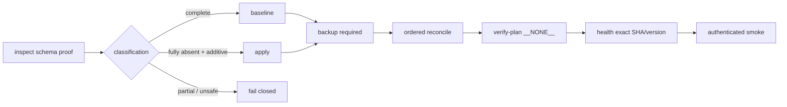

# BRVTAL — Último deploy

> Snapshot de **solo el deploy actual** para #681: desbloqueo estrecho del media-reference guard después de prueba estructural de ausencia total.

## Progress convention
- ✅ ~~Struck through~~ = completed and verified through required gates.
- 🚧 Normal text = pending/in progress.
- 🚧 = active production blocker.

## Estado del deploy
| Señal | Estado | Evidencia |
| --- | --- | --- |
| Work line | 🚧 **#681 · production migration registry parity** | `work/issue-681` · reserva `109ff86e-b4a6-47ce-a833-cbc00158b82c` |
| Base | ✅ **main** | `971172164768204bd65fc773f78361f841392e52` |
| Versión | 🚧 **v0.1.73** | patch deploy-bound |
| PR | 🚧 **#721** | `work/issue-681` → `main` |
| Main | 🚧 **post-merge** | CI del SHA exacto de main |
| Producción | 🚧 **NO GREEN** | reconcile → health → authenticated smoke pendientes |

## Huella del cambio
<!-- brvtal:git-delta -->
| Archivos | Inserciones | Eliminaciones | Neto |
| ---: | ---: | ---: | ---: |
| **6** | **+141** | **−44** | **+97** |

## Calidad y entrega
<!-- brvtal:gate-plan -->
| Control | Estado / contrato |
| --- | --- |
| Gates | 🚧 **preflight · coordination · fast[PHP+JS] · database · chromium · real-stack · webkit** |
| Factory | 🚧 Policy · Privacy · Labels |
| Snapshot | 🚧 PR + snapshot exacto |
| Main | 🚧 CI del SHA exacto de main tras merge |
| Review | 🚧 Sonar + CodeRabbit |
| Producción | 🚧 backup → reconcile → verify-plan → health → authenticated smoke |

## Flujo de entrega

```mermaid
flowchart LR
  I["inspect schema proof"] --> C{"classification"}
  C -->|complete| B["baseline"]
  C -->|fully absent + additive| A["apply"]
  C -->|partial / unsafe| X["fail closed"]
  B --> K["backup required"]
  A --> K
  K --> R["ordered reconcile"]
  R --> V["verify-plan __NONE__"]
  V --> H["health exact SHA/version"]
  H --> S["authenticated smoke"]
```

## Qué se hizo
- El diagnóstico read-only sobre producción v0.1.72 clasificó 14 migraciones pendientes: **8 baseline**, **4 apply** y **1 blocked**.
- El único bloqueador es `migration_zz_media_reference_guard_01.sql`; su proof muestra **todos** los objetos requeridos ausentes, no un estado parcial.
- El bloqueo provenía del scanner genérico: el SQL histórico define triggers con DML, usa `DROP TRIGGER IF EXISTS` idempotente y siembra el mutex controlado.
- El scanner estricto **no cambia por defecto**: `DROP`, `INSERT`, `UPDATE`, `DELETE`, `REPLACE`, `LOAD DATA` y DDL destructivo arbitrarios siguen rechazados.
- La excepción de reconcile exige simultáneamente el nombre exacto de la migración, proof completamente ausente y el blob Git histórico exacto `415d3ead6244a2b56ebae150fdeaa1b27d7c29e4`.
- Si cambia un byte del SQL, si aparece un solo objeto del proof o si se intenta reutilizar la excepción para otra migración, el flujo vuelve a fallar cerrado.
- El workflow ## Archivos modificados en este deploy
- `README.md` — snapshot exacto de la recuperación v0.1.73.
- `config/migration_reconcile.php` — habilitación estrecha solo con proof totalmente ausente.
- `config/migrations.php` — validación del blob histórico exacto sin relajar el scanner por defecto.
- `config/version.php` — versión v0.1.73.
- `package.json` — versión de runtime sincronizada.
- `tests/migrations-contract.php` — regresiones positivas/negativas del bootstrap exacto.

## Validación
- El SQL canónico del media guard debe seguir siendo rechazado por el scanner estricto normal.
- Solo el helper de reconciliación puede aceptarlo con proof totalmente ausente + blob exacto.
- Proof parcial, nombre distinto o SQL modificado deben fallar cerrado.
- MariaDB, real-stack, recovery, Sonar y CodeRabbit deben pasar sobre el HEAD final.
- Tras merge: CI exact-main → deploy observer → reconcile canónico con backup → `verify-plan __NONE__` → health 200 exacto → authenticated smoke PASS.

## Qué sigue
| Lane | Trabajo |
| --- | --- |
| **NOW** | 🚧 [#681](https://github.com/pl0n3r/brvtal/issues/681): validar V0.1.73 y cerrar el único bloqueo del reconcile. |
| **NEXT** | 🚧 Revalidar producción exact-main y cerrar el incidente solo con health + authenticated smoke PASS. |
| **LATER** | 🚧 [#533](https://github.com/pl0n3r/brvtal/issues/533): retomar roadmap canónico cuando producción vuelva a GREEN. |
| **BLOCKED / EXTERNAL** | ✅ ~~[#719](https://github.com/pl0n3r/brvtal/issues/719): credenciales de transporte provisionadas y verificadas.~~ |

## Panorama general pendiente
- 🚧 **NOW**: #681, restaurar migration registry parity con backup-before-write.
- 🚧 **NEXT**: declarar GREEN únicamente con exact SHA/version/schema + smoke autenticado.
- 🚧 **LATER**: #533 roadmap canónico.
- ✅ ~~**BLOCKED / EXTERNAL**: #719 resuelto; GitHub Actions ya autentica por SSH.~~
