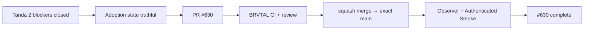

# BRVTAL — Último deploy

> Snapshot de **solo el deploy actual** para [#630](https://github.com/pl0n3r/brvtal/issues/630): cerrar la adopción Factory v1 con estado machine-readable alineado a la evidencia exact-main.

## Progress convention
- ✅ ~~Struck through~~ = completed and verified through required gates.
- 🚧 Normal text = pending/in progress.

## Estado del deploy
| Señal | Estado | Evidencia |
| --- | --- | --- |
| Work line | 🚧 **#630 · Factory v1 adoption closure** | `work/issue-630` · reserva `75d7955f-ee2c-40e1-bf57-d339cf1d7a17` |
| Base | ✅ ~~**main**~~ | `4317390029f3eb118f55bc97a30f4acf6560e1bb` · v0.1.84 |
| Versión producto | ✅ ~~**v0.1.84**~~ | cambio repo-only; sin bump |
| PR + snapshot exacto | 🚧 **candidate** | adoption state + fail-closed contract |
| Producción actual | ✅ ~~**GREEN**~~ | BRVTAL CI + Observer + Authenticated Smoke success sobre el SHA base |
| Producción candidato | 🚧 **pending** | merge → exact-main CI + Observer + Authenticated Smoke |

## Huella del cambio
<!-- brvtal:git-delta -->
| Archivos | Inserciones | Eliminaciones | Neto |
| ---: | ---: | ---: | ---: |
| **3** | **+47** | **−71** | **-24** |

## Calidad y entrega
<!-- brvtal:gate-plan -->
| Control | Estado / contrato |
| --- | --- |
| Gates | 🚧 **preflight · coordination · fast[PHP]** |
| Acceptance | 🚧 **AC-01 coordination · AC-02 observer · AC-03 labels · AC-04 adoption close + CI** |
| Factory | 🚧 Factory CI · Policy · Privacy · Labels |
| Review | 🚧 Sonar · CodeQL · CodeRabbit terminal |
| CI del SHA exacto de main | 🚧 BRVTAL CI · Production Deploy Observer · Authenticated Production Smoke |

## Qué se hizo
- Confirmó que #681, #689, #692 y #694 ya están cerrados/completados.
- Confirmó que el `main` base consume Factory v1 para CI, policy, release, labels, coordinación y observer.
- Cambia `production_green` y `epic_close_allowed` a `true` solo con listas de blockers/pending vacías.
- Elimina el pending obsoleto de #689.
- Endurece el contrato para que cierre falle si reaparece un blocker/pending o se pierde GREEN.
- No modifica runtime, versión, DB, Hostinger, secretos ni workflows.

## Archivos modificados en este deploy
- `README.md` — snapshot operativo exacto de #630.
- `docs/factory-adoption.json` — estado canónico de cierre Factory v1.
- `tests/factory-adoption-contract.php` — regresión fail-closed del cierre.

## Validación
- Base exacta `4317390029f3eb118f55bc97a30f4acf6560e1bb`: BRVTAL CI, Production Deploy Observer y Authenticated Production Smoke en success.
- El diff no toca producto ni dependencias y no colisiona con los workflows modificados por Dependabot #742.
- El contrato conserva callers Factory v1 y prohíbe autoridad local duplicada.
- Rollback: revert de este PR; cero mutaciones de datos.

## Flujo de entrega

```mermaid
flowchart LR
  A["Tanda 2 blockers closed"] --> B["Adoption state truthful"]
  B --> C["PR #630"]
  C --> D["BRVTAL CI + review"]
  D --> E["squash merge → exact main"]
  E --> F["Observer + Authenticated Smoke"]
  F --> G["#630 complete"]
```

## Qué sigue
| Lane | Trabajo |
| --- | --- |
| **NOW** | 🚧 [#630](https://github.com/pl0n3r/brvtal/issues/630): cerrar adopción Factory v1 con evidencia ejecutable. |
| **NEXT** | 🚧 Validar merge exact-main con BRVTAL CI + Production Deploy Observer + Authenticated Production Smoke. |
| **LATER** | 🚧 Reaplicar el despachador de Tanda 2 sobre GrindFlow y FactoryRunner. |
| **BLOCKED / EXTERNAL** | 🚧 [#736](https://github.com/pl0n3r/brvtal/issues/736): auditoría de privacidad depende del fix central Factory #308. |

## Panorama general pendiente
- 🚧 **NOW**: #630, sincronizar contrato de adopción y cerrar el épico.
- 🚧 **NEXT**: exact-main GREEN después del merge.
- 🚧 **LATER**: continuar la cola automática canónica.
- 🚧 **BLOCKED / EXTERNAL**: #736 permanece separado hasta Factory #308.
