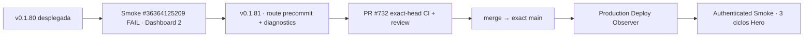

# BRVTAL — Último deploy

> Snapshot de **solo el deploy actual** para #729: v0.1.81 estabiliza el segundo Hero → Dashboard y deja diagnóstico seguro si una transición falla.

## Progress convention
- ✅ ~~Struck through~~ = completed and verified through required gates.
- 🚧 Normal text = pending/in progress.

## Estado del deploy
| Señal | Estado | Evidencia |
| --- | --- | --- |
| Work line | 🚧 **#729 · Hero/Dashboard cycle 2** | `work/issue-729` · reserva `2c53d5d3-43e3-4cf1-b5d4-87124eb16fb2` |
| Base | ✅ **main** | `ac3df13dd0db1a5f49932da8789dbe3911506e2e` · v0.1.80 |
| Producción base | ✅ **exacta** | v0.1.80 · observer `36363806627` · health 200 · DB connected |
| Smoke base | ❌ **AC-07 falla** | `36364125209` · Hero 1/2 PASS; Dashboard transition 2 devuelve `false` |
| Versión candidato | 🚧 **v0.1.81** | patch deploy-bound |
| PR | 🚧 **#732 en revisión** | `work/issue-729` → `main` |
| Producción candidato | 🚧 **pending** | observer + authenticated smoke exactos |

## Huella del cambio
<!-- brvtal:git-delta -->
| Archivos | Inserciones | Eliminaciones | Neto |
| ---: | ---: | ---: | ---: |
| **8** | **+295** | **−54** | **+241** |

## Calidad y entrega
<!-- brvtal:gate-plan -->
| Control | Estado / contrato |
| --- | --- |
| Gates | 🚧 **preflight · coordination · fast[PHP+JS] · database · chromium · real-stack · webkit** |
| Factory | 🚧 Factory CI · Policy · Privacy · Labels · **PR + snapshot exacto** |
| Review | 🚧 Sonar · CodeQL · CodeRabbit terminal |
| Main | 🚧 **CI del SHA exacto de main** · Production Deploy Observer · Authenticated Production Smoke |

## Qué se hizo
- Dashboard precompromete su URL canónica antes de esperar el mount asíncrono; si el mount falla, restaura el workspace/URL anterior.
- Admin Information Architecture registra una razón segura por transición: guard rechazado, stale token, core/mount false o commit inestable.
- Dashboard V2 registra diagnóstico seguro de ownership/mount sin datos sensibles.
- El smoke productivo guarda estado antes/después de cada Dashboard transition para que un futuro `false` sea explicable.
- Regresión browser prueba que un mount Dashboard pendiente ya no deja `?module=hero-slider` como ruta autoritativa.
- No se aumentan retries, no se relaja autenticación y no se modifica esquema ni datos.

## Archivos modificados en este deploy
- `README.md` — snapshot exacto, evidencia productiva y plan v0.1.81.
- `config/version.php` — versión deploy-bound v0.1.81.
- `discadmin/admin-information-architecture.js` — precommit de ruta Dashboard y diagnóstico seguro de navegación.
- `discadmin/dashboard-v2.js` — diagnóstico seguro de ownership y resultado del mount.
- `package.json` — versión del paquete alineada con v0.1.81.
- `tests/e2e/discadmin-information-architecture.spec.mjs` — regresión de URL canónica durante mount Dashboard pendiente.
- `tests/e2e/production-authenticated-smoke.mjs` — evidencia de transición Dashboard antes/después y motivo seguro de fallo.
- `tests/production-smoke-contract.php` — contrato ejecutable de transición awaited y diagnósticos seguros de #125.

## Validación
- v0.1.80 ya demuestra health 200, DB connected, versión/SHA exactos y Hero 1/2 sin 401 ni revalidación.
- v0.1.81 exige que Dashboard quite la ruta Hero antes de esperar sus GET y restaure Hero solo si el mount actual falla.
- El smoke registrará `heroDirty`, `unsavedDirty`, diagnóstico IA y diagnóstico Dashboard para cada retorno.
- Auth single-flight, mutaciones 401 fail-closed y los tres ciclos reales de #125 permanecen obligatorios.

## Evidencia base
- PR #731 fue integrado como v0.1.80 en `main@ac3df13dd0db1a5f49932da8789dbe3911506e2e`.
- Production Deploy Observer `36363806627` terminó **success** y observó v0.1.80 a los 8s.
- Exact-main BRVTAL CI `36363806923` terminó **success** tras un único rerun dirigido del flake de timing real-stack.
- Authenticated Production Smoke `36364125209` confirmó health 200, DB connected, versión/SHA exactos, Events, Sets y Hero intentos 1/2.
- El fallo exacto actual es `#125 Dashboard transition 2 did not commit (result=false)`; no hubo 401 ni revalidación auth.

## Flujo de entrega

```mermaid
flowchart LR
  A["v0.1.80 desplegada"] --> B["Smoke #36364125209 FAIL · Dashboard 2"]
  B --> C["v0.1.81 · route precommit + diagnostics"]
  C --> D["PR #732 exact-head CI + review"]
  D --> E["merge → exact main"]
  E --> F["Production Deploy Observer"]
  F --> G["Authenticated Smoke · 3 ciclos Hero"]
```

## Qué sigue
| Lane | Trabajo |
| --- | --- |
| **NOW** | 🚧 v0.1.81 / PR #732: cerrar gates sobre SHA exacto. |
| **NEXT** | 🚧 Exact-main CI + Production Deploy Observer. |
| **LATER** | 🚧 Authenticated Production Smoke fresco: tres ciclos Dashboard ↔ Hero. |
| **BLOCKED / EXTERNAL** | 🚧 Ninguno conocido. https://github.com/pl0n3r/brvtal/issues/729 solo se cierra con AC-07 verde. |

## Panorama general pendiente
- 🚧 **NOW**: #729 / PR #732, cerrar gates exact-head de v0.1.81.
- 🚧 **NEXT**: merge serializado, exact-main CI y Production Deploy Observer.
- 🚧 **LATER**: Authenticated Production Smoke fresco con tres ciclos Dashboard ↔ Hero; solo entonces cerrar #729.
