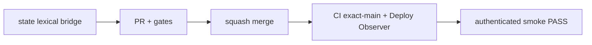

# BRVTAL — Último deploy

> Snapshot de **solo el deploy actual** para #681: corregir el bridge de estado del editor Sets detectado por el smoke autenticado.

## Progress convention
- ✅ ~~Struck through~~ = completed and verified through required gates.
- 🚧 Normal text = pending/in progress.
- 🚧 = active production blocker.

## Estado del deploy
| Señal | Estado | Evidencia |
| --- | --- | --- |
| Work line | 🚧 **#681 · Sets modal / authenticated smoke** | `work/issue-681` · reserva `a13327b5-a302-4bc3-9ec8-4310f8bb7f9c` |
| Base | ✅ **main** | `c892bea8269a8ed26cf4f85c89bc64f41951c97e` · v0.1.75 |
| Versión | 🚧 **v0.1.76** | patch deploy-bound |
| PR | 🚧 **pending** | `work/issue-681` → `main` |
| Main | 🚧 **pending** | CI del SHA exacto de main tras merge |
| Producción | 🚧 **NO GREEN** | health v0.1.75 exacto GREEN; smoke falla en Sets modal |

## Huella del cambio
<!-- brvtal:git-delta -->
| Archivos | Inserciones | Eliminaciones | Neto |
| ---: | ---: | ---: | ---: |
| **9** | **+81** | **−46** | **+35** |

## Calidad y entrega
<!-- brvtal:gate-plan -->
| Control | Estado / contrato |
| --- | --- |
| Gates | 🚧 **preflight · coordination · fast[PHP+JS] · database · chromium · real-stack · webkit · recovery** |
| Factory | 🚧 Policy · Privacy · Labels |
| Snapshot | 🚧 PR + snapshot exacto |
| Main | 🚧 CI del SHA exacto de main tras merge |
| Review | 🚧 Sonar + CodeRabbit |
| Producción | ✅ v0.1.75 health/schema exactos · 🚧 authenticated smoke |

## Flujo de entrega

```mermaid
flowchart LR
  F["state lexical bridge"] --> G["PR + gates"]
  G --> M["squash merge"]
  M --> E["CI exact-main + Deploy Observer"]
  E --> S["authenticated smoke PASS"]
```

## Qué se hizo
- v0.1.75 corrigió el 503 de storage; health productivo quedó 200, DB conectada, 14 migraciones aplicadas y 0 pendientes.
- Authenticated Production Smoke `36332511179` avanzó hasta Sets y falló en `sets-modal-visible`.
- El artifact probó Sets API 200, navegación browser 200, cero 5xx y cero mutaciones bloqueadas.
- Causa raíz: el shell declara `let state`, que no crea `window.state`; `admin-reliability.js` escribía `window.state` durante hidratación de Artist/Event y fallaba cerrado antes de abrir el modal.
- v0.1.76 usa el binding canónico `state` en login, logout y Sets, sin exportar estado interno nuevo a `window`.
- La regresión Playwright reproduce el shell real con `let state` y verifica explícitamente que `window.state` no exista.

## Archivos modificados en este deploy
- `README.md` — snapshot v0.1.76 del incidente.
- `config/version.php` — versión v0.1.76.
- `discadmin/admin-reliability.js` — usa el binding léxico canónico de estado.
- `ops/factory/transport.py` — normaliza `proofs=[]` solo con cero migraciones pendientes.
- `package.json` — versión sincronizada.
- `tests/admin-reliability-quick-wins-contract.php` — contrato de reliability léxica.
- `tests/admin-runtime-globals-contract.php` — contrato de globals runtime.
- `tests/e2e/admin-reliability-quick-wins.spec.mjs` — regresión con `let state`.
- `tests/test_production_migration_reconcile_workflow.py` — regresiones del reconcile sin pendientes.

## Validación
- No cambia DB, migraciones, storage ni permisos.
- Sets sigue hidratando Artist/Event con retry acotado y fail-closed.
- El estado interno no se publica como una API global nueva.
- Tras merge: CI exact-main → Deploy Observer → health exacto → authenticated smoke PASS.
- #681 solo se cierra cuando el smoke autenticado pase sobre el SHA desplegado de v0.1.76.

## Qué sigue
| Lane | Trabajo |
| --- | --- |
| **NOW** | 🚧 [#681](https://github.com/pl0n3r/brvtal/issues/681): validar v0.1.76 y repetir smoke autenticado. |
| **NEXT** | 🚧 Cerrar #681 únicamente con health + authenticated smoke exactos. |
| **LATER** | 🚧 [#533](https://github.com/pl0n3r/brvtal/issues/533): retomar roadmap cuando producción vuelva a GREEN. |
| **BLOCKED / EXTERNAL** | ✅ ~~Sin bloqueo externo adicional.~~ |

## Panorama general pendiente
- 🚧 **NOW**: #681, corregir el bridge lexical/global del editor Sets.
- 🚧 **NEXT**: declarar GREEN solo con smoke autenticado PASS.
- 🚧 **LATER**: #533 roadmap canónico.
