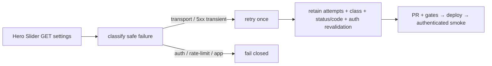

# BRVTAL — Último deploy

> Snapshot de **solo el deploy actual** para #726: hacer determinista y diagnosticable la lectura repetida de Hero Slider sin debilitar el smoke autenticado.

## Progress convention
- ✅ ~~Struck through~~ = completed and verified through required gates.
- 🚧 Normal text = pending/in progress.

## Estado del deploy
| Señal | Estado | Evidencia |
| --- | --- | --- |
| Work line | 🚧 **#726 · Hero Slider settings-read reliability** | `work/issue-726` · reserva `18ce95aa-1881-498f-b6f8-9d0492c08227` |
| Base | ✅ **main** | `26cbc5474388bb1e0362d99c31e8fc04038042c7` · v0.1.77 |
| Versión | 🚧 **v0.1.78** | patch deploy-bound |
| PR | 🚧 **pending** | `work/issue-726` → `main` |
| Main | 🚧 **pending** | CI del SHA exacto de main tras merge |
| Producción | ✅ **GREEN v0.1.77** | health + smoke recuperado; #726 corrige flakiness observada |

## Huella del cambio
<!-- brvtal:git-delta -->
| Archivos | Inserciones | Eliminaciones | Neto |
| ---: | ---: | ---: | ---: |
| **10** | **+161** | **−49** | **+112** |

## Calidad y entrega
<!-- brvtal:gate-plan -->
| Control | Estado / contrato |
| --- | --- |
| Gates | 🚧 **preflight · coordination · fast[PHP+JS] · database · chromium · real-stack · webkit** |
| Factory | 🚧 Policy · Privacy · Labels |
| Snapshot | 🚧 PR + snapshot exacto |
| Main | 🚧 CI del SHA exacto de main tras merge |
| Review | 🚧 Sonar + CodeRabbit |
| Producción | 🚧 authenticated smoke fresco sobre SHA exacto desplegado |

## Flujo de entrega

```mermaid
flowchart LR
  A["Hero Slider GET settings"] --> C["classify safe failure"]
  C -->|transport / 5xx transient| R["retry once"]
  C -->|auth / rate-limit / app| F["fail closed"]
  R --> D["retain attempts + class + status/code + auth revalidation"]
  D --> P["PR + gates → deploy → authenticated smoke"]
```

## Qué se hizo
- La lectura de Settings ya no reintenta casi cualquier error: solo transporte explícito y fallos 5xx transitorios tienen un segundo intento acotado.
- Los fallos de autenticación, rate-limit y aplicación quedan fail-closed sin retry adicional.
- El diagnóstico seguro conserva `settingsAttempts`, `failureClass`, `httpStatus`, `code` y si el GET atravesó revalidación canónica de sesión; el helper `req()` canónico ya no descarta esa metadata HTTP.
- El smoke autenticado conserva el diagnóstico Hero Slider tanto en intento fallido como exitoso.
- Las mutaciones de Settings siguen usando una sola solicitud y no heredan la política de retry de lectura.

## Archivos modificados en este deploy
- `README.md` — snapshot operativo v0.1.78.
- `config/version.php` — versión v0.1.78.
- `discadmin/admin-auth-boundary.js` — contador seguro de revalidaciones GET.
- `discadmin/hero-slider.js` — clasificación, metadata HTTP y retry acotado de Settings.
- `discadmin/index-core.php` — propaga status/code seguros desde el request helper canónico.
- `package.json` — versión runtime sincronizada.
- `tests/e2e/hero-slider-v2.spec.mjs` — regresiones de retry y clases fail-closed.
- `tests/e2e/production-authenticated-smoke.mjs` — evidencia diagnóstica en intentos exitosos.
- `tests/hero-slider-contract.php` — contrato de propagación de metadata HTTP segura.
- `tests/production-smoke-contract.php` — contrato de diagnóstico #125.

## Validación
- No cambia DB, migraciones, permisos ni esquema.
- Solo las lecturas GET de Hero Slider tienen recuperación transitoria acotada; las escrituras siguen fail-closed y no se reintentan.
- Rate-limit, auth y errores de aplicación no se convierten en falsos éxitos.
- El smoke conserva tres ciclos Dashboard ↔ Hero Slider obligatorios y registra evidencia segura por intento.
- El cierre de #726 exige BRVTAL CI, Privacy, Policy, Sonar y CodeQL verdes, deploy observado y authenticated smoke fresco sobre el SHA exacto resultante.

## Qué sigue
| Lane | Trabajo |
| --- | --- |
| **NOW** | 🚧 [#726](https://github.com/pl0n3r/brvtal/issues/726): validar v0.1.78 y desplegar. |
| **NEXT** | 🚧 Ejecutar authenticated smoke fresco y confirmar health/schema sin regresión. |
| **LATER** | 🚧 [#533](https://github.com/pl0n3r/brvtal/issues/533): retomar roadmap canónico. |
| **BLOCKED / EXTERNAL** | ✅ ~~Sin bloqueo externo conocido.~~ |

## Panorama general pendiente
- 🚧 **NOW**: #726, cerrar flakiness del Hero Slider con evidencia.
- 🚧 **NEXT**: declarar producción validada solo tras smoke fresco.
- 🚧 **LATER**: #533 roadmap canónico.
