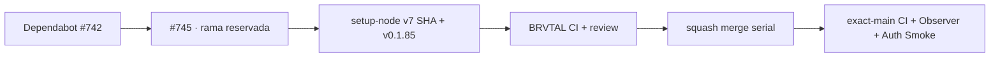

# BRVTAL — Último deploy

> Snapshot de **solo el deploy actual** para [#745](https://github.com/pl0n3r/brvtal/issues/745): promover el cambio Dependabot de `actions/setup-node` a una entrega Factory versionada, trazable y con referencia inmutable.

## Progress convention
- ✅ ~~Struck through~~ = completed and verified through required gates.
- 🚧 Normal text = pending/in progress.

## Estado del deploy

| Señal | Estado | Evidencia |
| --- | --- | --- |
| Work line | 🚧 **#745 · setup-node v7 promotion** | `work/issue-745` · reserva `6c4f03d3-5812-45b5-b6fe-e5b94c63fae9` |
| Base | ✅ ~~**main**~~ | `3cac33e7d8fd85abc78bea495b492e366248bfe3` · v0.1.84 |
| Producción actual | ✅ ~~**GREEN**~~ | `/api/health.php` exacto en v0.1.84 / `3cac33e7...` |
| Versión objetivo | 🚧 **v0.1.85** | `config/version.php` |
| Fuente automática | 🚧 **Dependabot #742 preservado** | [PR #742](https://github.com/pl0n3r/brvtal/pull/742) |
| PR + snapshot exacto | 🚧 **#747 en validación** | rama coordinada; no mergear #742 directamente |
| Producción candidato | 🚧 **pending** | merge → CI exact-main → Observer → Authenticated Production Smoke |

## Huella del cambio

<!-- brvtal:git-delta -->
| Archivos | Inserciones | Eliminaciones | Neto |
| ---: | ---: | ---: | ---: |
| **7** | **+134** | **−50** | **+84** |

## Calidad y entrega

<!-- brvtal:gate-plan -->
| Control | Estado / contrato |
| --- | --- |
| Gates seleccionados | 🚧 pendiente en HEAD final · **preflight · coordination · fast[PHP+JS] · database · chromium · real-stack · webkit** |
| Pin supply-chain | `actions/setup-node@820762786026740c76f36085b0efc47a31fe5020` · v7.0.0 |
| Fuente | Dependabot #742 queda como evidencia; el PR bot no se integra directamente |
| Revisión | CodeRabbit + Sonar + contratos BRVTAL sobre HEAD estable |
| CI del SHA exacto de main | obligatorio después del merge |
| Producción | Production Deploy Observer + Authenticated Production Smoke exact-main |

## Flujo de entrega

```mermaid
flowchart LR
  A["Dependabot #742"] --> B["#745 · rama reservada"]
  B --> C["setup-node v7 SHA + v0.1.85"]
  C --> D["BRVTAL CI + review"]
  D --> E["squash merge serial"]
  E --> F["exact-main CI + Observer + Auth Smoke"]
```

## Qué se hizo

- Conserva exactamente el alcance funcional de Dependabot #742 en los tres workflows de producción.
- Sustituye la referencia mutable `actions/setup-node@v4` por el SHA inmutable `820762786026740c76f36085b0efc47a31fe5020` correspondiente a v7.0.0.
- No cambia permisos, inputs, cachés, comandos, lógica de smoke ni comportamiento de producto.
- Materializa v0.1.85 y sincroniza `config/version.php` con `package.json`, como exige el contrato deploy-bound.
- Añade regresiones que exigen exactamente una referencia `actions/setup-node` por workflow, siempre el SHA v7.0.0; también fijan identidad de versión, snapshot README y preservación de #742.
- No toca DB, schema, datos, secretos ni contenido productivo.

## Archivos modificados en este deploy

- `.github/workflows/production-authenticated-smoke.yml`
- `.github/workflows/production-page-write-smoke.yml`
- `.github/workflows/production-performance.yml`
- `README.md`
- `config/version.php`
- `package.json`
- `tests/test_setup_node_promotion.py`

## Validación

- El commit base de producción es `3cac33e7d8fd85abc78bea495b492e366248bfe3`.
- Los tres workflows usan exactamente una referencia `actions/setup-node`, siempre el SHA de v7.0.0.
- `config/version.php` y `package.json` declaran la misma versión `0.1.85`.
- Dependabot #742 permanece como fuente de comparación: https://github.com/pl0n3r/brvtal/pull/742.
- El cambio canónico no añade nuevas dependencias ni modifica otra action.
- Rollback: revertir la entrega y volver a v0.1.84; no hay migraciones.
- GREEN final requiere exact-main BRVTAL CI, Production Deploy Observer y Authenticated Production Smoke.

## Qué sigue

| Lane | Trabajo |
| --- | --- |
| **NOW** | 🚧 [#745](https://github.com/pl0n3r/brvtal/issues/745): cerrar promoción setup-node v7. |
| **NEXT** | 🚧 [#746](https://github.com/pl0n3r/brvtal/issues/746): adoptar README Contract v1 cuando Factory publique el reusable en `@v1`. |
| **LATER** | 🚧 Continuar [roadmap #533](https://github.com/pl0n3r/brvtal/issues/533) por prioridad. |
| **BLOCKED / EXTERNAL** | 🚧 README Contract depende de la publicación protegida del nuevo Factory v1.x. |

## Panorama general pendiente

- **NOW**: 🚧 #745 promoción canónica del cambio Dependabot.
- **NEXT**: 🚧 #746 README Contract v1, serializado detrás de #745 y del canal Factory.
- **LATER**: 🚧 roadmap #533 y producto.
- **BLOCKED / EXTERNAL**: 🚧 publicación protegida de Factory `@v1`; ninguna acción manual de producción requerida para #745.
