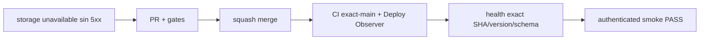

# BRVTAL — Último deploy

> Snapshot de **solo el deploy actual** para #681: degradación segura de storage administrado cuando la cuota no está configurada.

## Progress convention
- ✅ ~~Struck through~~ = completed and verified through required gates.
- 🚧 Normal text = pending/in progress.
- 🚧 = active production blocker.

## Estado del deploy
| Señal | Estado | Evidencia |
| --- | --- | --- |
| Work line | 🚧 **#681 · authenticated production smoke** | `work/issue-681` · reserva `2ec41f28-2ffe-4b87-a9e3-bc51fa3233b8` |
| Base | ✅ **main** | `7ca6e2f70e8f1ce2feda3a1761c854ee66a020f9` · v0.1.74 |
| Versión | 🚧 **v0.1.75** | patch deploy-bound |
| PR | 🚧 **pending** | `work/issue-681` → `main` |
| Main | 🚧 **pending** | CI del SHA exacto tras merge |
| Producción | 🚧 **NO GREEN** | health exacto GREEN; smoke falla solo por storage-metrics 503 |

## Huella del cambio
<!-- brvtal:git-delta -->
| Archivos | Inserciones | Eliminaciones | Neto |
| ---: | ---: | ---: | ---: |
| **6** | **+44** | **−40** | **+4** |

## Calidad y entrega
<!-- brvtal:gate-plan -->
| Control | Estado / contrato |
| --- | --- |
| Gates | 🚧 **preflight · coordination · fast[PHP+JS] · database · chromium · real-stack · webkit** |
| Factory | 🚧 Policy · Privacy · Labels |
| Snapshot | 🚧 PR + snapshot exacto |
| Main | 🚧 CI del SHA exacto de main tras merge |
| Review | 🚧 Sonar + CodeRabbit |
| Producción | ✅ reconcile + health exactos · 🚧 authenticated smoke |

## Flujo de entrega

```mermaid
flowchart LR
  F["storage unavailable sin 5xx"] --> G["PR + gates"]
  G --> M["squash merge"]
  M --> E["CI exact-main + Deploy Observer"]
  E --> H["health exact SHA/version/schema"]
  H --> S["authenticated smoke PASS"]
```

## Qué se hizo
- Deploy Observer confirmó `v0.1.74` y SHA exacto `7ca6e2f70e8f1ce2feda3a1761c854ee66a020f9`.
- Reconcile owner-only completó inspect → backup-before-write → reconcile → `verify-plan __NONE__`.
- `/api/health.php` devuelve 200, DB conectada, `schema_up_to_date=true`, 14 migraciones aplicadas y 0 pendientes.
- Authenticated Production Smoke `36327134844` autentica, valida health/home/admin, pero falla porque `/discadmin/storage-metrics.php` devuelve 503 cuando la cuota administrada no está configurada.
- La UI ya representa ese caso como `UNAVAILABLE · BRVTAL DATA`; no existe motivo para convertir una métrica opcional no configurada en un 5xx del dashboard.

### Cambio v0.1.75
- `storage-metrics.php` mantiene `ok:false`, añade `available:false` y conserva `STORAGE_QUOTA_NOT_CONFIGURED`.
- El estado no configurado usa respuesta HTTP normal; no inventa una cuota y no reutiliza el filesystem del host como cuota de BRVTAL.
- La UI existente sigue degradando a `MANAGED STORAGE UNAVAILABLE`.
- Regresiones de contrato y Playwright fijan que la ausencia de cuota no vuelve a producir un 5xx semántico.

## Archivos modificados en este deploy
- `README.md` — snapshot v0.1.75 del incidente.
- `config/version.php` — versión v0.1.75.
- `package.json` — versión sincronizada.
- `discadmin/storage-metrics.php` — unavailable semántico sin HTTP 5xx.
- `tests/system-status-contract.php` — contrato no-5xx y `available:false`.
- `tests/e2e/discadmin-system-status-v2.spec.mjs` — degradación visual con respuesta HTTP 200.

## Validación
- No se configura ni adivina `BRVTAL_STORAGE_QUOTA_BYTES`.
- Host filesystem sigue siendo `diagnostic_only`.
- Una cuota real configurada conserva el payload de uso/cuota existente.
- Tras merge: CI exact-main → Deploy Observer → health exacto → authenticated smoke PASS.
- #681 solo se cierra cuando el smoke autenticado pase sobre el SHA desplegado de v0.1.75.

## Qué sigue
| Lane | Trabajo |
| --- | --- |
| **NOW** | 🚧 [#681](https://github.com/pl0n3r/brvtal/issues/681): integrar v0.1.75 y repetir smoke autenticado. |
| **NEXT** | 🚧 Cerrar #681 únicamente con health + authenticated smoke exactos. |
| **LATER** | 🚧 [#533](https://github.com/pl0n3r/brvtal/issues/533): retomar roadmap cuando producción vuelva a GREEN. |
| **BLOCKED / EXTERNAL** | ✅ ~~Sin bloqueo externo adicional.~~ |

## Panorama general pendiente
- 🚧 **NOW**: #681, retirar el falso 5xx de storage no configurado.
- 🚧 **NEXT**: declarar GREEN solo con smoke autenticado PASS.
- 🚧 **LATER**: #533 roadmap canónico.
